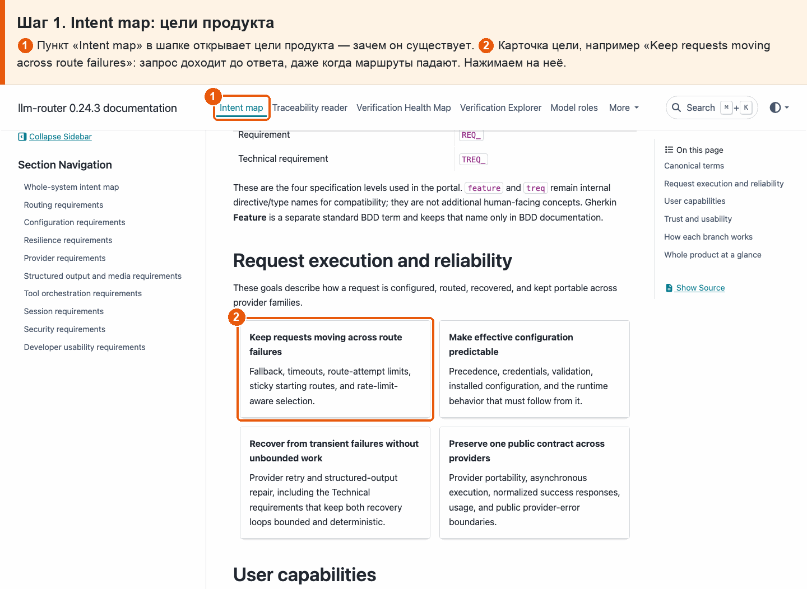
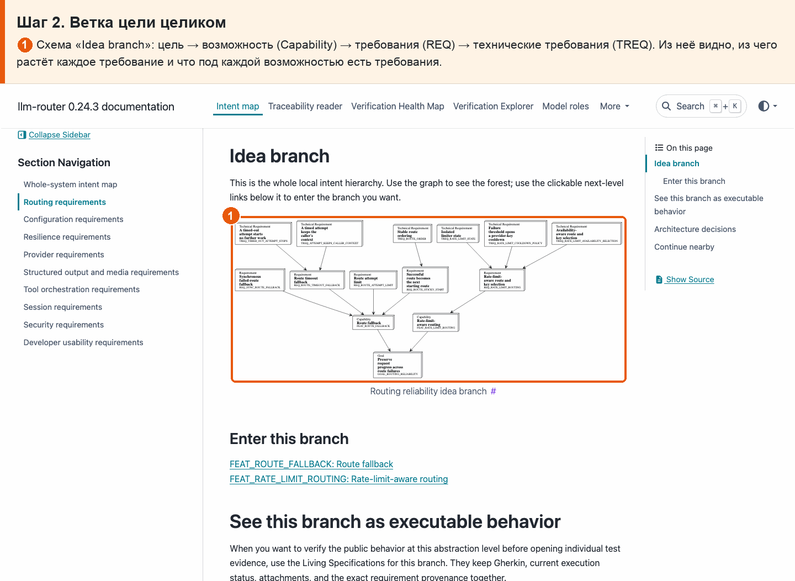
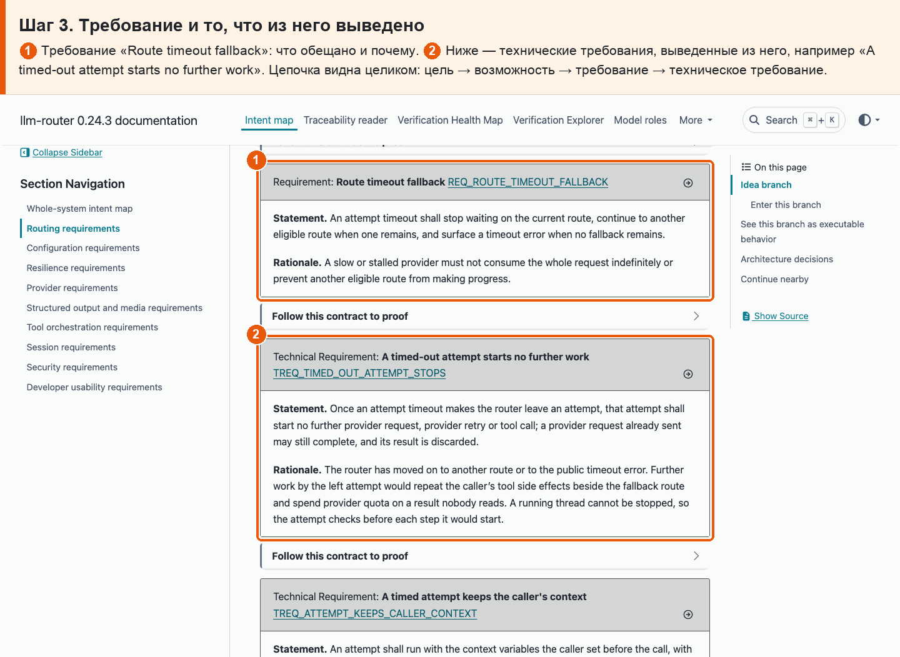

# 01 · Цель → возможность → требование

**Боль.** Хочу видеть, ради какой цели продукта и какой его возможности существует каждое требование, и что входит в каждую цель.

**Путь.**

1. **Intent map: цели продукта** ① Пункт «Intent map» в шапке открывает цели продукта — зачем он существует. ② Карточка цели, например «Keep requests moving across route failures»: запрос доходит до ответа, даже когда маршруты падают. Нажимаем на неё.

   

2. **Ветка цели целиком** ① Схема «Idea branch»: цель → возможность (Capability) → требования (REQ) → технические требования (TREQ). Из неё видно, из чего растёт каждое требование и что под каждой возможностью есть требования.

   

3. **Требование и то, что из него выведено** ① Требование «Route timeout fallback»: что обещано и почему. ② Ниже — технические требования, выведенные из него, например «A timed-out attempt starts no further work». Цепочка видна целиком: цель → возможность → требование → техническое требование.

   

**Что получаю.** У любого требования видно, ради какой цели и возможности оно существует, а у каждой цели — все её возможности и требования.
