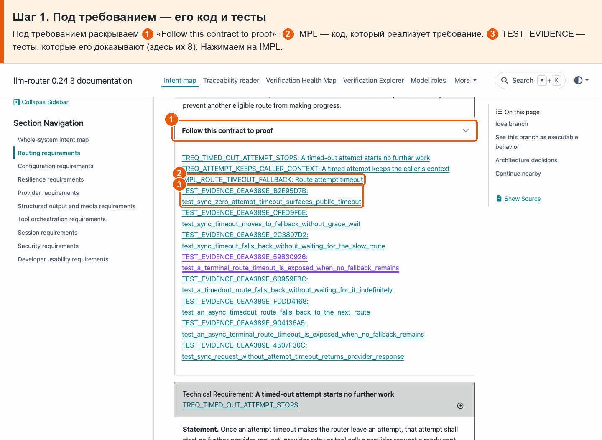
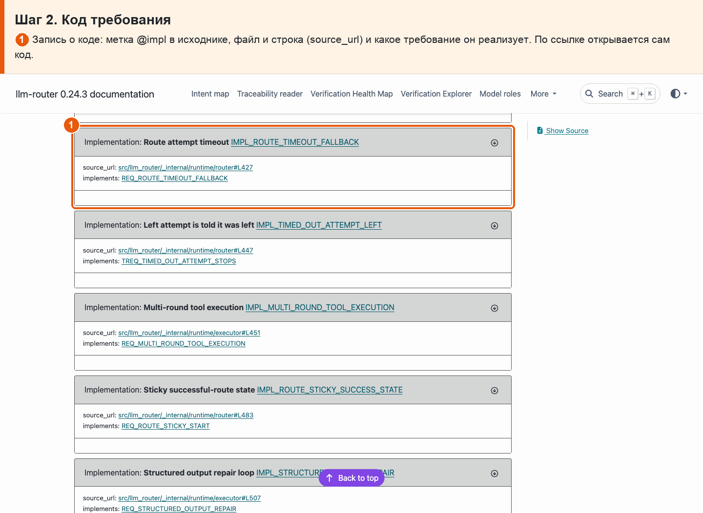
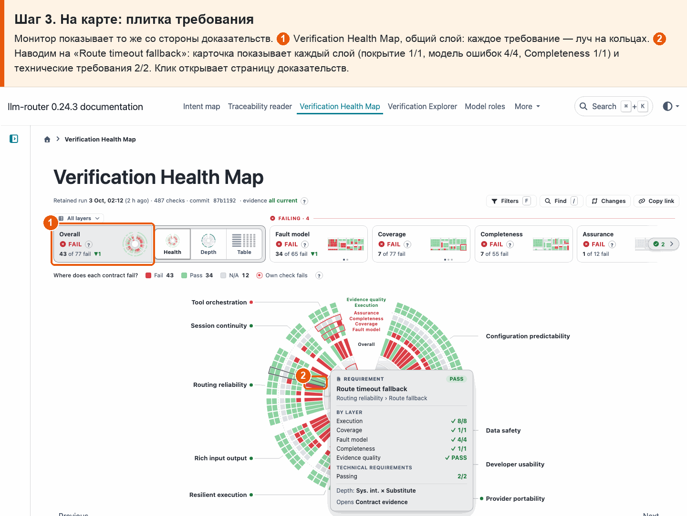
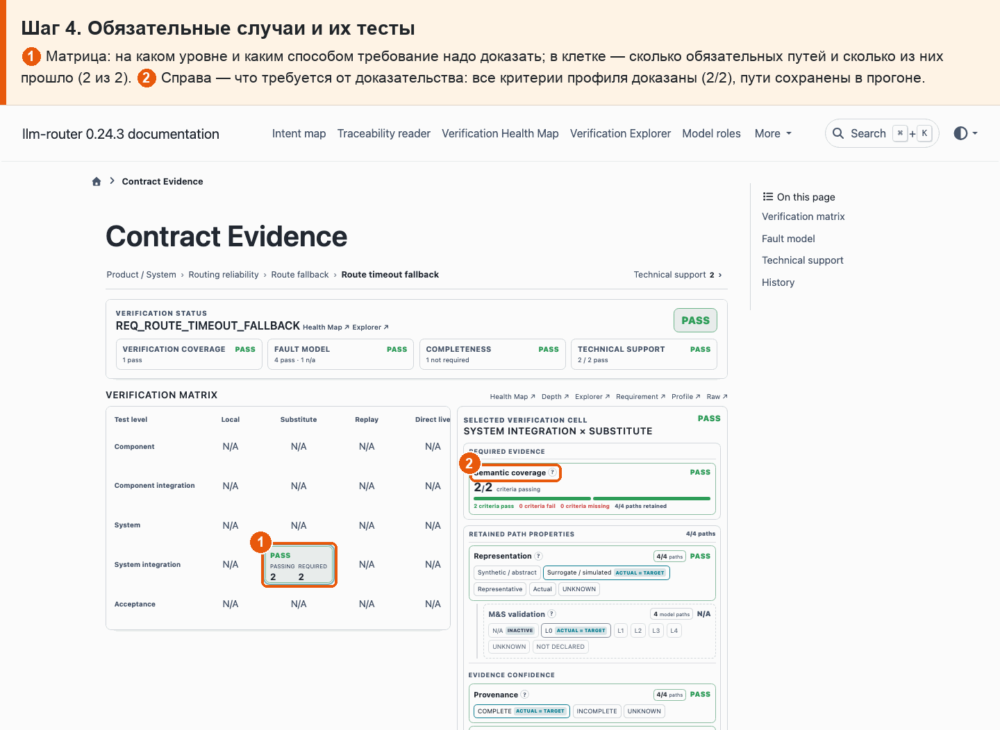

# 02 · Требование → код и тесты

**Боль.** По требованию хочу видеть, какой код его реализует, какие тесты его доказывают и все ли обязательные случаи доказаны.

**Путь.**

1. **Под требованием — его код и тесты** Под требованием раскрываем ① «Follow this contract to proof». ② IMPL — код, который реализует требование. ③ TEST_EVIDENCE — тесты, которые его доказывают (здесь их 8). Нажимаем на IMPL.

   

2. **Код требования** ① Запись о коде: метка @impl в исходнике, файл и строка (source_url) и какое требование он реализует. По ссылке открывается сам код.

   

3. **На карте: плитка требования** Монитор показывает то же со стороны доказательств. ① Verification Health Map, общий слой: каждое требование — луч на кольцах. ② Наводим на «Route timeout fallback»: карточка показывает каждый слой (покрытие 1/1, модель ошибок 4/4, Completeness 1/1) и технические требования 2/2. Клик открывает страницу доказательств.

   

4. **Обязательные случаи и их тесты** ① Матрица: на каком уровне и каким способом требование надо доказать; в клетке — сколько обязательных путей и сколько из них прошло (2 из 2). ② Справа — что требуется от доказательства: все критерии профиля доказаны (2/2), пути сохранены в прогоне.

   

**Что получаю.** Для требования видно его код (с местом в файле), все тесты-доказательства и сколько обязательных случаев доказано: у REQ_ROUTE_TIMEOUT_FALLBACK 2 из 2.
