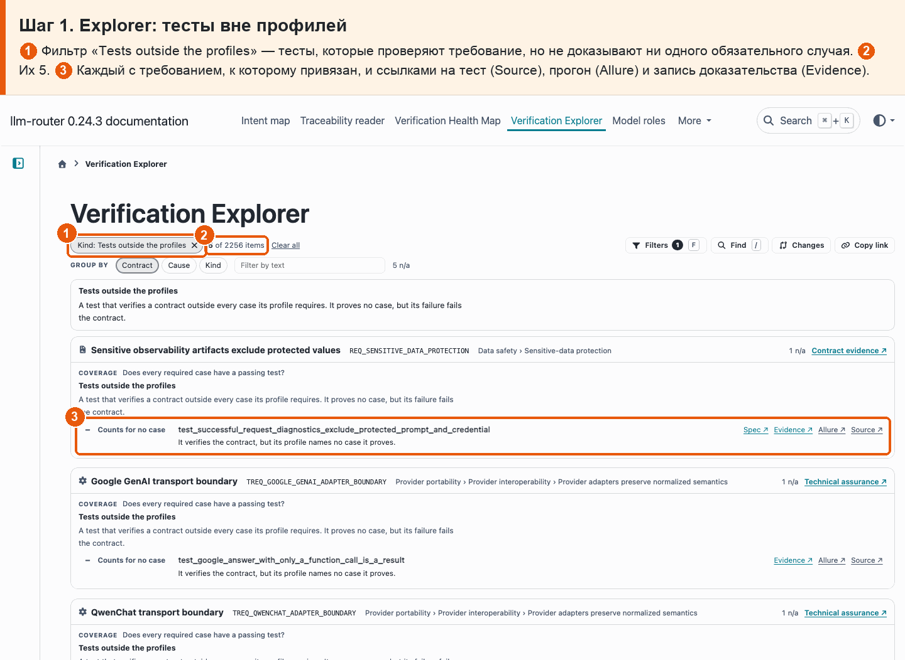

# 03 · Тест → требование

**Боль.** Есть ли тесты, которые привязаны к требованию, но ничего из обязательного не доказывают?

**Путь.**

1. **Explorer: тесты вне профилей** ① Фильтр «Tests outside the profiles» — тесты, которые проверяют требование, но не доказывают ни одного обязательного случая. ② Их 5. ③ Каждый с требованием, к которому привязан, и ссылками на тест (Source), прогон (Allure) и запись доказательства (Evidence).

   

**Что получаю.** Сейчас таких тестов 5. Каждый виден с требованием, к которому он привязан, и со ссылками на сам тест и его прогон.
