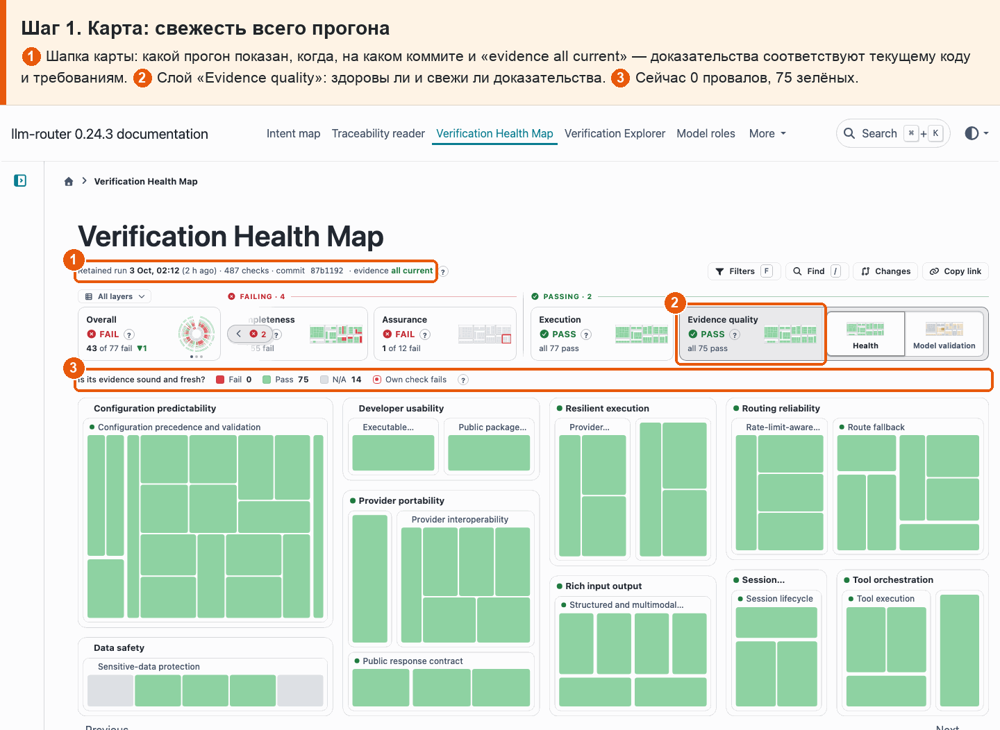
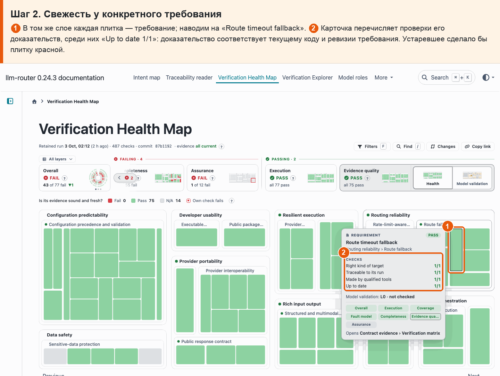

# 05 · Свежесть связей

**Боль.** Не устарели ли доказательства: соответствуют ли они текущему коду, требованиям и прогону?

**Путь.**

1. **Карта: свежесть всего прогона** ① Шапка карты: какой прогон показан, когда, на каком коммите и «evidence all current» — доказательства соответствуют текущему коду и требованиям. ② Слой «Evidence quality»: здоровы ли и свежи ли доказательства. ③ Сейчас 0 провалов, 75 зелёных.

   

2. **Свежесть у конкретного требования** ① В том же слое каждая плитка — требование; наводим на «Route timeout fallback». ② Карточка перечисляет проверки его доказательств, среди них «Up to date 1/1»: доказательство соответствует текущему коду и ревизии требования. Устаревшее сделало бы плитку красной.

   

**Что получаю.** Все доказательства свежие: прогон текущий («evidence all current»), слой Evidence quality зелёный — 75 требований из 75; свежесть проверяется у каждого требования отдельно.
