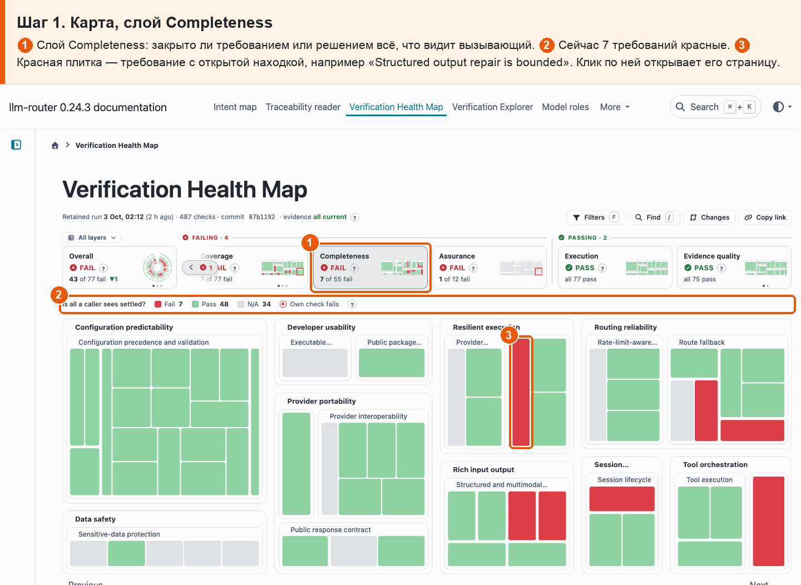
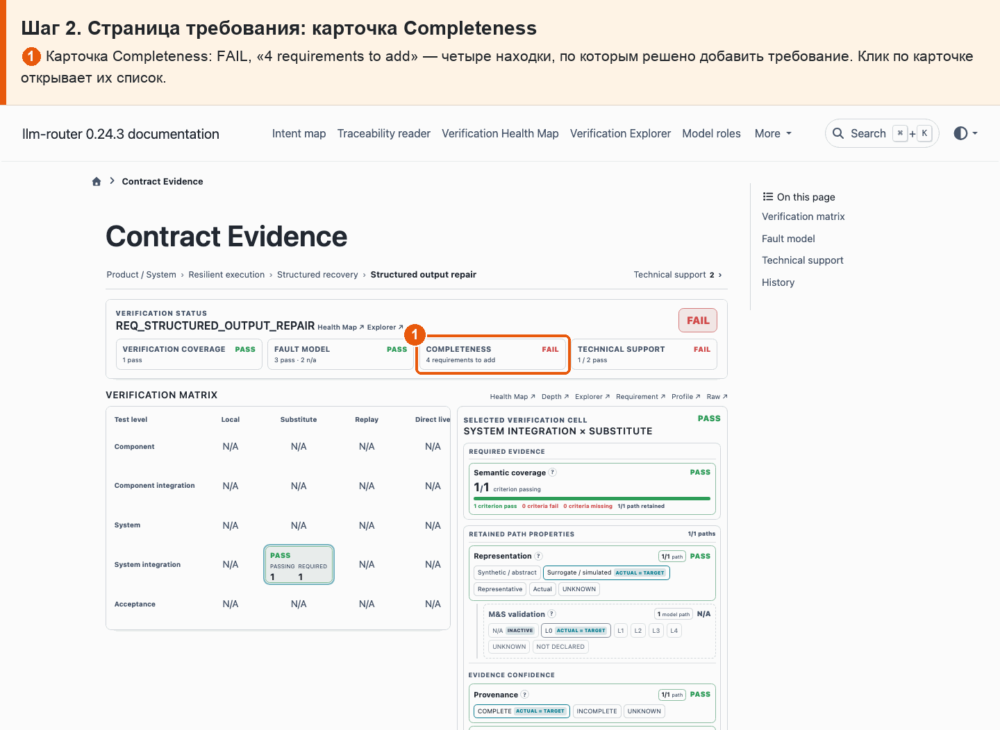
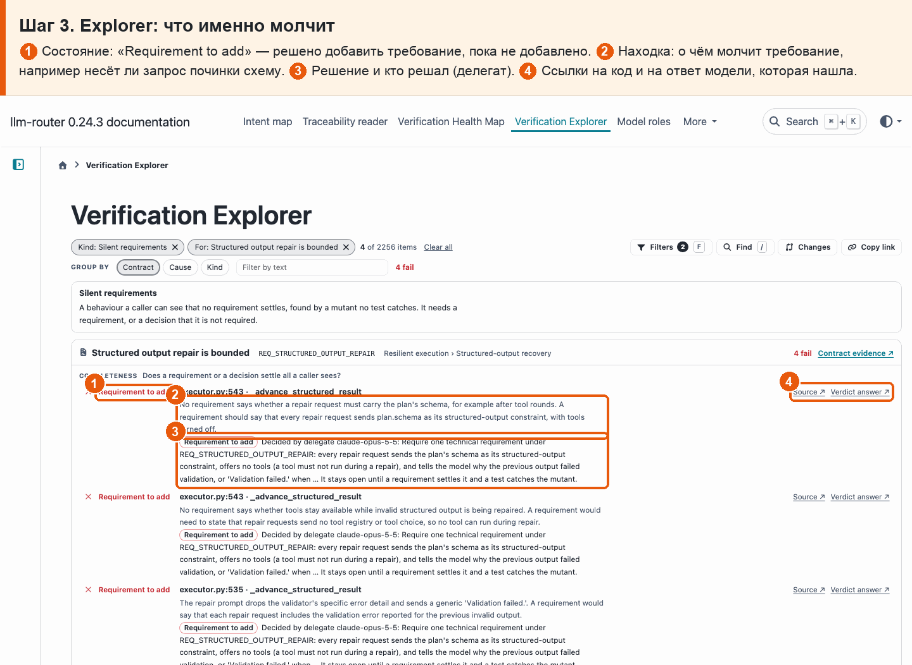

# 08 · «Требование молчит»

**Боль.** О каком поведении, которое видит пользователь библиотеки, требования ничего не говорят?

**Путь.**

1. **Карта, слой Completeness** ① Слой Completeness: закрыто ли требованием или решением всё, что видит вызывающий. ② Сейчас 7 требований красные. ③ Красная плитка — требование с открытой находкой, например «Structured output repair is bounded». Клик по ней открывает его страницу.

   

2. **Страница требования: карточка Completeness** ① Карточка Completeness: FAIL, «4 requirements to add» — четыре находки, по которым решено добавить требование. Клик по карточке открывает их список.

   

3. **Explorer: что именно молчит** ① Состояние: «Requirement to add» — решено добавить требование, пока не добавлено. ② Находка: о чём молчит требование, например несёт ли запрос починки схему. ③ Решение и кто решал (делегат). ④ Ссылки на код и на ответ модели, которая нашла.

   

**Что получаю.** Видно, какие требования молчат о видимом поведении (сейчас 7 требований, 16 находок), что именно не покрыто, что решили и кто решал.
