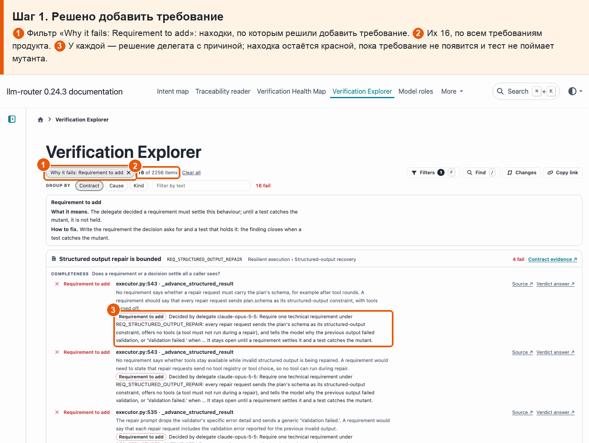
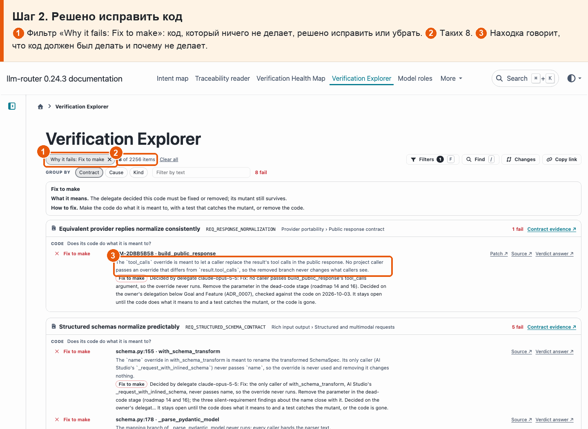
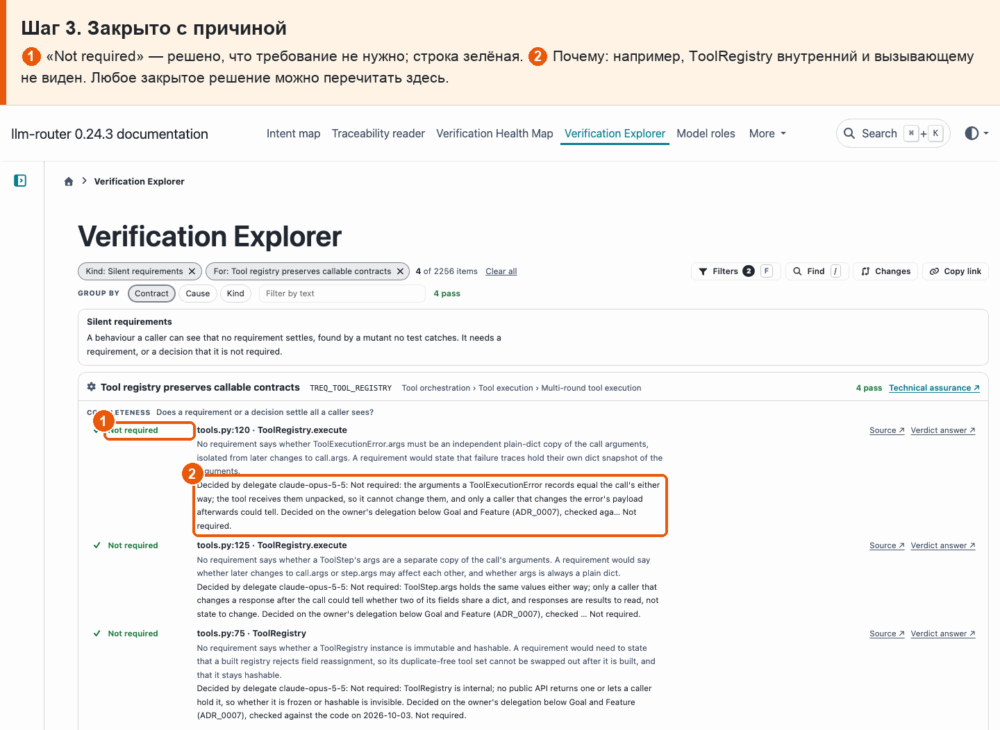

# 10 · Открытые вопросы и решения

**Боль.** Что ещё не решено, что решено, кем и почему — и что из решённого ещё надо сделать?

**Путь.**

1. **Решено добавить требование** ① Фильтр «Why it fails: Requirement to add»: находки, по которым решили добавить требование. ② Их 16, по всем требованиям продукта. ③ У каждой — решение делегата с причиной; находка остаётся красной, пока требование не появится и тест не поймает мутанта.

   

2. **Решено исправить код** ① Фильтр «Why it fails: Fix to make»: код, который ничего не делает, решено исправить или убрать. ② Таких 8. ③ Находка говорит, что код должен был делать и почему не делает.

   

3. **Закрыто с причиной** ① «Not required» — решено, что требование не нужно; строка зелёная. ② Почему: например, ToolRegistry внутренний и вызывающему не виден. Любое закрытое решение можно перечитать здесь.

   

**Что получаю.** Нерешённых находок сейчас нет. Открыты 16 «требование добавить» и 8 «исправить код»; у 38 закрытых видны решение и причина.
