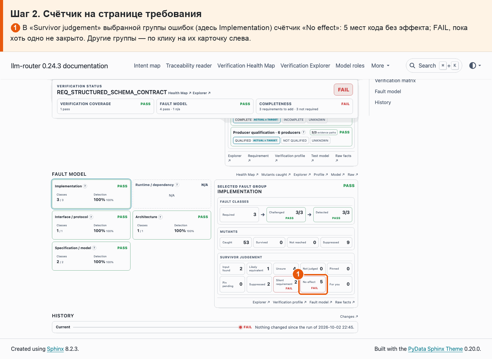
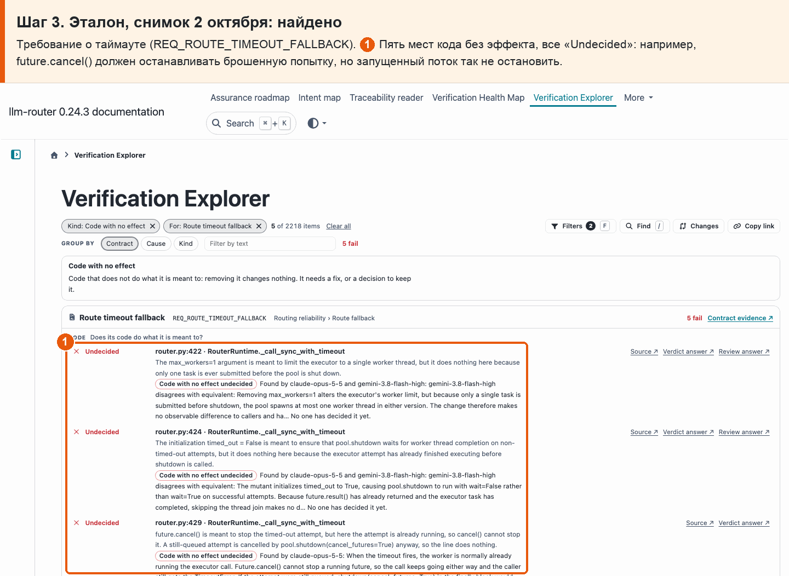
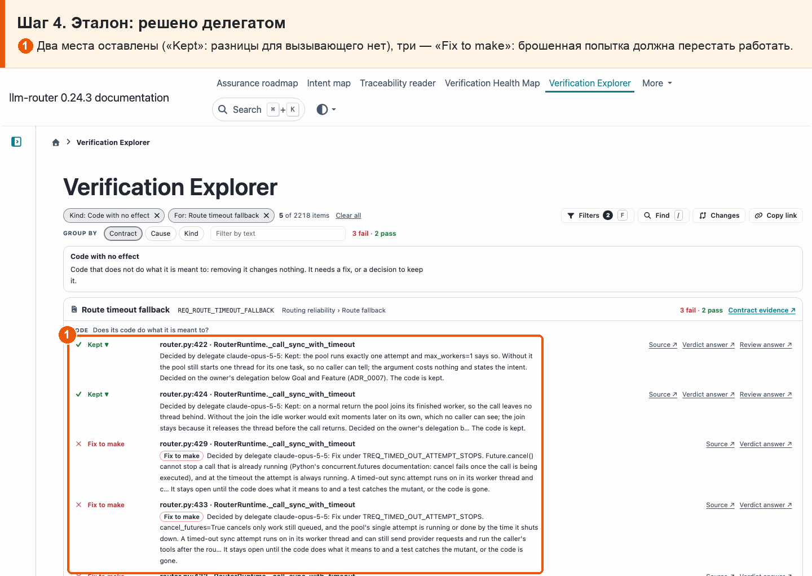
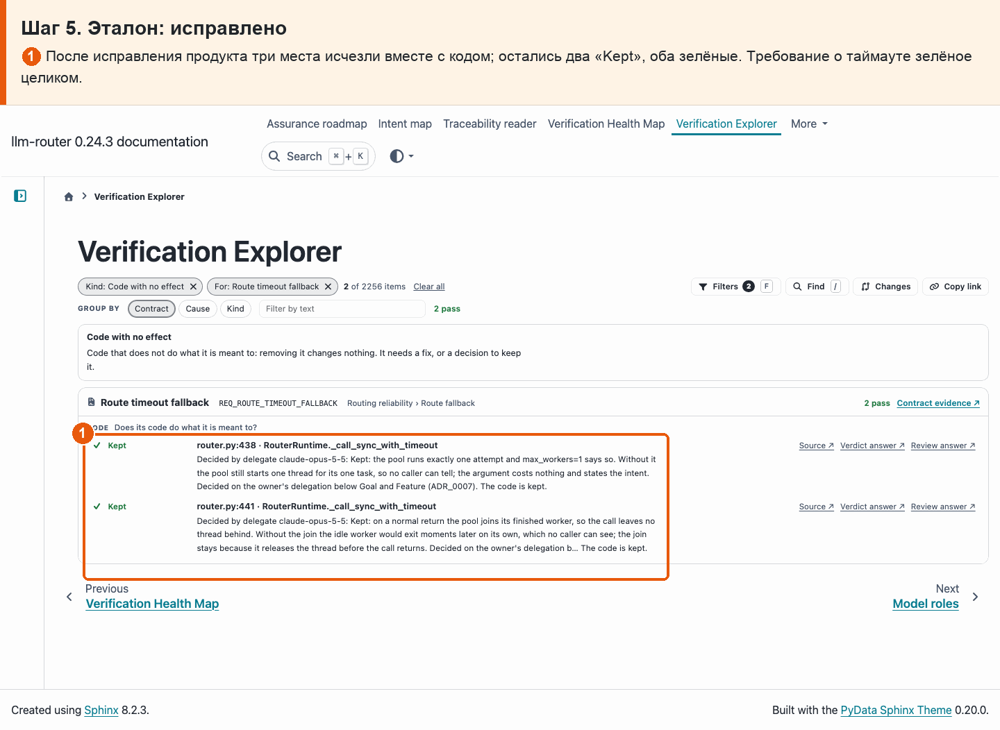

# 15 · Код без эффекта

**Боль.** Какой код ничего не делает — и что с ним решили?

**Путь.**

1. **Explorer: код без эффекта** ① Вид «Code with no effect» — код, удаление которого ничего не меняет для вызывающего. ② Всего 26. ③ Решение: «Fix to make» (исправить) или «Kept» (оставить). ④ Что код должен был делать и почему не делает.

   

2. **Счётчик на странице требования** ① В «Survivor judgement» выбранной группы ошибок (здесь Implementation) счётчик «No effect»: 5 мест кода без эффекта; FAIL, пока хоть одно не закрыто. Другие группы — по клику на их карточку слева.

   

3. **Эталон, снимок 2 октября: найдено** Требование о таймауте (REQ_ROUTE_TIMEOUT_FALLBACK). ① Пять мест кода без эффекта, все «Undecided»: например, future.cancel() должен останавливать брошенную попытку, но запущенный поток так не остановить.

   

4. **Эталон: решено делегатом** ① Два места оставлены («Kept»: разницы для вызывающего нет), три — «Fix to make»: брошенная попытка должна перестать работать.

   

5. **Эталон: исправлено** ① После исправления продукта три места исчезли вместе с кодом; остались два «Kept», оба зелёные. Требование о таймауте зелёное целиком.

   

**Что получаю.** Видно 26 мест кода без эффекта: 8 решено исправить, 18 оставлено с причиной. Эталон с таймаутом показывает весь путь находки до зелёного.
