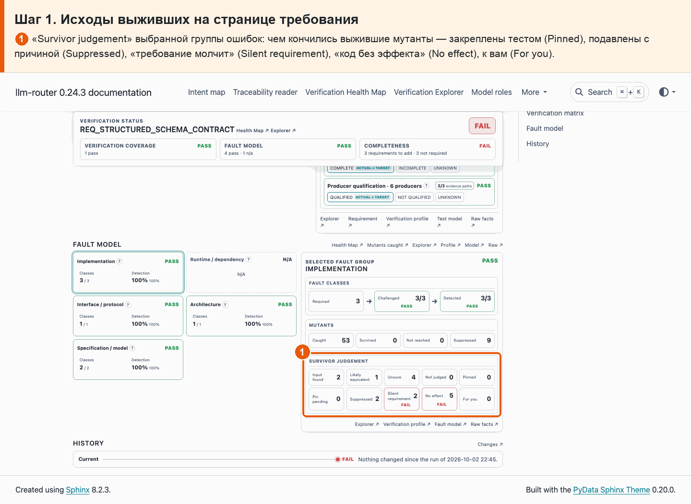
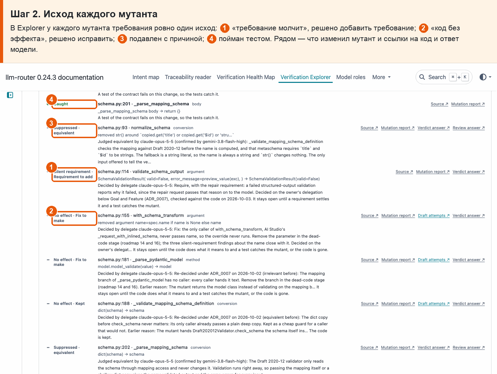

# 17 · Один исход у каждого выжившего мутанта

**Боль.** Каждый мутант, которого тесты не поймали, — чем он закончился?

**Путь.**

1. **Исходы выживших на странице требования** ① «Survivor judgement» выбранной группы ошибок: чем кончились выжившие мутанты — закреплены тестом (Pinned), подавлены с причиной (Suppressed), «требование молчит» (Silent requirement), «код без эффекта» (No effect), к вам (For you).

   

2. **Исход каждого мутанта** В Explorer у каждого мутанта требования ровно один исход: ① «требование молчит», решено добавить требование; ② «код без эффекта», решено исправить; ③ подавлен с причиной; ④ пойман тестом. Рядом — что изменил мутант и ссылки на код и ответ модели.

   

**Что получаю.** Ни один выживший не висит без исхода: на странице требования — счётчики исходов, в Explorer — исход каждого мутанта с причиной и ссылкой на ответ модели.
