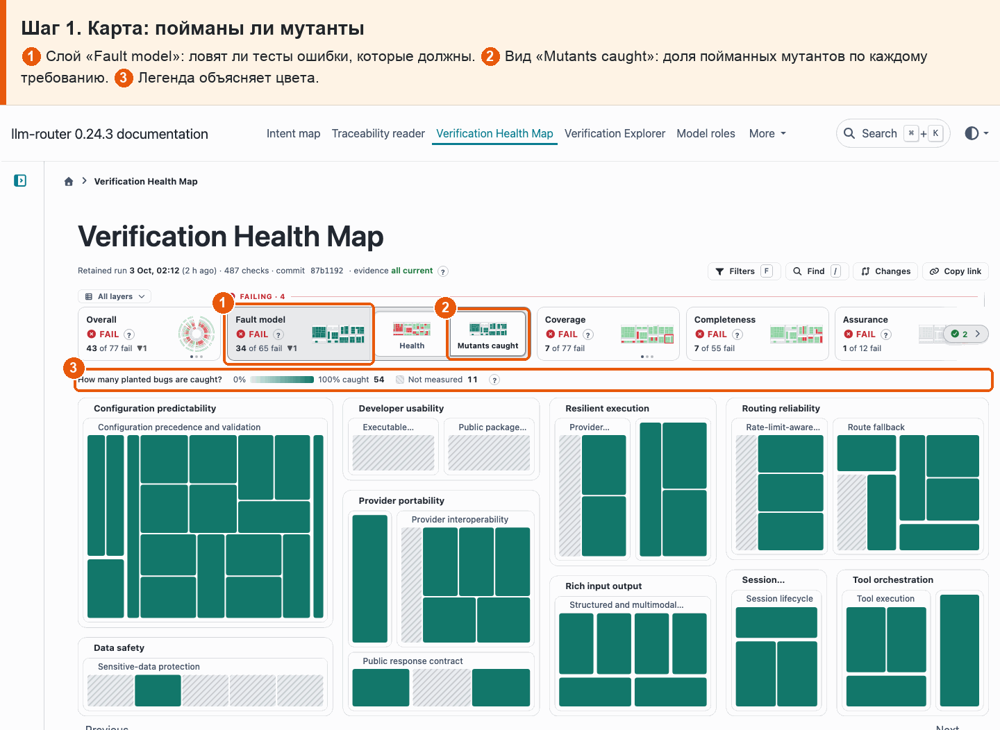
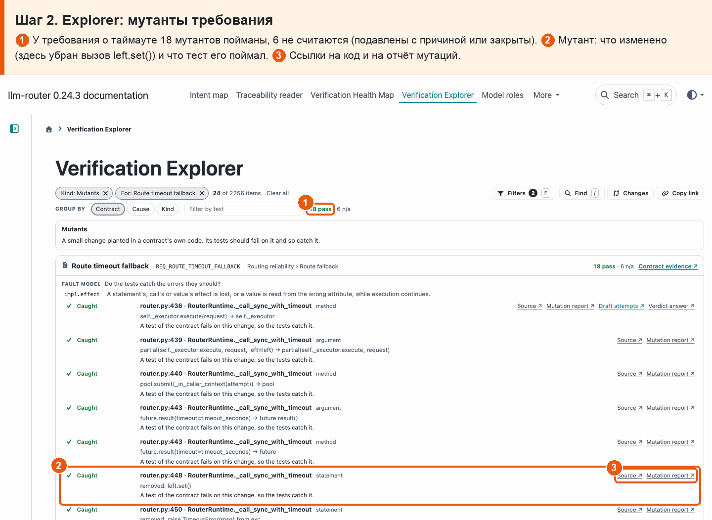

# 19 · Мутанты

**Боль.** Ловят ли тесты ошибки, которые должны ловить?

**Путь.**

1. **Карта: пойманы ли мутанты** ① Слой «Fault model»: ловят ли тесты ошибки, которые должны. ② Вид «Mutants caught»: доля пойманных мутантов по каждому требованию. ③ Легенда объясняет цвета.

   

2. **Explorer: мутанты требования** ① У требования о таймауте 18 мутантов пойманы, 6 не считаются (подавлены с причиной или закрыты). ② Мутант: что изменено (здесь убран вызов left.set()) и что тест его поймал. ③ Ссылки на код и на отчёт мутаций.

   

**Что получаю.** По каждому требованию видно, сколько посаженных ошибок пойманы, где выжившие и что с ними; у требования о таймауте пойманы все.
