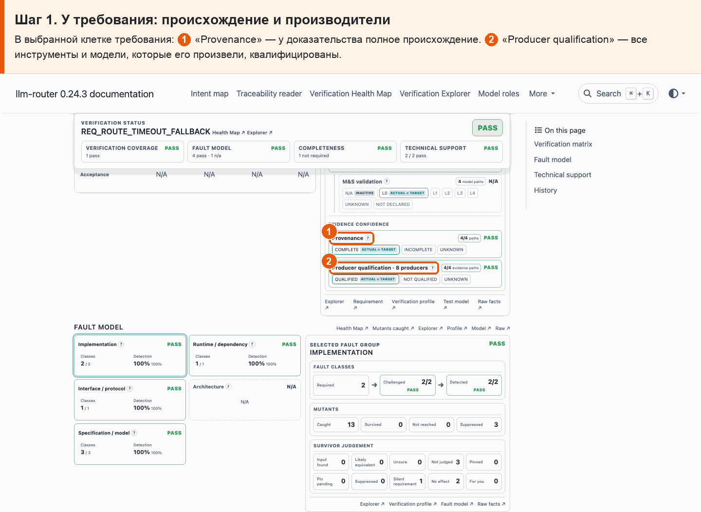
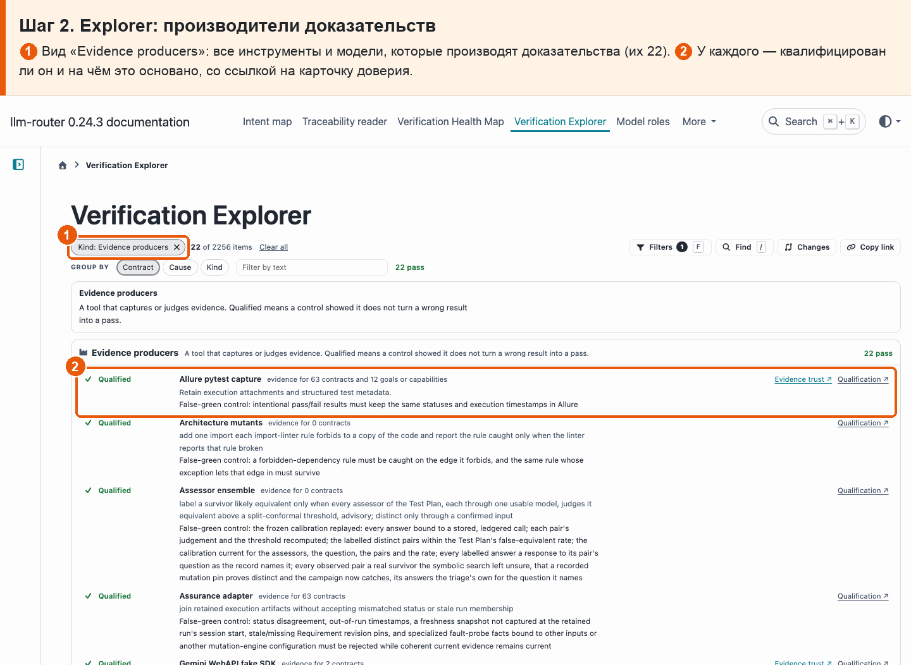
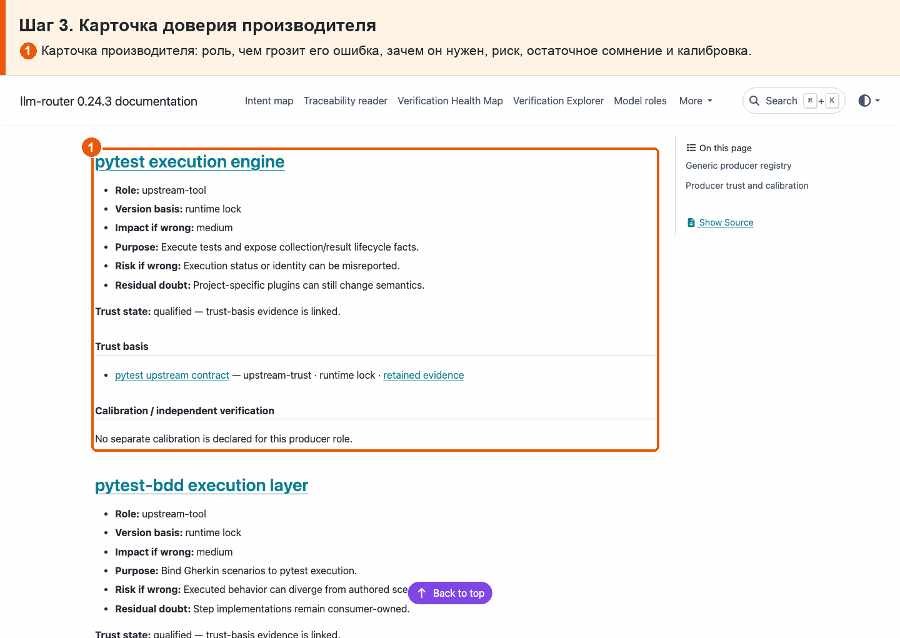

# 26 · Доверие к доказательствам

**Боль.** Можно ли доверять доказательствам: откуда они и проверены ли инструменты и модели, которые их дали?

**Путь.**

1. **У требования: происхождение и производители** В выбранной клетке требования: ① «Provenance» — у доказательства полное происхождение. ② «Producer qualification» — все инструменты и модели, которые его произвели, квалифицированы.

   

2. **Explorer: производители доказательств** ① Вид «Evidence producers»: все инструменты и модели, которые производят доказательства (их 22). ② У каждого — квалифицирован ли он и на чём это основано, со ссылкой на карточку доверия.

   

3. **Карточка доверия производителя** ① Карточка производителя: роль, чем грозит его ошибка, зачем он нужен, риск, остаточное сомнение и калибровка.

   

**Что получаю.** У каждого доказательства видно происхождение и кто его произвёл; каждый производитель квалифицирован, и есть его карточка: роль, риск, остаточное сомнение.
