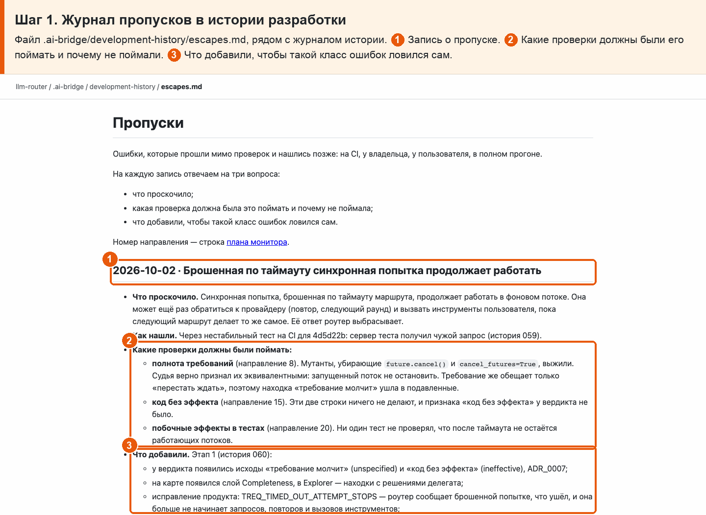

# 35 · Пропущенная ошибка → новая проверка

**Боль.** Какие ошибки прошли мимо проверок и что добавили, чтобы такие ловились сами?

**Путь.**

1. **Журнал пропусков в истории разработки** Файл .ai-bridge/development-history/escapes.md, рядом с журналом истории. ① Запись о пропуске. ② Какие проверки должны были его поймать и почему не поймали. ③ Что добавили, чтобы такой класс ошибок ловился сам.

   

**Что получаю.** Журнал пропусков: на каждую пропущенную ошибку — что проскочило, какая проверка должна была поймать и что добавили. Первая запись — брошенная по таймауту попытка.
