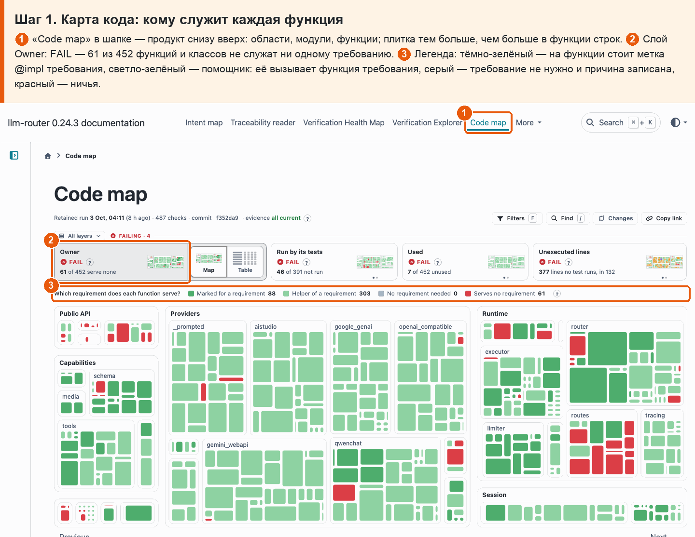
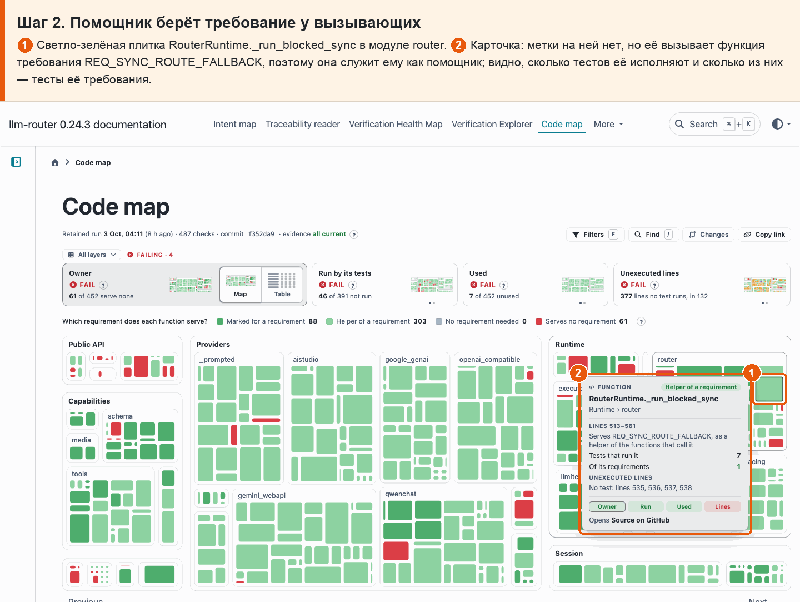
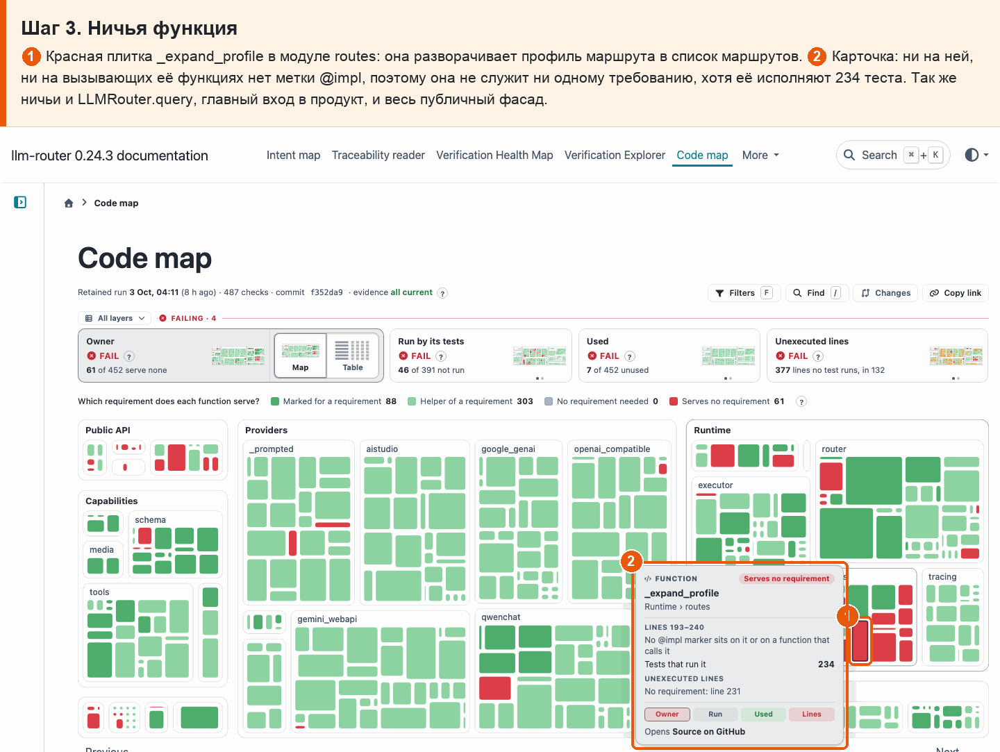
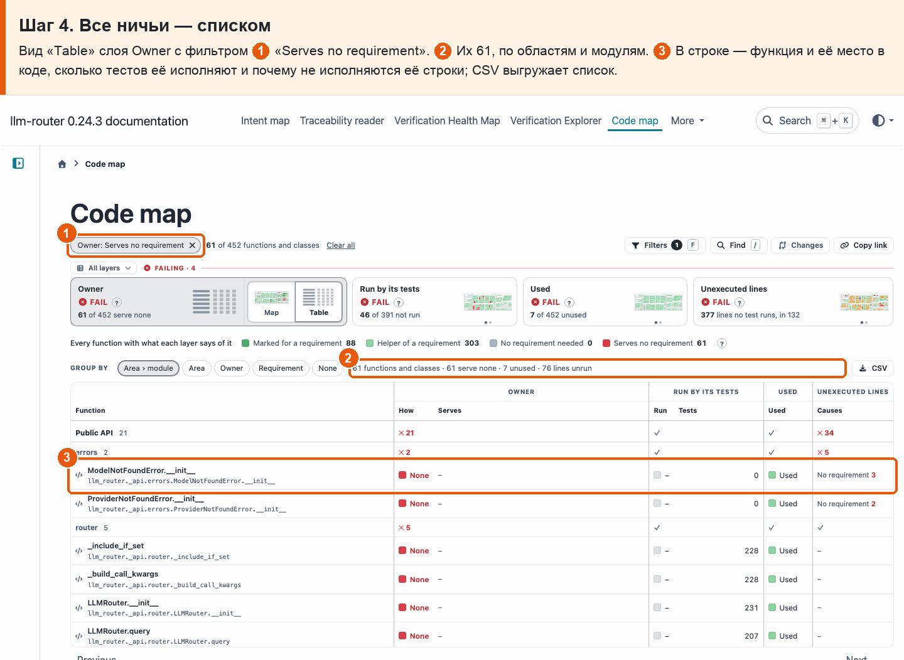

# 04 · Код без требования

**Боль.** Хочу видеть, какой код не служит ни одному требованию, и чем служебный код отличается от ничьего.

**Путь.**

1. **Карта кода: кому служит каждая функция** ① «Code map» в шапке — продукт снизу вверх: области, модули, функции; плитка тем больше, чем больше в функции строк. ② Слой Owner: FAIL — 61 из 452 функций и классов не служат ни одному требованию. ③ Легенда: тёмно-зелёный — на функции стоит метка @impl требования, светло-зелёный — помощник: её вызывает функция требования, серый — требование не нужно и причина записана, красный — ничья.

   

2. **Помощник берёт требование у вызывающих** ① Светло-зелёная плитка RouterRuntime.\_run_blocked_sync в модуле router. ② Карточка: метки на ней нет, но её вызывает функция требования REQ_SYNC_ROUTE_FALLBACK, поэтому она служит ему как помощник; видно, сколько тестов её исполняют и сколько из них — тесты её требования.

   

3. **Ничья функция** ① Красная плитка \_expand_profile в модуле routes: она разворачивает профиль маршрута в список маршрутов. ② Карточка: ни на ней, ни на вызывающих её функциях нет метки @impl, поэтому она не служит ни одному требованию, хотя её исполняют 234 теста. Так же ничьи и LLMRouter.query, главный вход в продукт, и весь публичный фасад.

   

4. **Все ничьи — списком** Вид «Table» слоя Owner с фильтром ① «Serves no requirement». ② Их 61, по областям и модулям. ③ В строке — функция и её место в коде, сколько тестов её исполняют и почему не исполняются её строки; CSV выгружает список.

   

**Что получаю.** Каждая функция окрашена по тому, кому она служит: по своей метке @impl, как помощник вызывающих её функций, с записанной причиной или никому. Ничьих сейчас 61 — публичный фасад (LLMRouter, Session), сборка конфигурации и маршрутов, классы ошибок и неиспользуемый код; они остаются красными, пока требование или записанная причина их не покроют.
