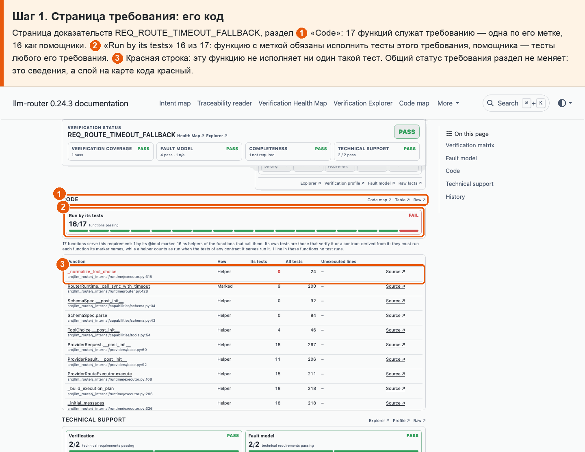
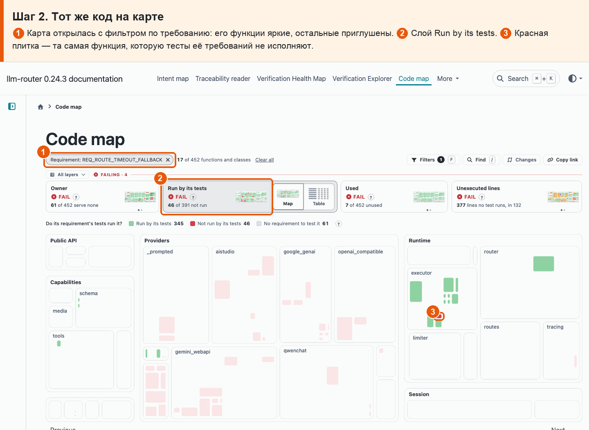
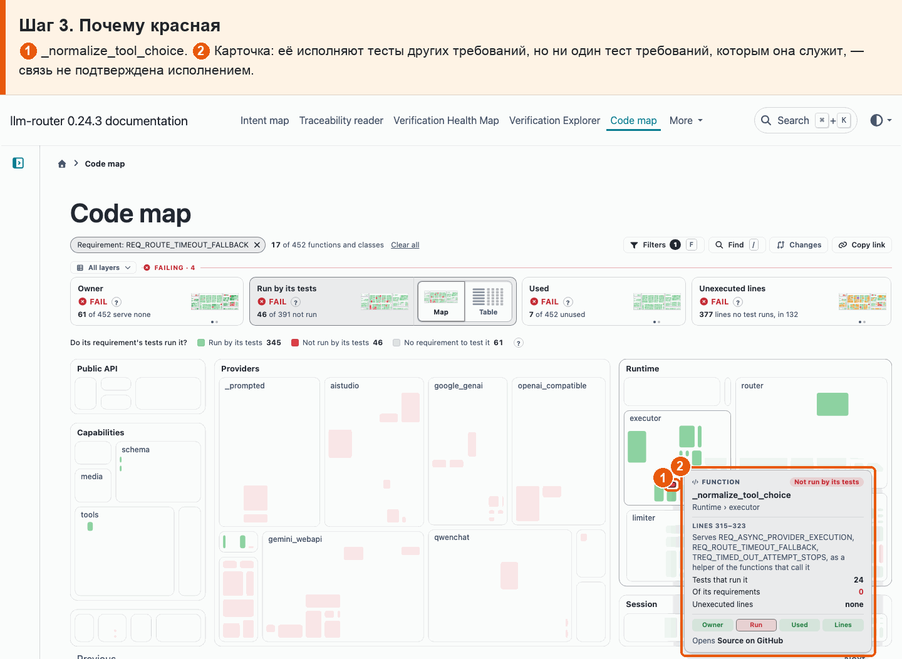

# 06 · Связь подтверждена исполнением

**Боль.** Метка @impl говорит, что функция реализует требование. Хочу видеть, исполняют ли эту функцию тесты самого требования.

**Путь.**

1. **Страница требования: его код** Страница доказательств REQ_ROUTE_TIMEOUT_FALLBACK, раздел ① «Code»: 17 функций служат требованию — одна по его метке, 16 как помощники. ② «Run by its tests» 16 из 17: функцию с меткой обязаны исполнить тесты этого требования, помощника — тесты любого его требования. ③ Красная строка: эту функцию не исполняет ни один такой тест. Общий статус требования раздел не меняет: это сведения, а слой на карте кода красный.

   

2. **Тот же код на карте** ① Карта открылась с фильтром по требованию: его функции яркие, остальные приглушены. ② Слой Run by its tests. ③ Красная плитка — та самая функция, которую тесты её требований не исполняют.

   

3. **Почему красная** ① \_normalize_tool_choice. ② Карточка: её исполняют тесты других требований, но ни один тест требований, которым она служит, — связь не подтверждена исполнением.

   

**Что получаю.** По каждой функции требования видно, исполняют ли её его тесты. У REQ_ROUTE_TIMEOUT_FALLBACK одну из 17 функций (\_normalize_tool_choice) не исполняет ни один тест её требований: её связь с требованием не подтверждена исполнением. Всего таких функций 46.
