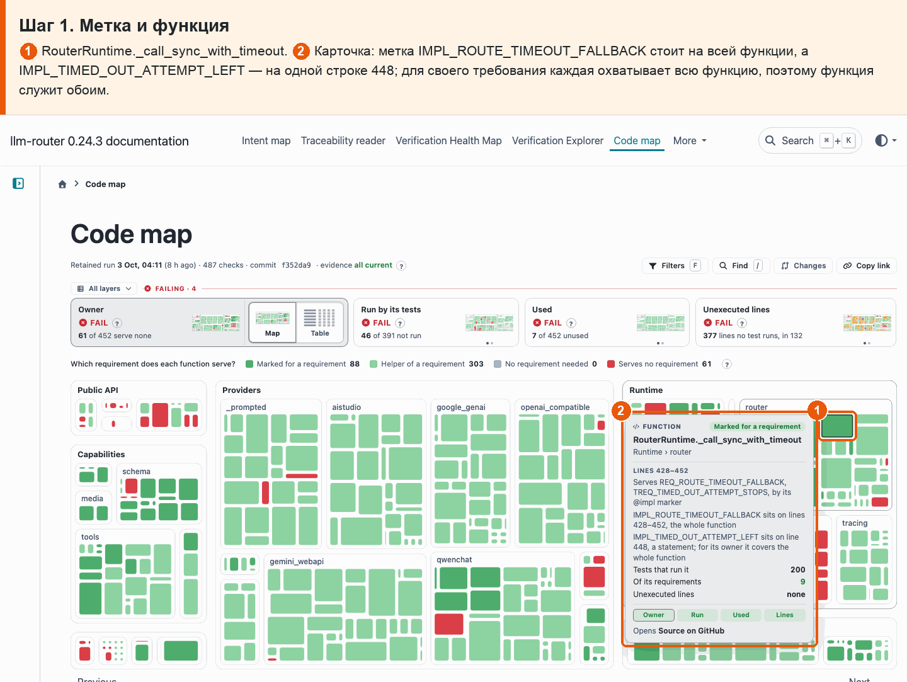

# 07 · Метка относится ко всей функции

**Боль.** Метка @impl стоит на одной строке. Хочу видеть, что она охватывает и какую функцию относит к требованию.

**Путь.**

1. **Метка и функция** ① RouterRuntime.\_call_sync_with_timeout. ② Карточка: метка IMPL_ROUTE_TIMEOUT_FALLBACK стоит на всей функции, а IMPL_TIMED_OUT_ATTEMPT_LEFT — на одной строке 448; для своего требования каждая охватывает всю функцию, поэтому функция служит обоим.

   

**Что получаю.** Видно, где стоит каждая метка и что она охватывает: для владения метка на одной строке относит к своему требованию всю функцию, а кампания мутаций по-прежнему сажает мутантов только в строки самой метки.
