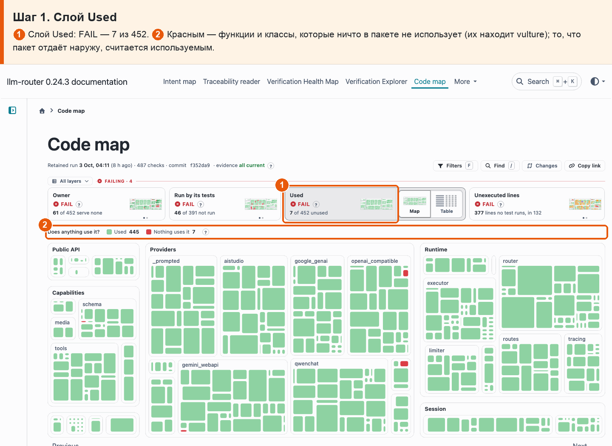
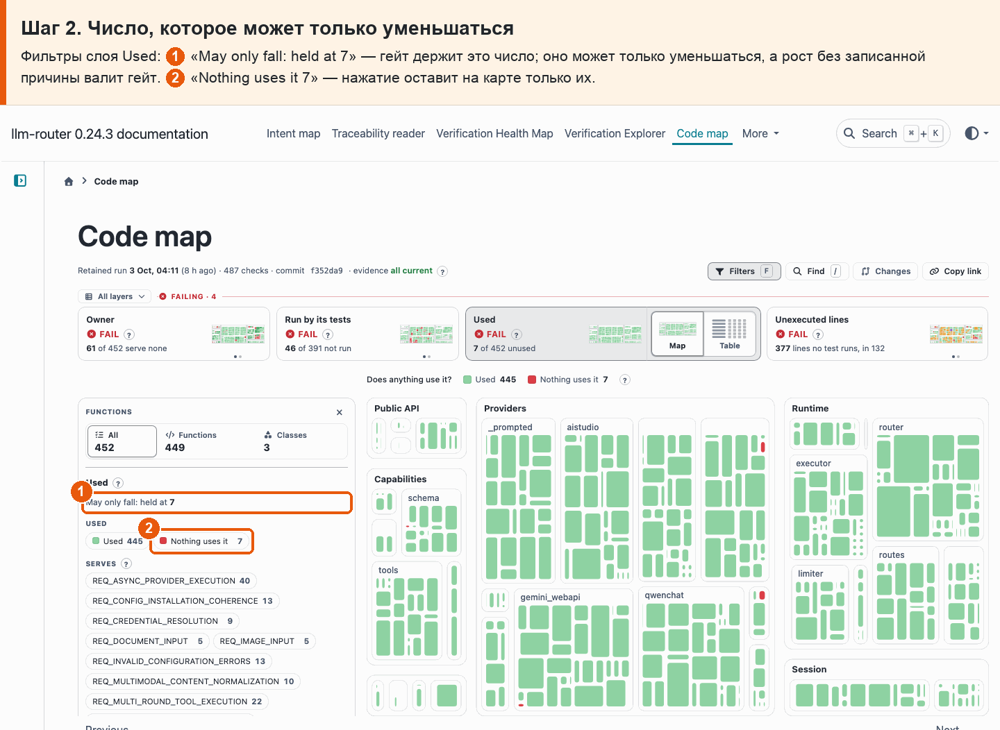
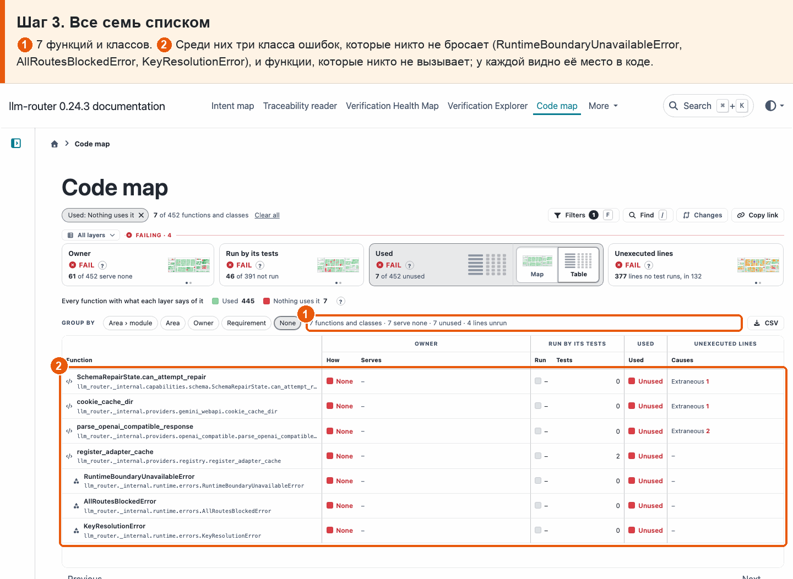

# 14 · Неиспользуемый код

**Боль.** Хочу видеть код, которым ничто не пользуется, и чтобы его не становилось больше.

**Путь.**

1. **Слой Used** ① Слой Used: FAIL — 7 из 452. ② Красным — функции и классы, которые ничто в пакете не использует (их находит vulture); то, что пакет отдаёт наружу, считается используемым.

   

2. **Число, которое может только уменьшаться** Фильтры слоя Used: ① «May only fall: held at 7» — гейт держит это число; оно может только уменьшаться, а рост без записанной причины валит гейт. ② «Nothing uses it 7» — нажатие оставит на карте только их.

   

3. **Все семь списком** ① 7 функций и классов. ② Среди них три класса ошибок, которые никто не бросает (RuntimeBoundaryUnavailableError, AllRoutesBlockedError, KeyResolutionError), и функции, которые никто не вызывает; у каждой видно её место в коде.

   

**Что получаю.** Неиспользуемый код виден цветом и списком: сейчас 7 — четыре функции и три класса ошибок, которые никто не бросает. Гейт держит это число: оно может только уменьшаться, а рост без записанной причины валит гейт.
