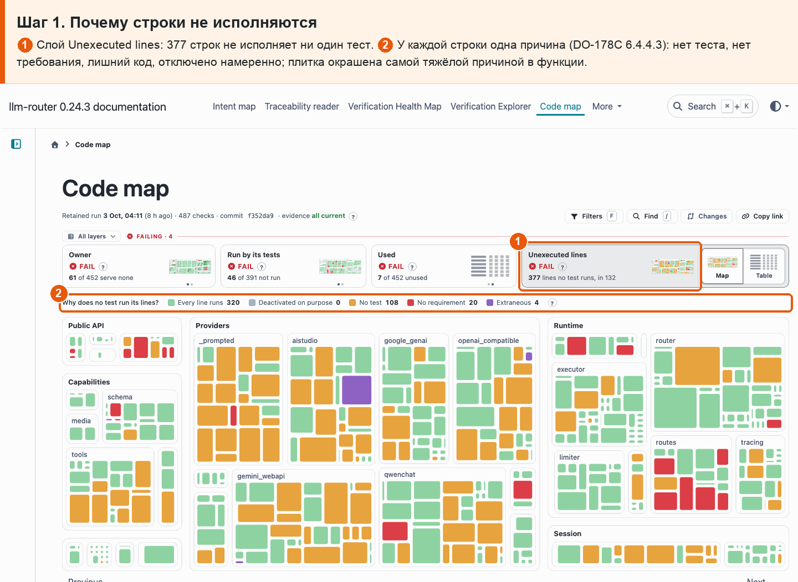
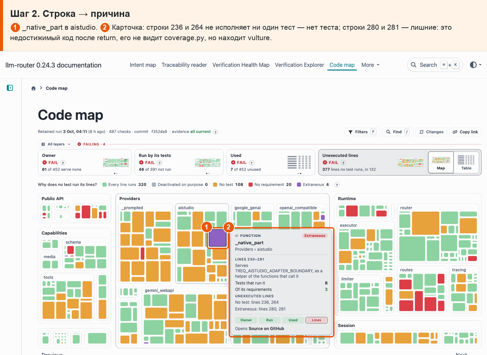
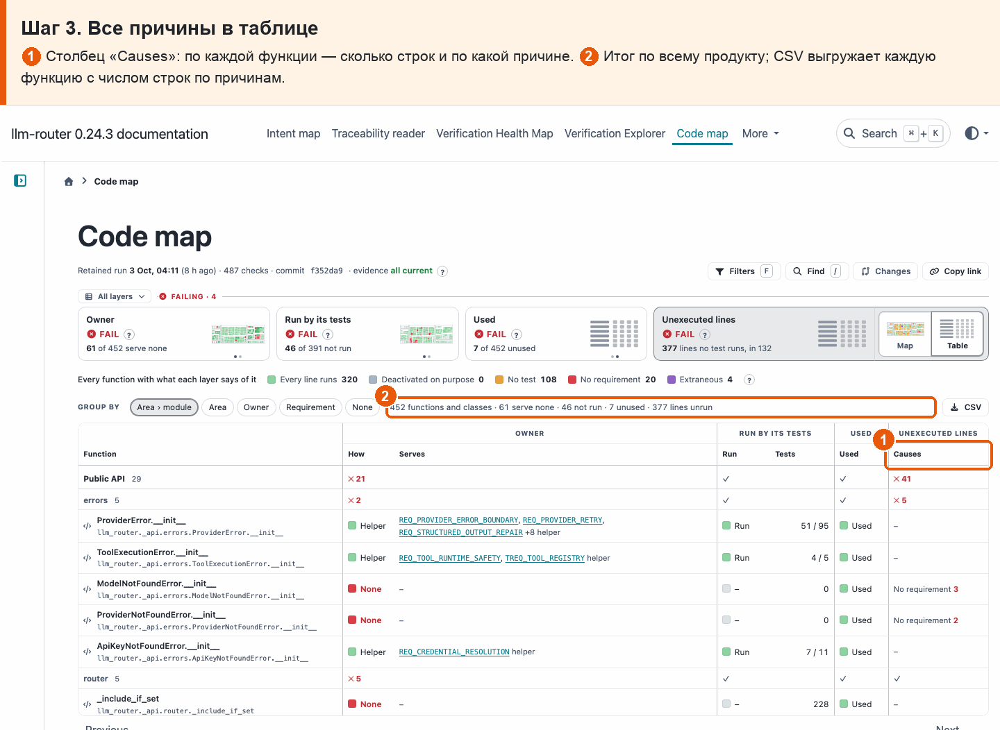

# 16 · Разбор неисполняемых строк на 4 причины

**Боль.** Хочу знать про каждую строку, которую не исполняет ни один тест, почему: нет теста, нет требования, код лишний или отключён намеренно.

**Путь.**

1. **Почему строки не исполняются** ① Слой Unexecuted lines: 377 строк не исполняет ни один тест. ② У каждой строки одна причина (DO-178C 6.4.4.3): нет теста, нет требования, лишний код, отключено намеренно; плитка окрашена самой тяжёлой причиной в функции.

   

2. **Строка → причина** ① \_native_part в aistudio. ② Карточка: строки 236 и 264 не исполняет ни один тест — нет теста; строки 280 и 281 — лишние: это недостижимый код после return, его не видит coverage.py, но находит vulture.

   

3. **Все причины в таблице** ① Столбец «Causes»: по каждой функции — сколько строк и по какой причине. ② Итог по всему продукту; CSV выгружает каждую функцию с числом строк по причинам.

   

**Что получаю.** Каждая неисполняемая строка получает одну причину: сейчас 299 строк без теста своего требования, 72 строки без требования, 6 лишних (неиспользуемый и недостижимый код) и 0 отключённых намеренно. По функции видно, какие именно строки и почему.
