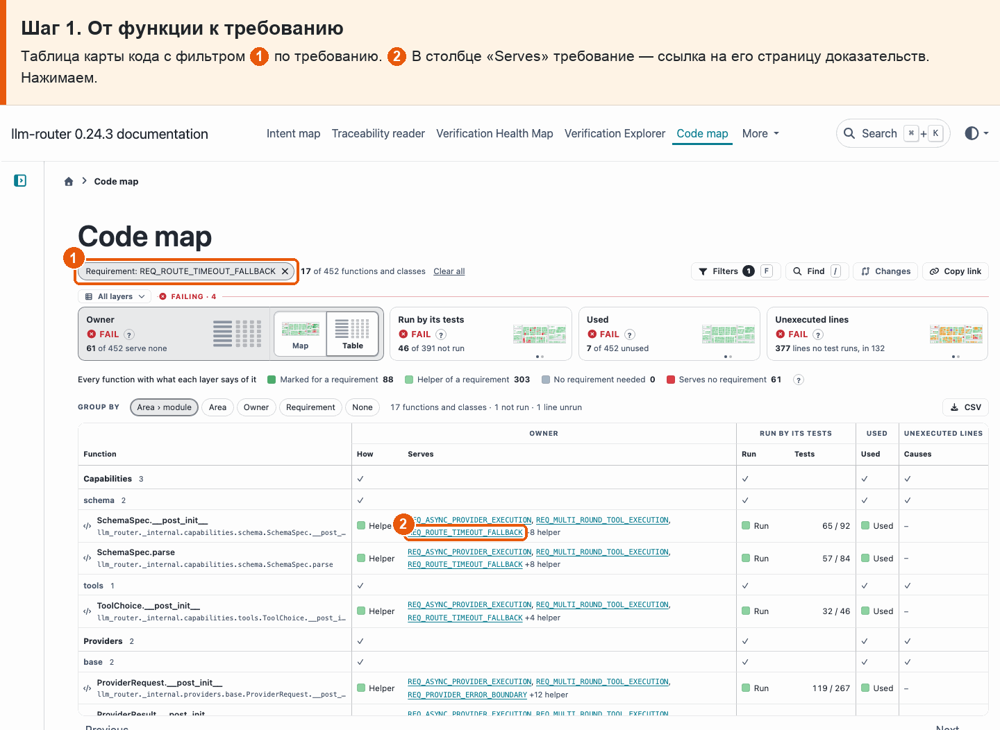
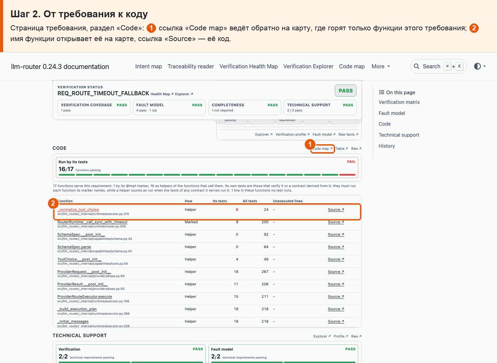

# 37 · Связи в обе стороны на сайте

**Боль.** Хочу переходить от функции к требованию, которому она служит, и от требования — к его функциям.

**Путь.**

1. **От функции к требованию** Таблица карты кода с фильтром ① по требованию. ② В столбце «Serves» требование — ссылка на его страницу доказательств. Нажимаем.

   

2. **От требования к коду** Страница требования, раздел «Code»: ① ссылка «Code map» ведёт обратно на карту, где горят только функции этого требования; ② имя функции открывает её на карте, ссылка «Source» — её код.

   

**Что получаю.** Между кодом и требованием можно ходить в обе стороны: из таблицы карты кода — на страницу требования, со страницы требования — на карту, где горят только его функции, а имя функции открывает её на карте.
