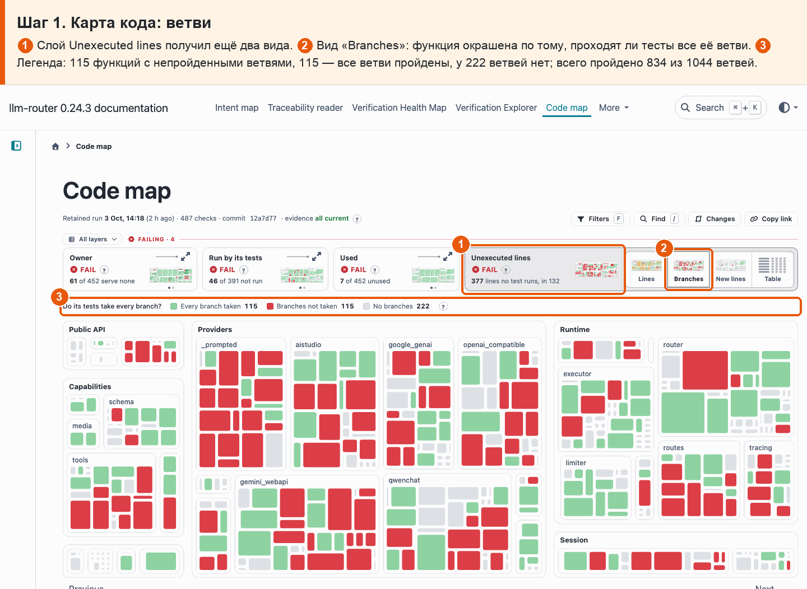
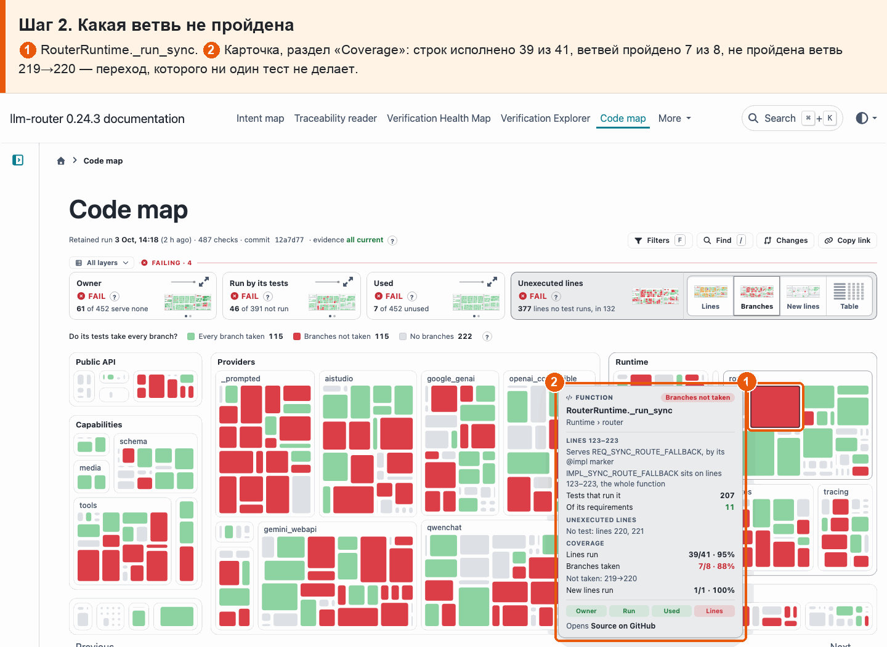
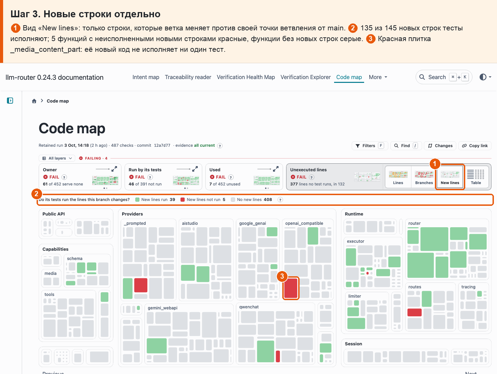
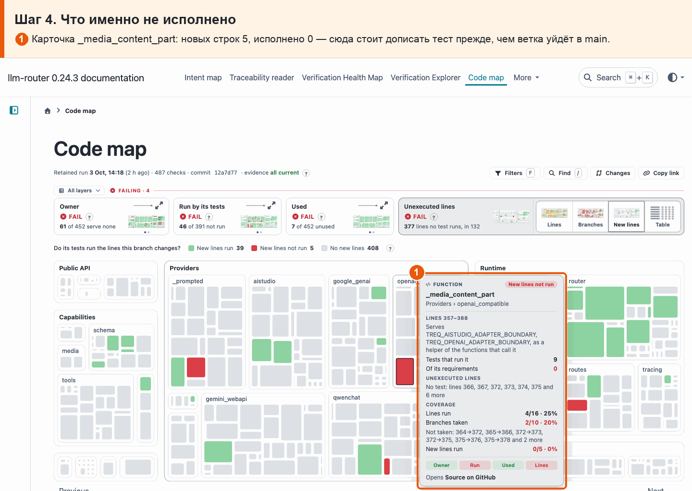
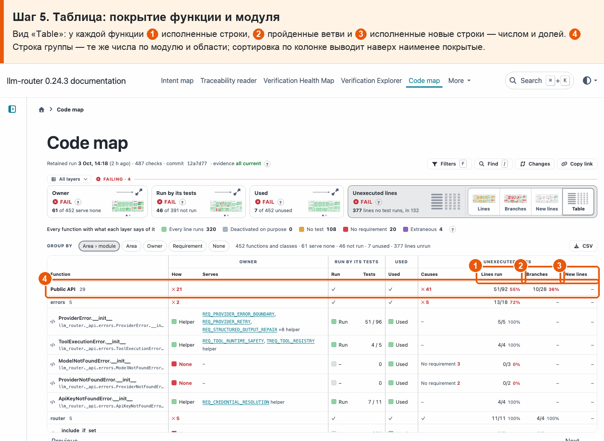

# 18 · Покрытие строк и ветвей

**Боль.** Хочу видеть покрытие каждой функции и модуля не только по строкам, но и по ветвям, и отдельно — исполняют ли тесты строки, которые меняет эта ветка.

**Путь.**

1. **Карта кода: ветви** ① Слой Unexecuted lines получил ещё два вида. ② Вид «Branches»: функция окрашена по тому, проходят ли тесты все её ветви. ③ Легенда: 115 функций с непройденными ветвями, 115 — все ветви пройдены, у 222 ветвей нет; всего пройдено 834 из 1044 ветвей.

   

2. **Какая ветвь не пройдена** ① RouterRuntime.\_run_sync. ② Карточка, раздел «Coverage»: строк исполнено 39 из 41, ветвей пройдено 7 из 8, не пройдена ветвь 219→220 — переход, которого ни один тест не делает.

   

3. **Новые строки отдельно** ① Вид «New lines»: только строки, которые ветка меняет против своей точки ветвления от main. ② 135 из 145 новых строк тесты исполняют; 5 функций с неисполненными новыми строками красные, функции без новых строк серые. ③ Красная плитка \_media_content_part: её новый код не исполняет ни один тест.

   

4. **Что именно не исполнено** ① Карточка \_media_content_part: новых строк 5, исполнено 0 — сюда стоит дописать тест прежде, чем ветка уйдёт в main.

   

5. **Таблица: покрытие функции и модуля** Вид «Table»: у каждой функции ① исполненные строки, ② пройденные ветви и ③ исполненные новые строки — числом и долей. ④ Строка группы — те же числа по модулю и области; сортировка по колонке выводит наверх наименее покрытые.

   

**Что получаю.** Прогон тестов теперь меряет ветви. Тесты проходят 834 из 1044 ветвей (79%) и исполняют 2217 из 2592 строк функций. Из 145 строк, которые ветка меняет против main, тесты не исполняют 10 — в пяти функциях; например, весь новый код \_media_content_part в openai_compatible.
