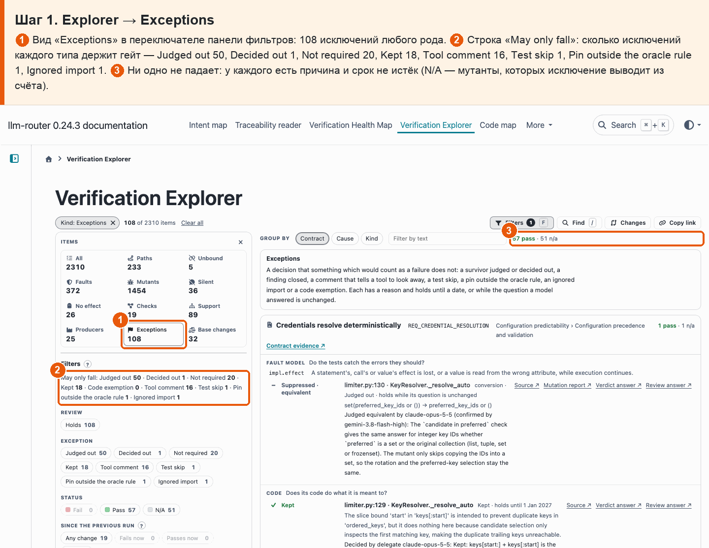
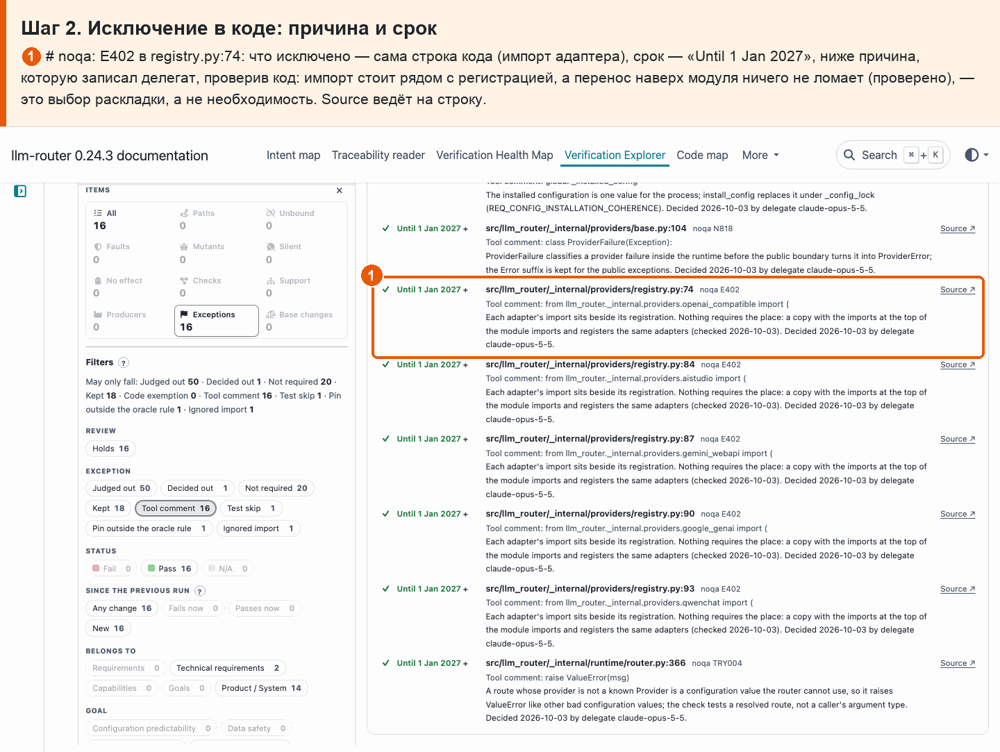
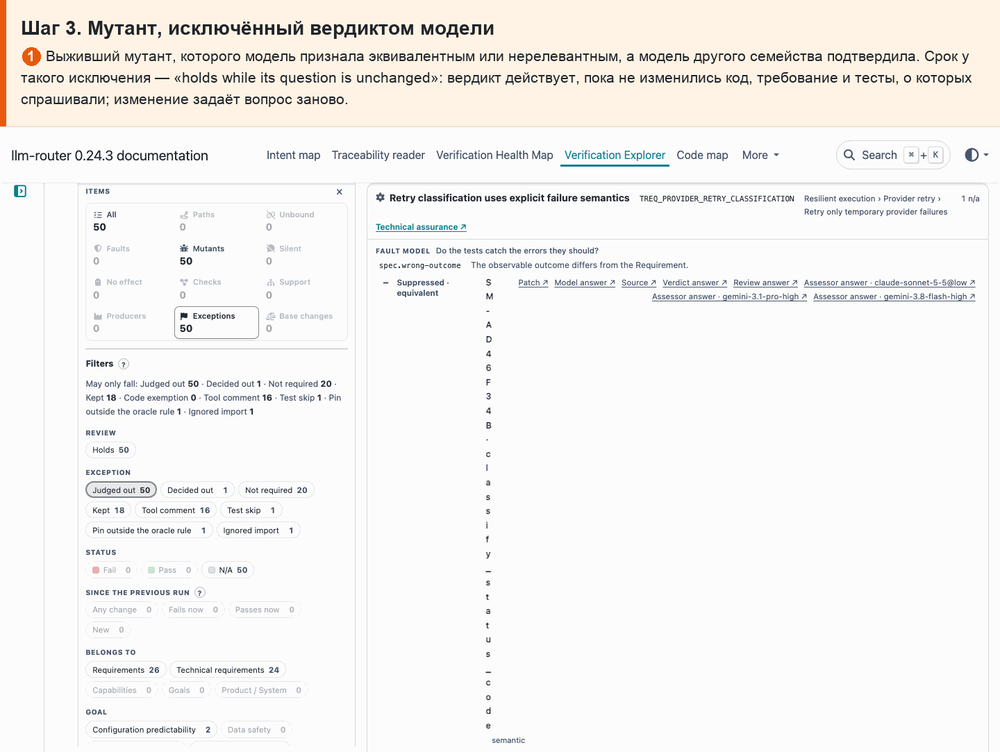
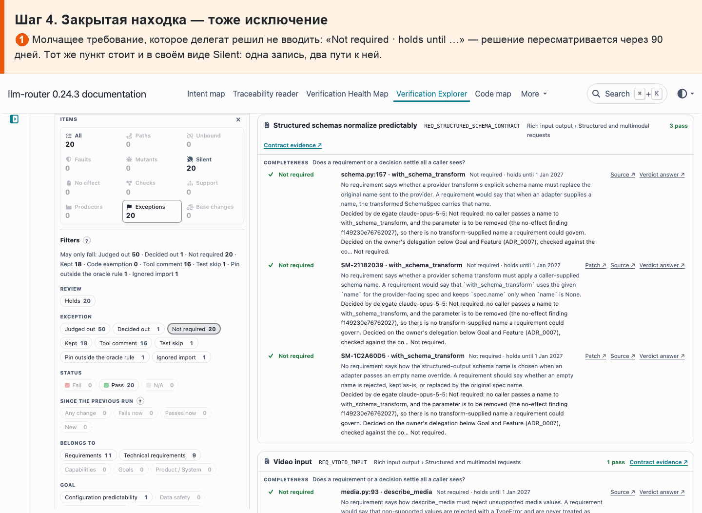
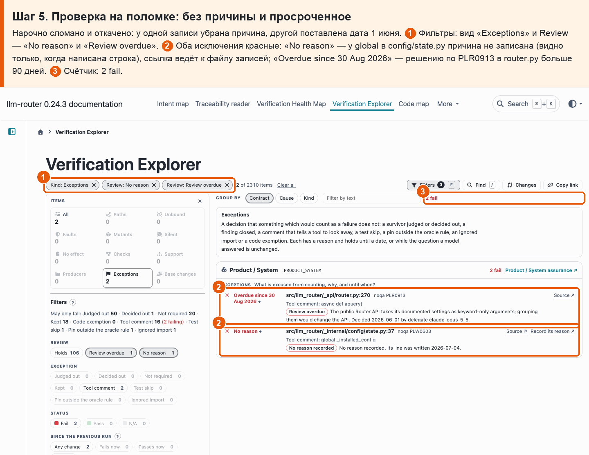

# 30 · Единый реестр исключений

**Боль.** Исключения разбросаны: вердикты по мутантам, закрытые находки, # noqa и # pragma в коде, пропуски тестов. Хочу видеть их все в одном месте, у каждого — причину и срок, и чтобы их число не росло незаметно.

**Путь.**

1. **Explorer → Exceptions** ① Вид «Exceptions» в переключателе панели фильтров: 108 исключений любого рода. ② Строка «May only fall»: сколько исключений каждого типа держит гейт — Judged out 50, Decided out 1, Not required 20, Kept 18, Tool comment 16, Test skip 1, Pin outside the oracle rule 1, Ignored import 1. ③ Ни одно не падает: у каждого есть причина и срок не истёк (N/A — мутанты, которых исключение выводит из счёта).

   

2. **Исключение в коде: причина и срок** ① # noqa: E402 в registry.py:74: что исключено — сама строка кода (импорт адаптера), срок — «Until 1 Jan 2027», ниже причина, которую записал делегат, проверив код: импорт стоит рядом с регистрацией, а перенос наверх модуля ничего не ломает (проверено), — это выбор раскладки, а не необходимость. Source ведёт на строку.

   

3. **Мутант, исключённый вердиктом модели** ① Выживший мутант, которого модель признала эквивалентным или нерелевантным, а модель другого семейства подтвердила. Срок у такого исключения — «holds while its question is unchanged»: вердикт действует, пока не изменились код, требование и тесты, о которых спрашивали; изменение задаёт вопрос заново.

   

4. **Закрытая находка — тоже исключение** ① Молчащее требование, которое делегат решил не вводить: «Not required · holds until …» — решение пересматривается через 90 дней. Тот же пункт стоит и в своём виде Silent: одна запись, два пути к ней.

   

5. **Проверка на поломке: без причины и просроченное** Нарочно сломано и откачено: у одной записи убрана причина, другой поставлена дата 1 июня. ① Фильтры: вид «Exceptions» и Review — «No reason» и «Review overdue». ② Оба исключения красные: «No reason» — у global в config/state.py причина не записана (видно только, когда написана строка), ссылка ведёт к файлу записей; «Overdue since 30 Aug 2026» — решению по PLR0913 в router.py больше 90 дней. ③ Счётчик: 2 fail.

   

**Что получаю.** Все 108 исключений в одном списке Explorer: 51 мутант, исключённый вердиктом или решением, 38 закрытых находок и 19 исключений в коде. У каждого — причина, кто решил, когда и до какого срока действует. Вердикт модели действует, пока не изменился её вопрос; остальное — 90 дней от решения. Число по каждому типу может только уменьшаться: рост без записанной причины валит гейт.
