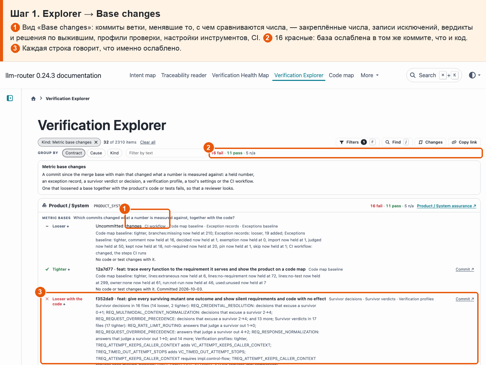
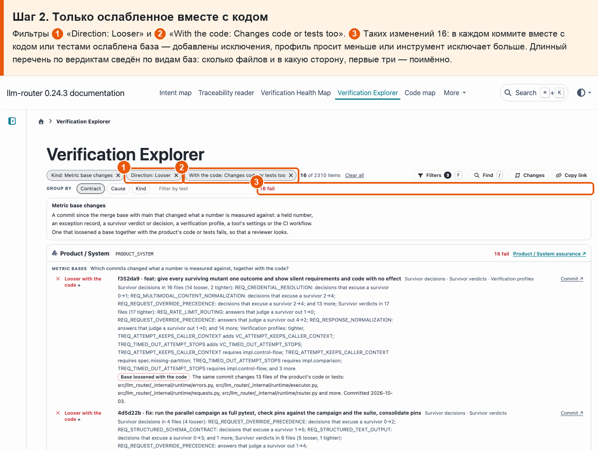
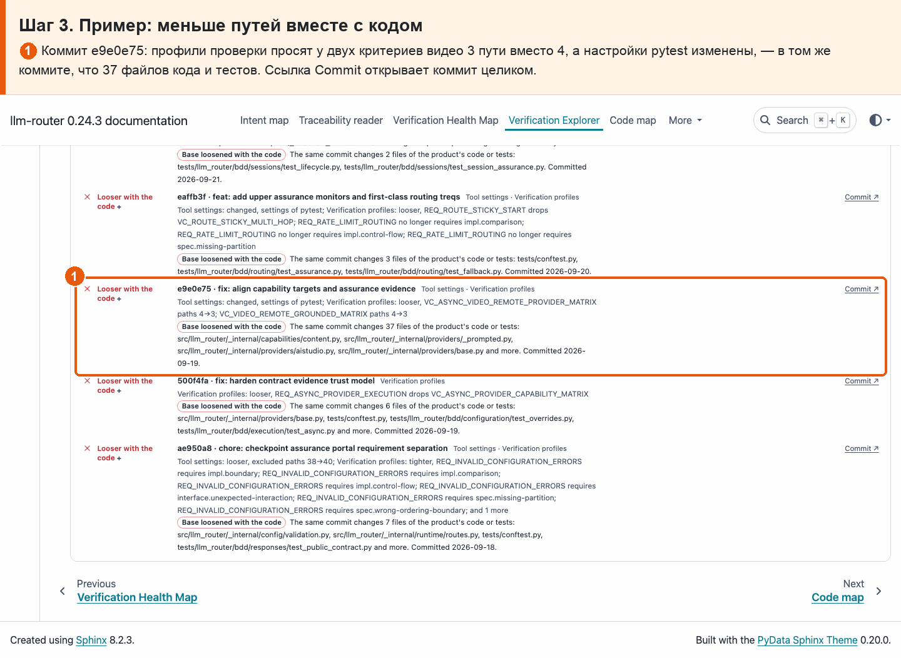
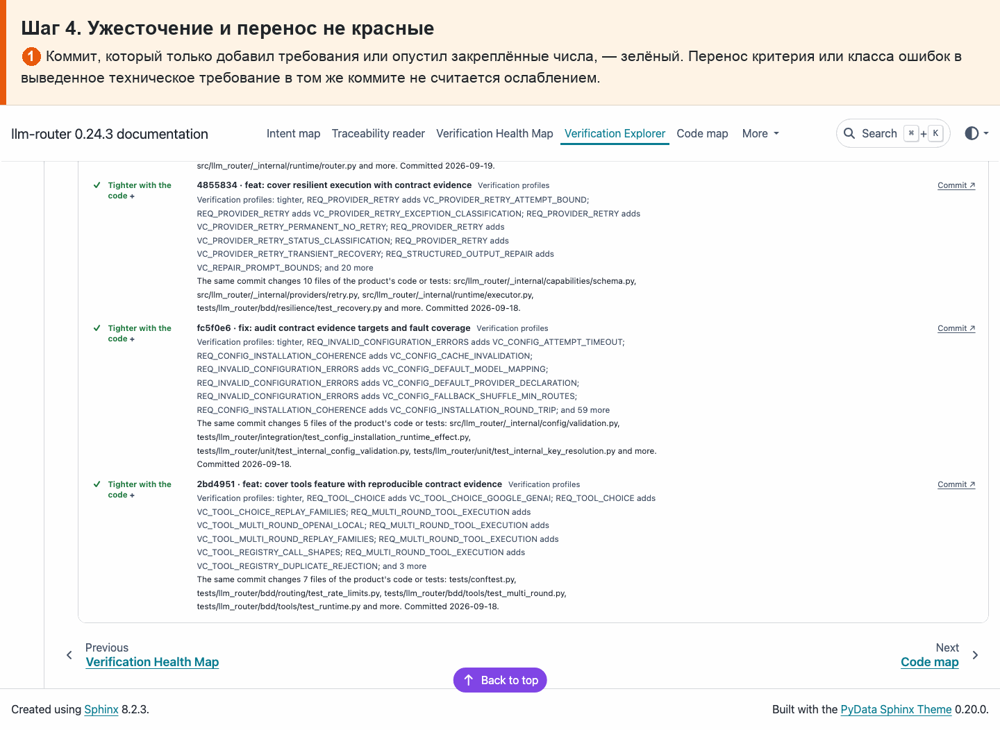

# 31 · Защита метрик от подкрутки

**Боль.** Число может улучшиться не потому, что продукт стал лучше, а потому что ослабили то, с чем его сравнивают: подняли порог, добавили исключение, убрали обязательный путь из профиля. Хочу видеть, когда базу метрики меняли вместе с кодом.

**Путь.**

1. **Explorer → Base changes** ① Вид «Base changes»: коммиты ветки, менявшие то, с чем сравниваются числа, — закреплённые числа, записи исключений, вердикты и решения по выжившим, профили проверки, настройки инструментов, CI. ② 16 красные: база ослаблена в том же коммите, что и код. ③ Каждая строка говорит, что именно ослаблено.

   

2. **Только ослабленное вместе с кодом** Фильтры ① «Direction: Looser» и ② «With the code: Changes code or tests too». ③ Таких изменений 16: в каждом коммите вместе с кодом или тестами ослаблена база — добавлены исключения, профиль просит меньше или инструмент исключает больше. Длинный перечень по вердиктам сведён по видам баз: сколько файлов и в какую сторону, первые три — поимённо.

   

3. **Пример: меньше путей вместе с кодом** ① Коммит e9e0e75: профили проверки просят у двух критериев видео 3 пути вместо 4, а настройки pytest изменены, — в том же коммите, что 37 файлов кода и тестов. Ссылка Commit открывает коммит целиком.

   

4. **Ужесточение и перенос не красные** ① Коммит, который только добавил требования или опустил закреплённые числа, — зелёный. Перенос критерия или класса ошибок в выведенное техническое требование в том же коммите не считается ослаблением.

   

**Что получаю.** Explorer → «Base changes» перечисляет каждый коммит ветки, который менял базу метрики, с тем, ослабил он её или ужесточил. Из 32 изменений 16 ослабили базу в одном коммите с кодом или тестами — они красные; например, e9e0e75 снизил число обязательных путей двух критериев видео с 4 до 3. Гейт это не валит: отметка просит человека посмотреть.
