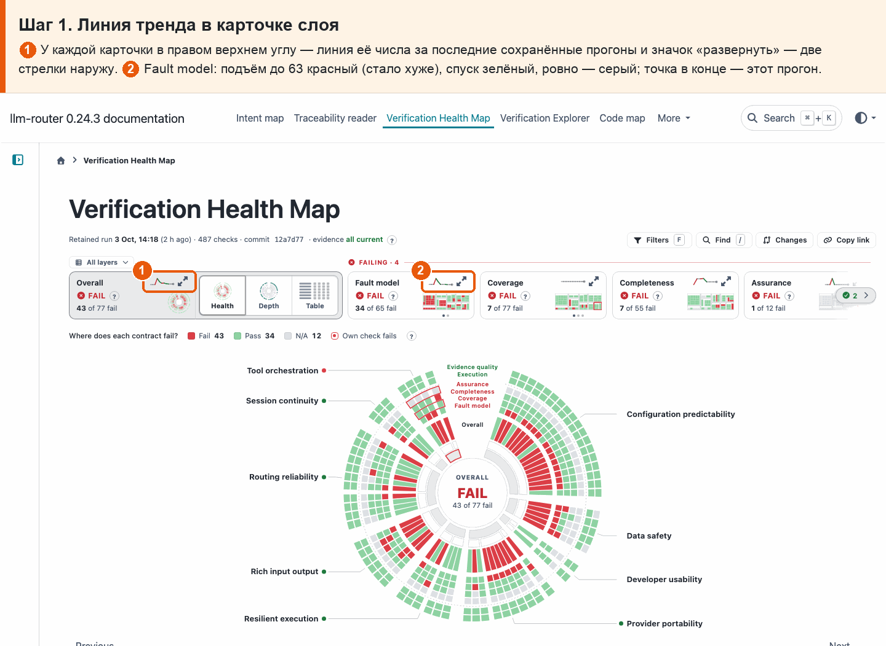
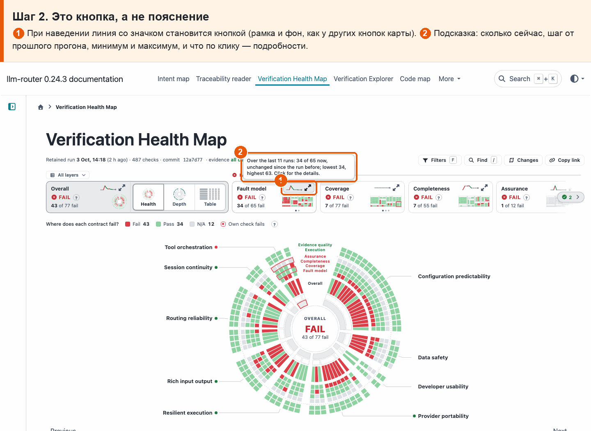
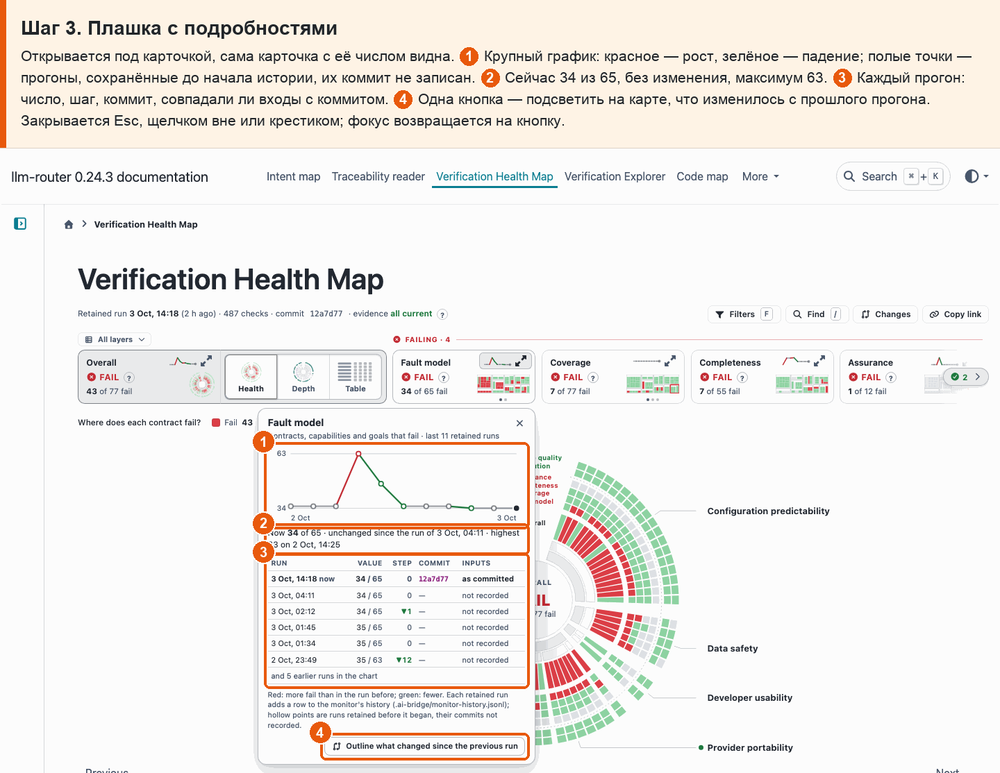
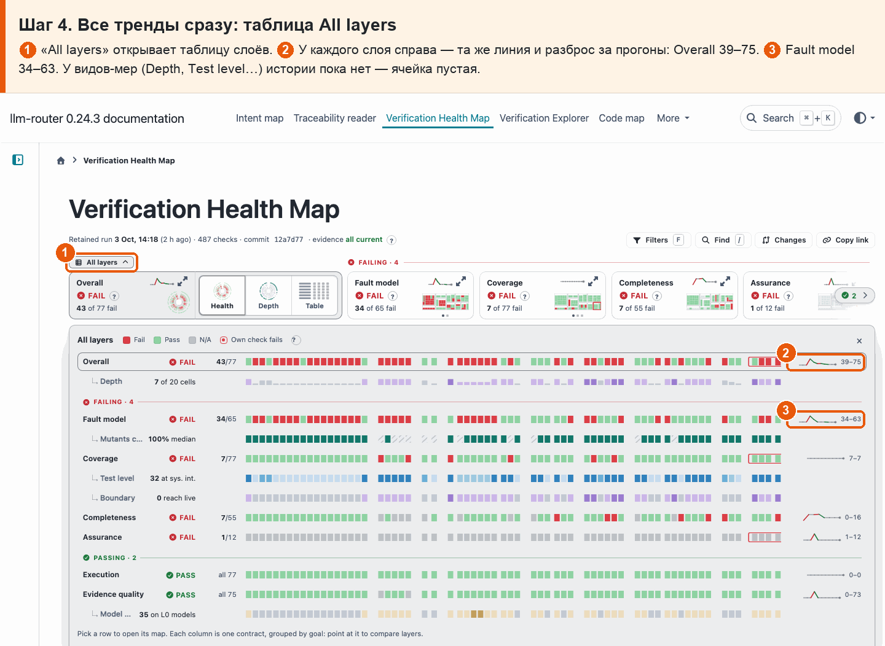
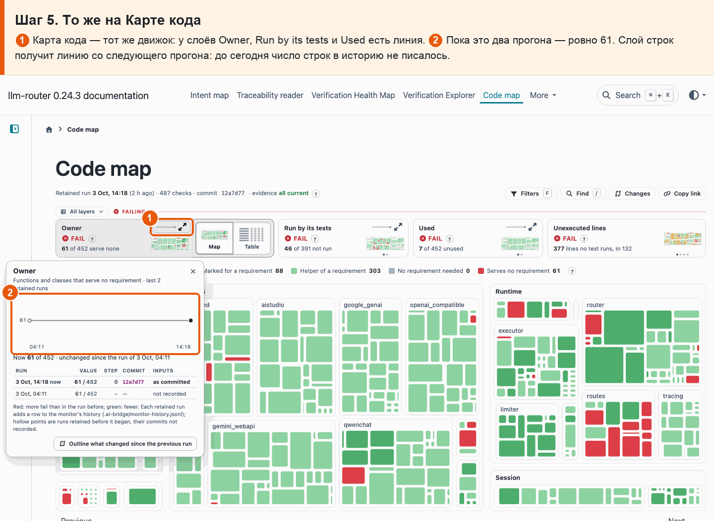

# 36 · Тренды и регресс

**Боль.** Хочу видеть у каждого числа, куда оно идёт от прогона к прогону, и чтобы рост того, что падает, был красным; маленькая линия — с понятным путём к подробностям.

**Путь.**

1. **Линия тренда в карточке слоя** ① У каждой карточки в правом верхнем углу — линия её числа за последние сохранённые прогоны и значок «развернуть» — две стрелки наружу. ② Fault model: подъём до 63 красный (стало хуже), спуск зелёный, ровно — серый; точка в конце — этот прогон.

   

2. **Это кнопка, а не пояснение** ① При наведении линия со значком становится кнопкой (рамка и фон, как у других кнопок карты). ② Подсказка: сколько сейчас, шаг от прошлого прогона, минимум и максимум, и что по клику — подробности.

   

3. **Плашка с подробностями** Открывается под карточкой, сама карточка с её числом видна. ① Крупный график: красное — рост, зелёное — падение; полые точки — прогоны, сохранённые до начала истории, их коммит не записан. ② Сейчас 34 из 65, без изменения, максимум 63. ③ Каждый прогон: число, шаг, коммит, совпадали ли входы с коммитом. ④ Одна кнопка — подсветить на карте, что изменилось с прошлого прогона. Закрывается Esc, щелчком вне или крестиком; фокус возвращается на кнопку.

   

4. **Все тренды сразу: таблица All layers** ① «All layers» открывает таблицу слоёв. ② У каждого слоя справа — та же линия и разброс за прогоны: Overall 39–75. ③ Fault model 34–63. У видов-мер (Depth, Test level…) истории пока нет — ячейка пустая.

   

5. **То же на Карте кода** ① Карта кода — тот же движок: у слоёв Owner, Run by its tests и Used есть линия. ② Пока это два прогона — ровно 61. Слой строк получит линию со следующего прогона: до сегодня число строк в историю не писалось.

   

**Что получаю.** У каждой карточки слоя в правом верхнем углу — короткая линия числа по сохранённым прогонам со значком «развернуть» (две стрелки наружу): это кнопка, как focus mode в Power BI или развёртывание виджета в Datadog, а не «?» с пояснением. Рост красный, падение зелёное. По клику — плашка: крупный график, каждый прогон с числом, шагом, коммитом и тем, совпадали ли входы с коммитом, и кнопка «что изменилось». В таблице All layers у каждого слоя та же линия и разброс. Числа берутся из истории монитора (`monitor-history.jsonl`).
