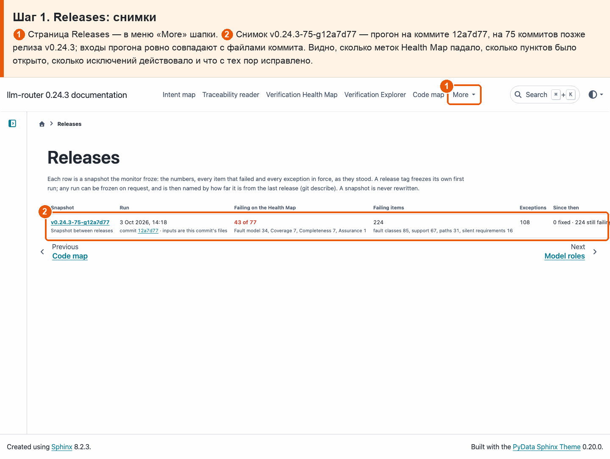
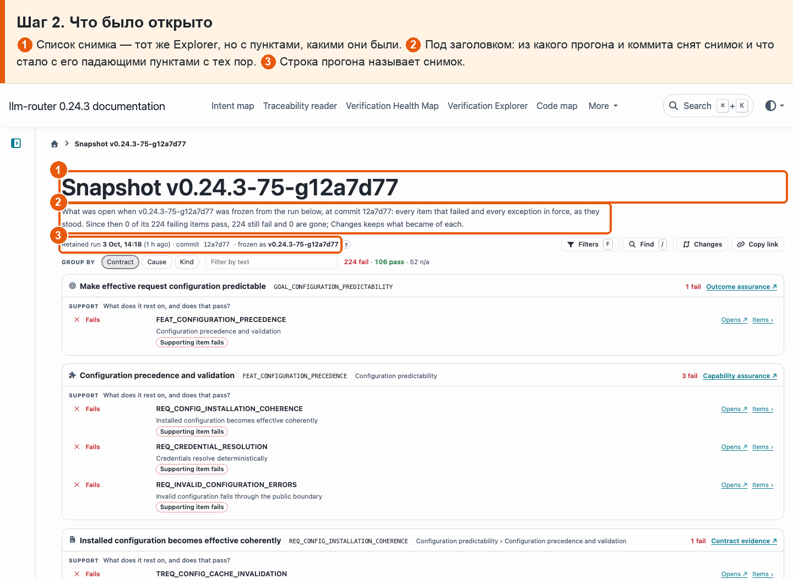

# 38 · Снимок на релиз

**Боль.** Хочу знать, что было открыто в момент релиза: какие проверки падали и какие исключения действовали, — и что с тех пор исправлено.

**Путь.**

1. **Releases: снимки** ① Страница Releases — в меню «More» шапки. ② Снимок v0.24.3-75-g12a7d77 — прогон на коммите 12a7d77, на 75 коммитов позже релиза v0.24.3; входы прогона ровно совпадают с файлами коммита. Видно, сколько меток Health Map падало, сколько пунктов было открыто, сколько исключений действовало и что с тех пор исправлено.

   

2. **Что было открыто** ① Список снимка — тот же Explorer, но с пунктами, какими они были. ② Под заголовком: из какого прогона и коммита снят снимок и что стало с его падающими пунктами с тех пор. ③ Строка прогона называет снимок.

   

**Что получаю.** Первый прогон монитора на теге релиза замораживает снимок: числа, все падающие пункты и все действующие исключения; по запросу снимок можно снять и между релизами. Снимок не переписывается. Страница Releases перечисляет снимки, а каждый открывается списком Explorer «как было», с отметкой, что стало с каждым пунктом.
