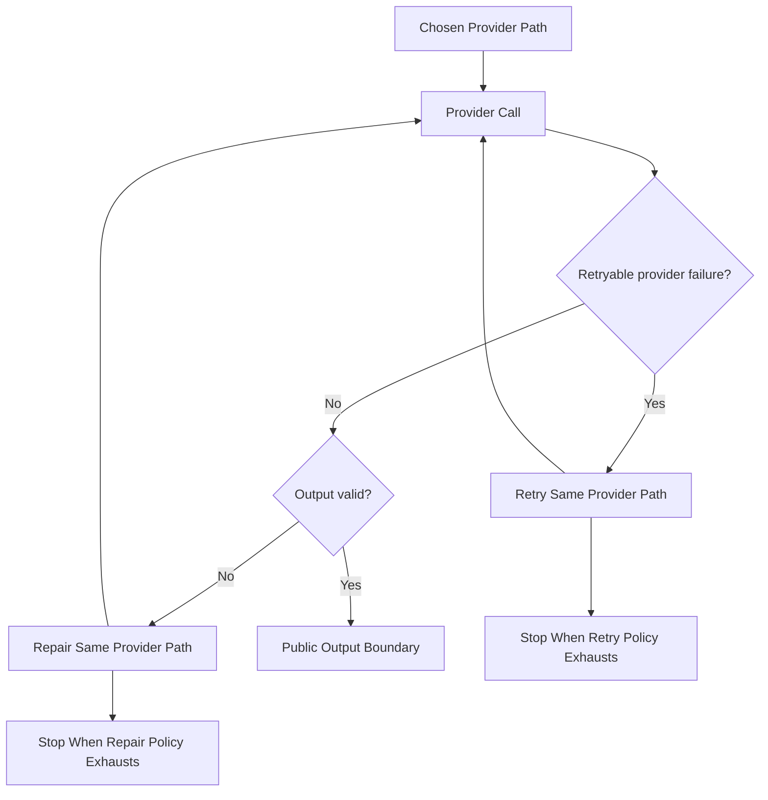

# Provider Retries And Output Repair

## Overview

This document describes how `llm_router` recovers on one chosen provider path
when the provider fails transiently or returns invalid output.

Question this diagram answers: How does one chosen provider path retry or
repair output without turning into route fallback?

## Main Model

### Same-Provider Retry

- Once routing chooses a provider path, transient provider failures may be
  retried on that same path under provider-level policy.
- Same-provider retry preserves the chosen route identity until the retry
  policy is exhausted or recovery succeeds.

### Output Repair Loop

- Invalid structured output or related validation failures may trigger a
  corrective continuation on the same provider path.
- Output repair changes the provider input or local validation context, but it
  does not change route ownership.
- Schema repair and similar corrective loops stay inside one coherent request lifecycle.

### Terminal Recovery Boundary

- If same-provider recovery succeeds, the request still exits through the same
  public output boundary as any other successful request.
- If retry or repair policy is exhausted, the request stops with a library
  error surface or returns control to route-level policy.

## Rules

- Same-provider retry is distinct from route fallback.
- Output repair must remain attributable to the same logical request and the
  same chosen provider path.
- Invalid output should surface as explicit repair or terminal failure, not as
  silent degradation.
