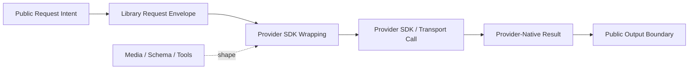

# Provider SDK Wrapping

## Overview

This document describes how `llm_router` keeps one public request model while
wrapping that request into provider-specific SDK and transport workflows.

Question this diagram answers: How does one public request become different
provider SDK calls without splitting the caller-facing API?

## Main Model

### Public Request Boundary

- Callers express content, media, schemas, tools, and route intent in
  library vocabulary rather than in provider-native payload shapes.
- One logical request remains provider-agnostic until routing chooses the
  provider path that will execute it.
- Capability intent enters through the same boundary as ordinary text input
  instead of creating separate caller APIs.

### Provider SDK Wrapping Boundary

- After routing chooses a path, the library wraps the request into the SDK,
  HTTP, or transport shape expected by that provider family.
- Message layout, media upload rules, schema/tool protocols, and other
  provider-specific request mechanics stay behind this wrapping boundary, and
  provider SDK objects and payloads stay private to the library.
- The wrapper absorbs provider diversity so the caller does not need to think
  in multiple SDK models.

### Wrapped Workflow Variants

- Plain generation, multimodal requests, schema-constrained output, and
  tool-enabled requests are workflow variants of the same wrapped request
  model.
- Capability differences may change how the library wraps the request, but
  they should not change request meaning or force a second public API family.
- Provider limitations may require graceful degradation or rejection, but
  callers still describe the request in library terms first.

## Rules

- Callers should never assemble provider SDK payloads themselves.
- Provider-specific request mechanics should begin only after the library has
  already formed one coherent public request.
- Capability-specific wrapping may branch internally, but it must preserve the
  public meaning of the request.
