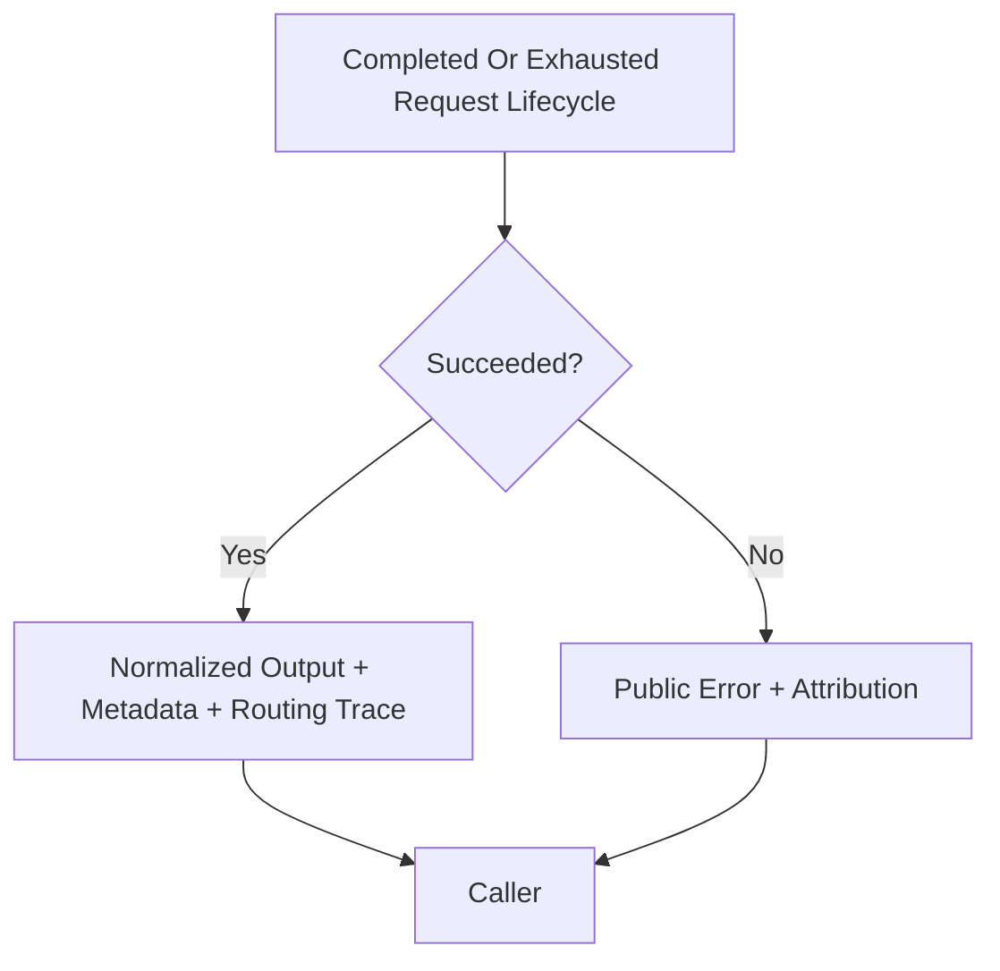

# Public Output And Errors

## Overview

This document describes what callers receive from `llm_router` at the terminal
public boundary: one normalized output surface on success or one library-owned
error surface on failure.

Question this diagram answers: What can leave the router boundary after one
request execution succeeds or stops?

## Main Model

### Normalized Output Boundary

- Successful requests return one library-owned output surface rather than raw
  provider response objects, and callers should be able to use that surface
  without reading provider-native responses first.
- Text output, structured output, provider/model identity, routing trace,
  and usage metadata all belong to that normalized boundary.
- Structured or tool-driven workflows still terminate in the same public
  output contract.

### Public Error Boundary

- Unsuccessful execution returns a library-owned public error surface rather
  than raw SDK exceptions.
- The public boundary should preserve stable high-level attribution such as
  caller, config, routing, provider, tool, or output-enforcement
  responsibility.

## Rules

- Raw provider objects and exceptions must not cross the public boundary.
- Routing trace and other metadata may enrich terminal outcomes, but they
  should not replace the main caller-facing result or error.
- Tool failures and output-enforcement failures must remain distinguishable
  from provider failures at the public surface.
- The caller should be able to reason about terminal outcomes without reading
  raw transport payloads.
