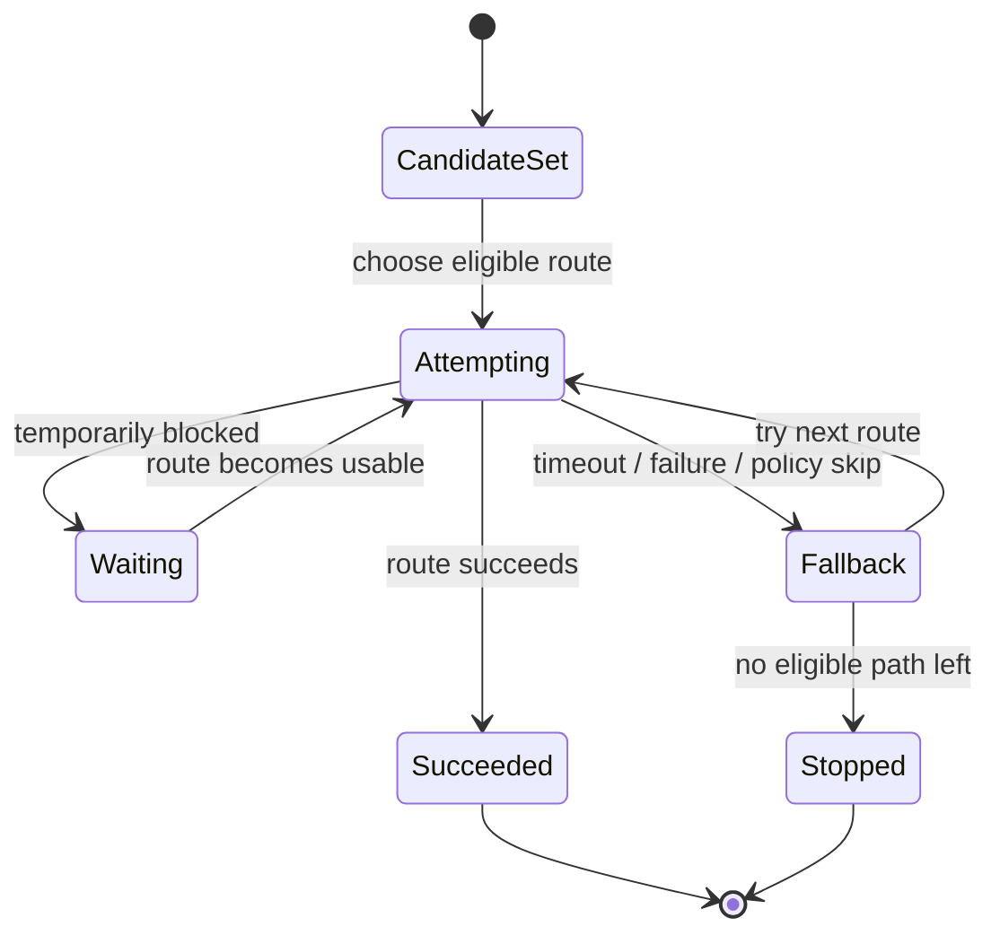

# Route Fallback And Attempt Policy

## Overview

This document describes how `llm_router` moves one request across eligible
routes and attempt slots before it succeeds or stops.

Question this diagram answers: How does one logical request move across
routes and attempts before it returns or stops?

## Main Model

### Attempt Progression

- If a route is blocked, times out, degrades, or fails, the router may wait,
  skip, or fall back depending on policy.
- Route fallback means moving the same request to another eligible route, not
  retrying inside one chosen provider path.

### Public Outcome

- The routing trace should explain which route was chosen, waited on, skipped,
  or replaced.
- The caller still sees one coherent request lifecycle even when routing
  evaluates multiple candidates.

## Rules

- One logical request may involve multiple candidate routes, but the caller
  should still experience one coherent request lifecycle.
- Waiting, timeout, and fallback behavior must remain policy-driven and
  predictable.
