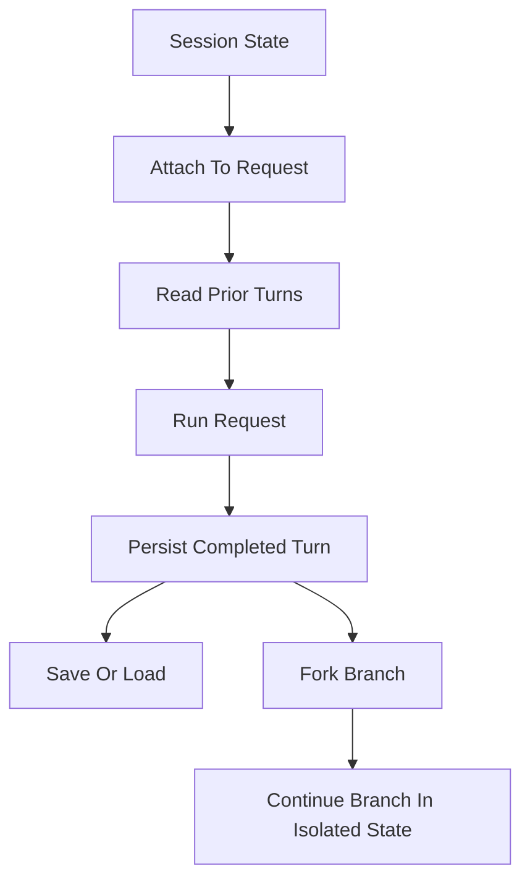

# Session State And Isolation

## Overview

This document describes how `llm_router` treats session state as library-owned
conversation meaning and keeps that state isolated across sessions and
branches.

> [!IMPORTANT]
> Session state preserves conversation meaning, not one provider's raw
> transcript format.

Question this diagram answers: How does session state move through attachment,
persist, restore, and branch-isolated continuation?

## Main Model

### Session Attachment

- A caller attaches a `Session` to a router.
- One logical request may include prior conversational context from that
  `Session`.
- Session state remains separate from routing state and provider SDK state.

### State Persistence And Branching

- When the logical request completes, the new turn is persisted back into
  session state.
- Persisted state remains library-owned conversation state, not a leaked provider
  transcript.
- The same `Session` may later be saved, loaded, cleared, or forked into a new
  branch.
- Save, load, clear, and fork keep the same public session model.

### Isolation Boundary

- One session's future turns must not bleed into another session unless the
  caller explicitly reuses that same session.
- Forked branches share history up to the fork point, then evolve in isolated
  future state so later changes affect only that branch.

## Rules

- `Session` is provider-agnostic state within the library model rather than a
  provider transcript wrapper.
- Session identity is library-owned and does not depend on one provider's
  transcript format.
