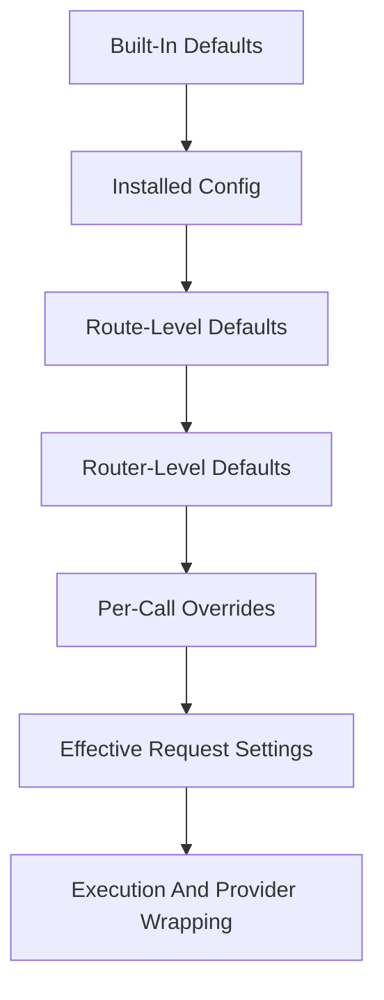

# Settings Overrides And Propagation

## Overview

This document describes how `llm_router` lets settings be supplied at multiple
convenient layers, resolves which value wins, and propagates the effective
values into one request lifecycle.

> [!IMPORTANT]
> Omission and explicit `None` are different public signals. The first keeps
> inheriting; the second clears the value.

Question this diagram answers: How are effective request settings resolved and
carried into execution for one logical request?

## Main Model

### Setting Layers

- Built-in defaults provide the library baseline.
- Installed runtime config provides the process-wide validated operating
  context.
- Route-level defaults let one route family declare preferred behavior.
- Router-level defaults let one router instance specialize that behavior.
- Per-call override values express immediate caller intent for one
  logical request.

### Override Resolution And Propagation

When the same setting is available at multiple layers, the effective value is
resolved in this order:

1. explicit per-call override
2. router-level default
3. route-level default
4. installed runtime config
5. built-in default

Higher layers replace lower layers for the same setting.

The chosen value is then carried into routing, provider wrapping, and result
handling as part of one request-scoped execution context.

## Rules

- Public settings should be expressed in stable library vocabulary rather than
  provider-native option objects.
- Validation and normalization should happen before routing or provider
  execution depends on the values.
- Omitting a value means "keep using the next available default."
- Explicit `None` means "clear this value instead of inheriting it."
- One logical request should execute against one coherent set of resolved
  values.
- Requests should not depend on mutable process-wide config changes after
  execution has started.
