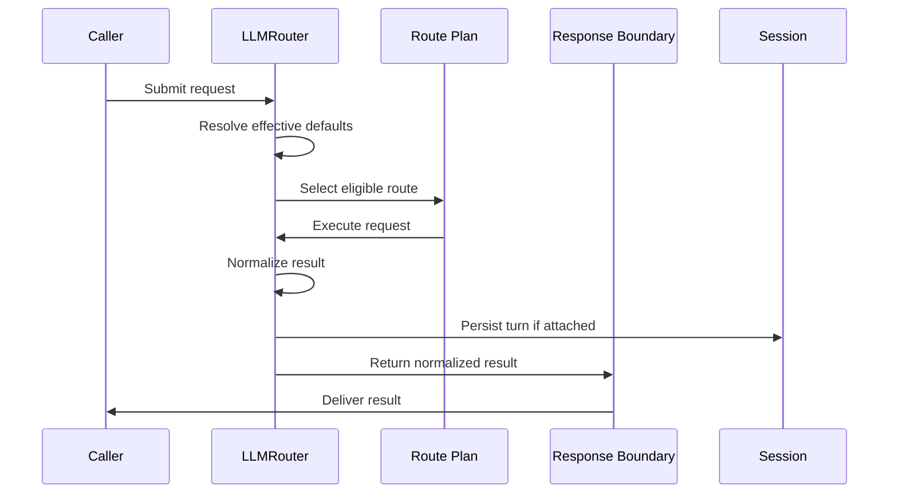

# Request Lifecycle

## Overview

This document describes the lifecycle of one logical request from caller
input to normalized result.

Question this diagram answers: How does one logical request move from caller
input to normalized result and optional continuity persistence?

## Main Flow

1. The caller enters through `LLMRouter` with content plus any explicit
   per-call requirements.
2. The system resolves the effective defaults described in
   [../concepts/settings-overrides-and-propagation.md](../concepts/settings-overrides-and-propagation.md)
   and the effective route plan.
3. The router chooses the next eligible route under the active routing policy.
4. The selected provider path executes the request using the provider wrapping
   strategy that matches the requested capabilities.
5. Structured output, the tool loop, and same-provider repair or retry,
   when required, stay inside the same logical request lifecycle.
6. The final result is normalized into `LLMRouterResponse`, following the
   terminal public boundary described in
   [../concepts/public-output-and-errors.md](../concepts/public-output-and-errors.md).
7. If a `Session` is attached, after the final result is normalized, the
   completed turn is persisted back into continuity state.

## Rules

- One caller request may imply multiple attempts, but it should remain one
  coherent logical request lifecycle.
- Route selection, structured workflows, and continuity updates happen
  inside the same logical request boundary.
