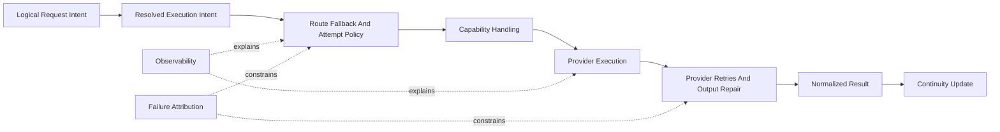

# System

## Overview

This document describes how `llm_router` gives callers one stable interface
for text, media, structured output, tools, routing, and continuity
without exposing provider-specific SDK shapes. The library should preserve one
logical request from caller intent to normalized result even when the
request crosses multiple routes, provider families, retries, or session
workflows.

Configuration, routing, provider wrapping, recovery, normalization,
continuity, failures, and logs should all describe that same request rather
than behaving like disconnected subsystems.

Question this diagram answers: Which architectural concepts, flows, and
private design groups cooperate to preserve one logical request from caller
intent to normalized result?

## Public Runtime Model

The caller interacts with one stable public router model rather than choosing
between separate provider SDK APIs. Direct model entry, pinned-route entry,
and multi-route entry all lead into the same runtime model, and both
`query(...)` and `aquery(...)` should preserve the same request meaning. See
[../usage.md](../usage.md) for representative caller patterns.

Request content, route intent, response schema, tools, and media all enter
through one library-owned boundary. Images, files, PDFs, local video, remote
video, and similar capabilities are extensions of the same logical request,
not separate public subsystems. The library then wraps that request for the
chosen provider path instead of making the caller think in provider-native
payloads. See
[concepts/provider-sdk-wrapping.md](concepts/provider-sdk-wrapping.md) for
details.

The request should also execute against one coherent validated snapshot
rather than a loose mix of defaults. Built-in defaults, installed config,
route defaults, router defaults, and per-call override values become one
resolved execution intent, with omission and explicit clearing preserved as
different signals. That override order should stay predictable from the
caller perspective even when provider choice or request shape changes. See
[concepts/settings-overrides-and-propagation.md](concepts/settings-overrides-and-propagation.md)
for details.

Providers sit behind that public runtime model as interchangeable execution
backends. Successful execution should leave through one normalized result
boundary, while failures should leave through one library-owned public error
boundary with stable failure attribution, not through raw provider objects
or exceptions. Provider limitations may force degradation or rejection, but
they should not split the public API into provider-specific surfaces. See
[concepts/public-output-and-errors.md](concepts/public-output-and-errors.md)
for terminal-boundary details.

## Execution Story

One logical request should still preserve one coherent request lifecycle.
See [flows/request-lifecycle.md](flows/request-lifecycle.md) for details. The
lifecycle resolves effective intent, chooses the next usable route, executes
with the required capabilities, normalizes the result, and optionally updates
continuity state.

Routing is therefore a first-class architectural concern, not a hidden
implementation detail. Route ordering, waiting, blocked-path handling, and
fallback belong to the system behavior promised by one logical request. See
[concepts/route-fallback-and-attempt-policy.md](concepts/route-fallback-and-attempt-policy.md)
for details.

Structured output, the tool loop, and same-provider recovery should also
remain inside that same lifecycle. Route fallback and provider-level recovery
are different concerns: fallback moves to another route, while retry and
repair stay on the chosen provider path. See
[concepts/provider-retries-and-output-repair.md](concepts/provider-retries-and-output-repair.md)
for recovery details.

Session state participates in the same story, but remains optional at the
public boundary. A `Session` may supply prior context, receive the completed
turn, be saved or restored, or be forked into a new branch, but it should
still preserve conversation meaning and remain isolated between sessions and
branches. See
[concepts/session-state-and-isolation.md](concepts/session-state-and-isolation.md)
for details.

## Runtime Shape

Behind the public runtime model, the runtime should stay organized around a
few stable design groups.

- A validated snapshot freezes the effective policy and registry view for
  one request instead of letting mutable config leak into ordinary runtime
  work.
- A coordinator owns one logical request from resolved intent to terminal
  outcome.
- Routing state owns mutable operational concerns such as waits, cooldowns,
  blocked routes, and fallback progression.
- A provider-independent attempt model carries execution meaning between
  routing and provider execution.
- Capability handling shapes tools, schemas, media, and related behaviors
  before provider translation begins.
- Provider execution stays at the edge, where external SDKs and transport
  details are absorbed and normalized.
- Continuity state remains a separate semantic boundary rather than becoming
  routing logic or transport history.
- Shared observability and failure translation connect all of those groups
  into one explainable system.

Those groups are not feature silos; they are the runtime seams that let one
public request model support media, tools, routing, retries, and sessions
without splitting into provider-specific subsystems.

The detailed design rules for those groups live in `principles/`, especially
[solid.md](principles/solid.md),
[state-and-snapshots.md](principles/state-and-snapshots.md),
[capability-normalization.md](principles/capability-normalization.md),
[semantic-persistence.md](principles/semantic-persistence.md), and
[ports-and-adapters.md](principles/ports-and-adapters.md). The concept docs
describe what these runtime boundaries mean; the principle docs describe how
the private implementation should stay organized so those boundaries survive
refactor.
