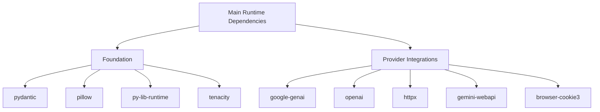

# Dependencies

## Overview

This document describes why `llm_router` carries each main runtime dependency
declared in `pyproject.toml`. It separates foundational packages from
provider integration packages, and it covers only the packages under
`[project].dependencies`.

Question this diagram answers: Which main dependencies are foundational,
and which ones exist to support shipped provider integrations?

## Dependency Roles

### Foundation

These packages support the public runtime model, shared runtime behavior, or
import-time package features.

| Package          | Why it is in main dependencies                                                                                       | Status       |
| ---------------- | -------------------------------------------------------------------------------------------------------------------- | ------------ |
| `pydantic`       | Defines public data models, structured output schemas, routing primitives, and provider request/result models.       | Foundational |
| `pillow`         | Supports the public image contract and session/media persistence for image inputs.                                   | Foundational |
| `py-lib-runtime` | Supplies the authoritative logging, bounded preview, retry-event, and shared runtime primitives used by the package. | Foundational |
| `tenacity`       | Powers the common retry model and retry-aware logging hooks for provider execution.                                  | Foundational |

### Provider Integrations

These packages exist because the shipped package includes multiple provider
families behind one runtime boundary.

| Package           | Why it is in main dependencies                                                                                  | Status                             |
| ----------------- | --------------------------------------------------------------------------------------------------------------- | ---------------------------------- |
| `google-genai`    | Supports Google-family provider execution and is also pulled into package import through public preset support. | Shipped provider dependency        |
| `openai`          | Supports OpenAI-compatible providers and reusable chat/tooling types used by OpenAI-family integrations.        | Shipped provider dependency        |
| `httpx`           | Supplies explicit HTTP clients and transport exceptions for several provider adapters.                          | Shipped provider dependency        |
| `gemini-webapi`   | Supports the Gemini WebApp-backed provider path.                                                                | Feature-scoped provider dependency |
| `browser-cookie3` | Supports Opera cookie extraction for the Gemini WebApp-backed provider path.                                    | Feature-scoped provider dependency |

## Rules

- A main dependency should either support the public import surface, a
  foundational runtime model, or a shipped provider path.
- A dependency justification should explain current runtime value, not
  hypothetical future use.
- Provider-specific packages can stay in main dependencies when the project
  ships those provider paths by default rather than behind extras.
- If a package is listed in main dependencies but not imported by the package
  runtime, it should be documented as review-needed instead of being given an
  invented justification.
- If packaging strategy changes, this doc should change with it rather than
  preserving outdated rationale.
