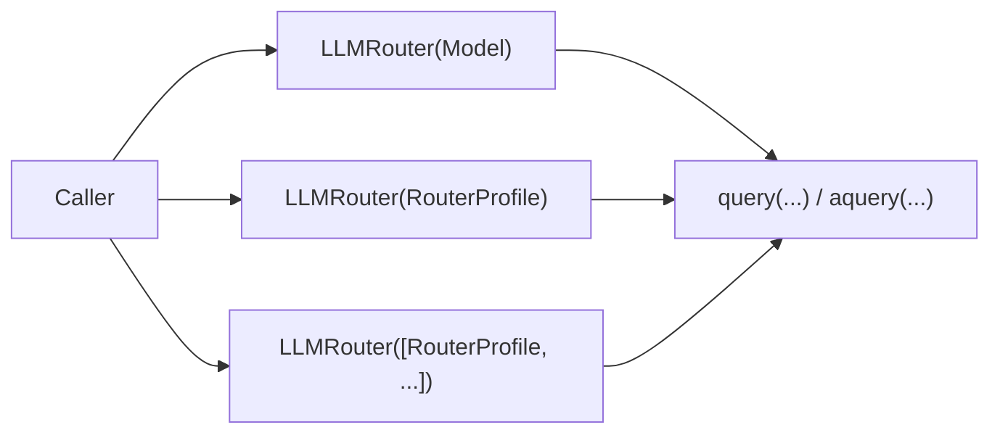

# Usage

## Overview

This document shows representative ways to use the stable public API from
application code. It complements the architecture docs and is not a test plan.

Question this diagram answers: What are the main public entry shapes a caller
can use?



## Shared Example Inputs

- image: `tests/llm_router/data/test_image.png`
- PDF: `tests/llm_router/data/variative.pdf`
- local video: `tests/llm_router/data/jumper.mp4`
- remote video: `https://www.youtube.com/shorts/QUxqvF0pyGw`

## Shapes

- `LLMRouter(Model.X)`
  Direct model-based entry point.
- `LLMRouter(RouterProfile(...))`
  Pinned route with explicit provider or extra route-level options.
- `LLMRouter([RouterProfile(...), ...])`
  Multi-route entry point with fallback behavior behind one public object.
- `query(...)`
  Synchronous request.
- `aquery(...)`
  Asynchronous request.
- `response_schema=...`
  Structured output validated against a public DTO.
- `tools=[...]`, `tool_choice=...`
  Local tool execution through the logical request boundary.
- `Session`
  Conversation state, persistence, and branching.

## Examples

## 1. Pattern: Direct Model Query

Use when:
The caller wants the simplest public entry point and already runs inside an
async workflow.

```python
class LegalCase(BaseModel):
    case_name: str
    court: str
    plaintiffs: list[str]
    defendants: list[str]


router = LLMRouter(Model.MISTRAL_LARGE)
response = await router.aquery(
    [
        "You are a legal assistant. Extract case details.",
        legal_case_text,
    ],
    response_schema=LegalCase,
)
```

## 2. Pattern: Pinned Route With File Input

Use when:
The caller needs explicit provider choice and a validated response.

```python
class PDFDigest(BaseModel):
    title: str
    title_words: list[str]
    abstract_one_sentence: str


pdf = FileSchema(
    path="tests/llm_router/data/variative.pdf",
    mime_type="application/pdf",
)
router = LLMRouter(RouterProfile(model=Model.GEMINI_3_FLASH, provider=Provider.GOOGLE))
response = router.query(
    [
        "Follow instructions exactly.",
        "Extract the paper title, three title words, and one-sentence abstract.",
        pdf,
    ],
    response_schema=PDFDigest,
)
```

## 3. Pattern: Same File DTO On Alternate Clients

Use when:
The caller wants one public `FileSchema` shape across clients that handle files
very differently internally.

```python
class PDFDigest(BaseModel):
    title: str
    title_words: list[str]
    abstract_one_sentence: str


pdf = FileSchema(
    path="tests/llm_router/data/variative.pdf",
    mime_type="application/pdf",
)
web_router = LLMRouter(
    RouterProfile(model=Model.GEMINI_FLASH, provider=Provider.GEMINI_WEBAPI)
)
qwen_router = LLMRouter(
    RouterProfile(model=Model.QWEN_VL_32B, provider=Provider.QWENCHAT)
)
web_response = web_router.query(
    [
        "Follow instructions exactly.",
        "Extract the paper title, three title words, and one-sentence abstract.",
        pdf,
    ],
    response_schema=PDFDigest,
)
qwen_response = qwen_router.query(
    [
        "Follow instructions exactly.",
        "Extract the paper title, three title words, and one-sentence abstract.",
        pdf,
    ],
    response_schema=PDFDigest,
)
```

## 4. Pattern: Image Input

Use when:
The caller passes an image through the logical request boundary.

```python
image = Image.open("tests/llm_router/data/test_image.png")
router = LLMRouter(Model.QWEN3_VL_PLUS)
response = router.query(["Describe the image in one short sentence.", image])
```

## 5. Pattern: Video Inputs

Use when:
The caller wants one public video idea across local and remote inputs while
still validating each shape on a supporting client.

```python
class VideoObservation(BaseModel):
    action: str
    location: str


local_video = VideoSchema(path="tests/llm_router/data/jumper.mp4", fps=1)
remote_video = VideoUrlSchema(
    url="https://www.youtube.com/shorts/QUxqvF0pyGw",
    fps=1,
)
google_router = LLMRouter(
    RouterProfile(model=Model.GEMINI_3_FLASH, provider=Provider.GOOGLE)
)
aistudio_router = LLMRouter(
    RouterProfile(model=Model.GEMINI_3_FLASH, provider=Provider.AISTUDIO)
)

local_response = google_router.query(
    ["Follow instructions exactly.", "Describe the clip.", local_video],
    response_schema=VideoObservation,
)
remote_response = aistudio_router.query(
    ["Follow instructions exactly.", "Describe the clip.", remote_video],
    response_schema=VideoObservation,
)
```

## 6. Pattern: Tool Calling

Use when:
The caller needs local Python tools and explicit control over which tool is
used.

```python
def add(*, a: int, b: int) -> dict[str, int]:
    return {"result": a + b}


def multiply(*, a: int, b: int) -> dict[str, int]:
    return {"result": a * b}


router = LLMRouter(
    RouterProfile(model=Model.GEMINI_FLASH_LITE, provider=Provider.AISTUDIO)
)
response = router.query(
    [
        "Follow instructions exactly.",
        "Use ONLY add with a=40 and b=2, then reply with only the number.",
    ],
    tools=[add, multiply],
    tool_choice={"type": "function", "function": {"name": "add"}},
)
```

## 7. Pattern: Tool Calling Followed By Structured Output

Use when:
The caller needs the tool loop as an intermediate step but still wants the
final answer to match a DTO.

```python
class CalcResult(BaseModel):
    result: int


def multiply(*, a: int, b: int) -> dict[str, int]:
    return {"result": a * b}


router = LLMRouter(
    RouterProfile(model=Model.GEMINI_FLASH_LITE, provider=Provider.GOOGLE)
)
response = router.query(
    "Compute 17*19 using the tool, then return JSON.",
    tools=[multiply],
    tool_choice="required",
    response_schema=CalcResult,
    max_tool_rounds=4,
)
```

## 8. Pattern: Multi-Route Entry Point

Use when:
The caller wants one public entry point with multiple routes behind it.

```python
router = LLMRouter(
    [
        RouterProfile(provider="not-a-provider", model=Model.LLAMA_MAVERICK),
        RouterProfile(provider=Provider.NVIDIA, model=Model.LLAMA_MAVERICK),
    ]
)
first = router.query(["Follow instructions exactly.", "Reply only with OK."])
second = router.query(["Follow instructions exactly.", "Reply only with 12345."])
```

## 9. Pattern: Automatic Key Rotation And Limits

Use when:
The caller wants one route to draw from multiple real keys.

```python
router = LLMRouter(
    RouterProfile(
        provider=Provider.NVIDIA,
        model=Model.LLAMA_MAVERICK,
        key_id="auto",
    ),
    limits_by_provider={
        Provider.NVIDIA: ProviderLimits(
            rps=0.5,
            rpm=1_000_000_000,
            cooldown_seconds=0.0,
            cooldown_after_failures=0,
        )
    },
)
first = await router.aquery(["Follow instructions exactly.", "Reply only with A."])
second = await router.aquery(["Follow instructions exactly.", "Reply only with B."])
third = await router.aquery(["Follow instructions exactly.", "Reply only with C."])
```

## 10. Pattern: Session Workflow

Use when:
The caller needs continuity, persistence, and branching.

```python
session = Session(system="Follow instructions exactly.")
router = LLMRouter(
    RouterProfile(model=Model.GEMINI_FLASH, provider=Provider.GEMINI_WEBAPI),
    session=session,
)

router.query("Secret code for this chat: 81723. Reply only OK.")
session.save("session.json")

loaded = Session.load("session.json")
branch = loaded.fork()
resumed_router = LLMRouter(
    RouterProfile(model=Model.GEMINI_FLASH, provider=Provider.GEMINI_WEBAPI),
    session=loaded,
)
branch_router = LLMRouter(
    RouterProfile(model=Model.GEMINI_FLASH, provider=Provider.GEMINI_WEBAPI),
    session=branch,
)
resumed = resumed_router.query("What is the secret code? Reply only digits.")
branched = branch_router.query("Update the secret code to 12345, then reply only OK.")
```
