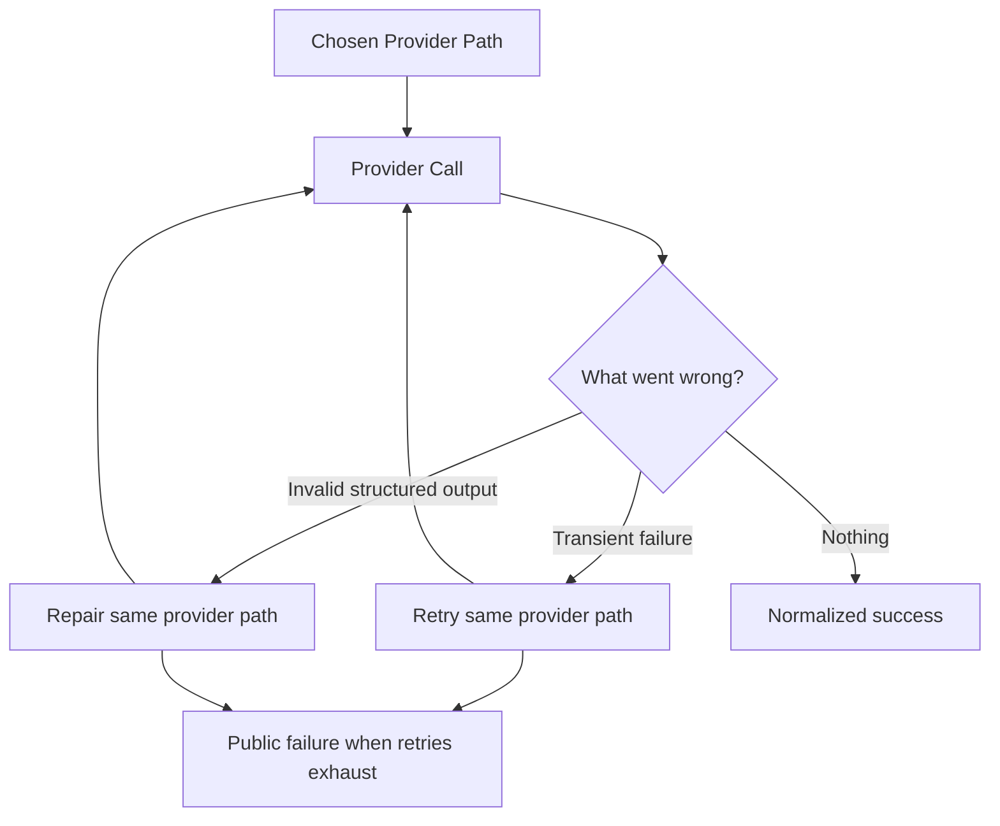
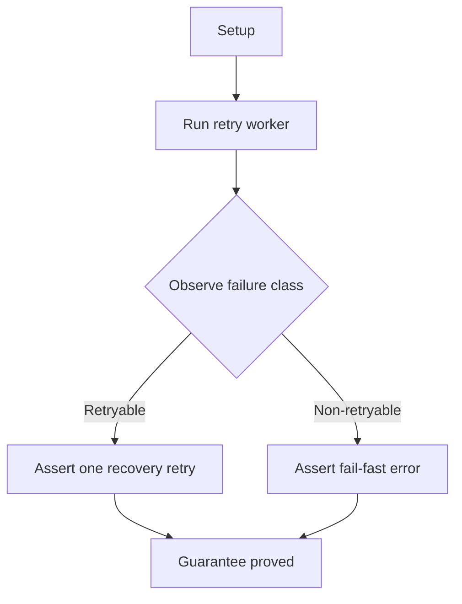
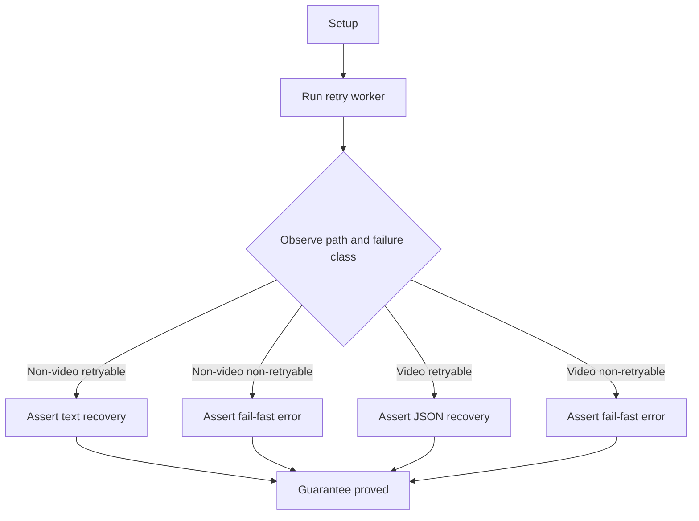
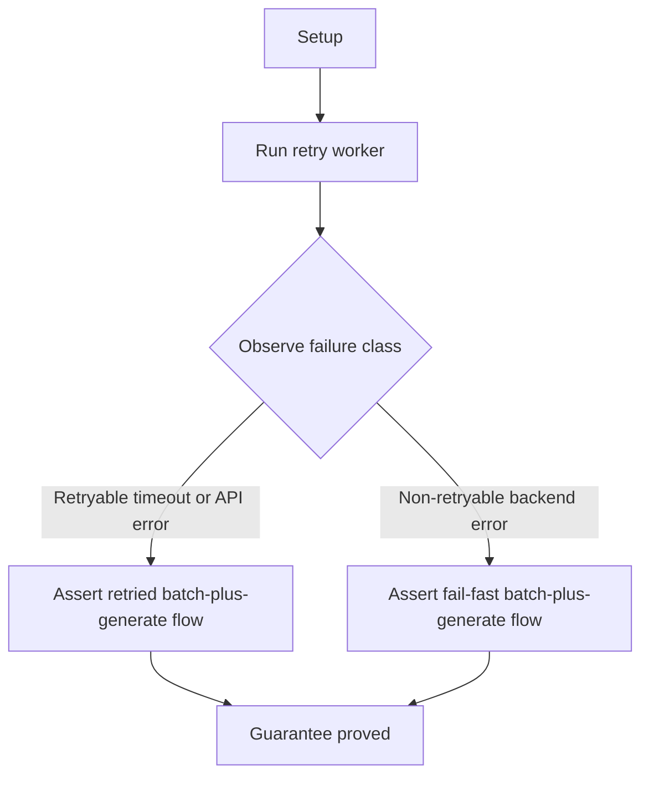
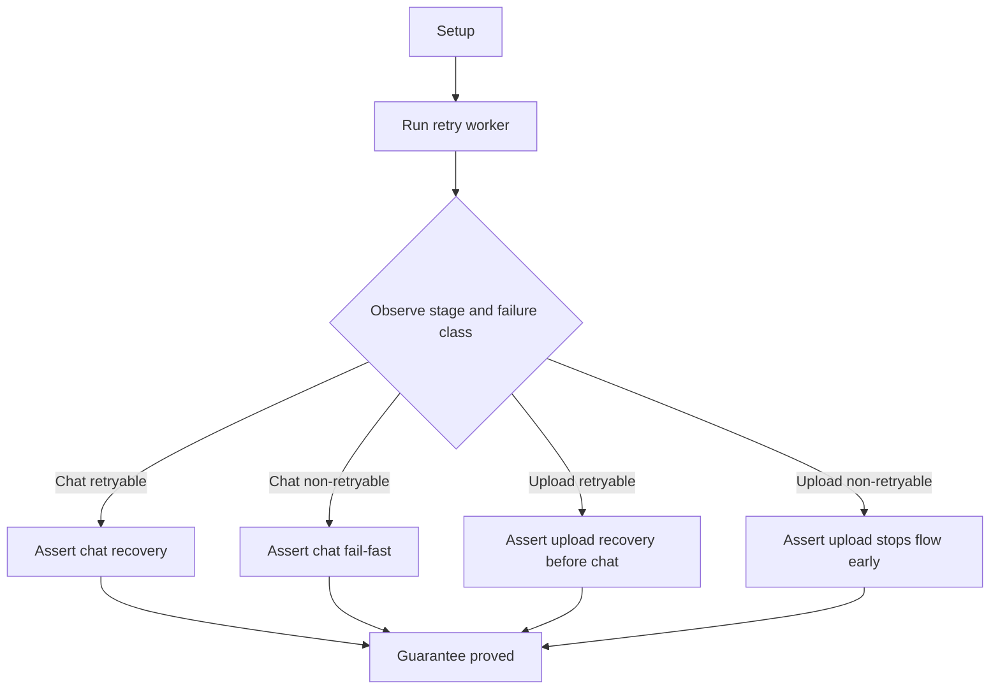
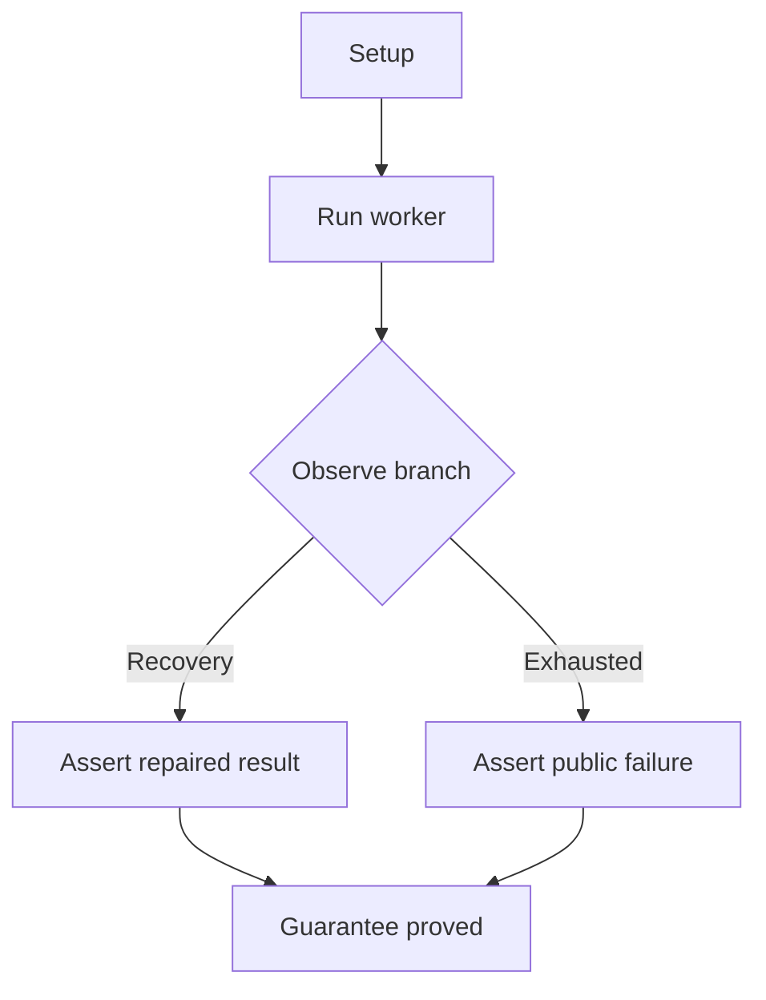

# Provider Retries And Output Repair

## Overview

This document describes how the e2e suite proves that one chosen provider path
can retry transient failures or repair invalid structured output without
turning into route fallback.

Question this diagram answers: How does the behavior suite prove that
same-provider recovery stays bounded and explainable after routing has already
chosen the provider path?

## Proof Areas

## 1. Proof: Transient Problems Recover And Permanent Ones Stop Early

This proof area shows that short-lived instability should often recover
automatically, while invalid or permanent failures should become clear public
errors without wasted retries.

### Seen In Tests

[OpenAI-compatible retry behavior](../../../../tests/llm_router/e2e/provider_retries_and_output_repair/test_openai_compatible_retry_pipeline.py):
proves the baseline distinction between retryable `429`, `503`, or disconnect
failures and fail-fast `400` or `401` outcomes.

Question this diagram answers: How does this file prove that only retryable
OpenAI-compatible failures get a second attempt?

Walkthrough:

1. scripts retryable `429`, retryable `503`, and retryable disconnect cases on
   the OpenAI-compatible path

2. each retryable branch asserts success text from attempt `2` and provider hit
   count `2`

3. scripts non-retryable `400` and `401` cases and asserts public
   `ProviderError` with provider hit count `1`

Why this is sufficient:

- hit count distinguishes recovery from fail-fast behavior, while the final
  visible output proves that the second attempt produced the public success
- the file covers both HTTP retryable failures and transport interruption, so
  the retry boundary is not limited to one error shape

Would fail if:

- retryable failures stopped too early or required the wrong number of attempts
- non-retryable failures were retried instead of surfacing a public
  `ProviderError` immediately

[Google GenAI retry behavior](../../../../tests/llm_router/e2e/provider_retries_and_output_repair/test_google_genai_retry_pipeline.py):
proves the same public success-versus-failure contract on the native Google
path with Google-shaped error codes.

Question this diagram answers: How does this file prove retryable versus
fail-fast behavior on the native Google path?

Walkthrough:

1. scripts retryable `429` and `503` failures on the native Google path and
   asserts visible success text on attempt `2`

2. scripts non-retryable `400` and `403` failures and asserts public
   `ProviderError` with hit count `1`

3. every retryable branch proves provider hit count `2`

Why this is sufficient:

- the same native Google path is exercised across retryable and non-retryable
  classes, so the proof is about retry classification rather than route shape
- success text plus hit count `2` proves real recovery, while hit count `1`
  proves fail-fast semantics for permanent errors

Would fail if:

- retryable Google failures were not retried exactly once
- permanent Google failures were retried, misclassified, or surfaced as the
  wrong public error

[AI Studio retry behavior](../../../../tests/llm_router/e2e/provider_retries_and_output_repair/test_aistudio_retry_pipeline.py):
proves the same retry boundary on native AI Studio video requests as well as
simpler text or media requests.

Question this diagram answers: How does this file prove that both AI Studio
paths follow the same retry boundary even though one path is native video?

Walkthrough:

1. covers both AI Studio path families: the non-video OpenAI-compatible path
   and the native video path

2. non-video retryable `429` and `503` branches assert success text on attempt
   `2` with hit count `2`

3. non-video non-retryable `400` and `401` branches assert public
   `ProviderError` with hit count `1`

4. video retryable `429` and `503` branches parse the recovered JSON report and
   assert video hit count `2`

5. video non-retryable `400` and `401` branches assert public `ProviderError`
   with video hit count `1`

Why this is sufficient:

- the file covers both AI Studio request families, so the proof shows that one
  retry policy spans the text-like path and the native video path
- the video recovery branch parses the final structured JSON report, which
  proves that retry recovery is semantically correct on the native endpoint, not
  just textually successful

Would fail if:

- one AI Studio path family used different retry behavior from the other
- video retries recovered at the transport level but returned the wrong
  structured payload or wrong attempt counts

[Gemini WebAPI retry behavior](../../../../tests/llm_router/e2e/provider_retries_and_output_repair/test_gemini_webapi_retry_pipeline.py):
proves retry behavior across browser-backed batch and generate stages.

Question this diagram answers: How does this file prove retry behavior when the
Gemini WebAPI path has both bootstrap-style batch work and final generate work?

Walkthrough:

1. starts scripted Gemini WebAPI bootstrap, batch, and generate routes

2. retryable timeout branch makes the first generate attempt too slow and
   asserts final success with batch hit count `2` and generate hit count `2`

3. retryable API-error branch returns a retryable backend error and asserts the
   same doubled batch and generate hit counts

4. non-retryable backend branch asserts public `ProviderError` with batch and
   generate hit count `1`

Why this is sufficient:

- batch and generate hit counts are checked together, so the proof verifies the
  whole browser-backed flow rather than only the final generate step in
  isolation
- timeout recovery, API-error recovery, and fail-fast backend error are all
  covered, which demonstrates the retry boundary across the main Gemini WebAPI
  failure classes

Would fail if:

- only part of the browser-backed flow retried while another stage stayed on
  the first attempt
- non-retryable backend errors were retried or retryable ones surfaced without
  the expected doubled batch-plus-generate behavior

[QwenChat retry behavior](../../../../tests/llm_router/e2e/provider_retries_and_output_repair/test_qwenchat_retry_pipeline.py):
proves that both upload retries and completion retries follow the same public
recovery boundary.

Question this diagram answers: How does this file prove retry behavior across
both the QwenChat upload stage and the QwenChat completion stage?

Walkthrough:

1. covers both QwenChat stages: the completion stage and the upload stage

2. chat retryable `429` and `503` branches assert success text on attempt `2`
   and chat hit count `2`

3. chat non-retryable `400` and `401` branches assert public `ProviderError`
   with chat hit count `1`

4. upload retryable `429` and `503` branches assert upload hit count `2` and
   one final chat hit after recovery

5. non-retryable upload `400` asserts public `ProviderError`, upload hit count
   `1`, and chat hit count `0`

Why this is sufficient:

- the file separates upload-stage behavior from completion-stage behavior, so it
  proves retry classification at both QwenChat seams instead of only after the
  upload has already succeeded
- upload branches also check whether chat was called at all, which proves the
  router either resumed at the right point after recovery or stopped before
  completion on permanent failure

Would fail if:

- a permanent upload failure still triggered a completion call
- completion-stage non-retryable failures were retried, or upload recovery
  resumed with the wrong request counts

## 2. Proof: Invalid Structured Output Triggers Repair

This proof area shows that invalid structured output is not silently
accepted. The library can run a controlled schema repair loop and either
return a valid result or surface a clear public failure.

### Seen In Tests

[Gemini WebAPI structured recovery](../../../../tests/llm_router/e2e/provider_retries_and_output_repair/test_gemini_webapi_structured_recovery_pipeline.py):
proves that one invalid structured output becomes a guided schema repair
attempt, while repeated invalid answers surface a public `ProviderError`.

Question this diagram answers: How does this file prove both the repair-success
branch and the repair-exhausted branch on Gemini WebAPI?

Walkthrough:

1. starts a scripted Gemini WebAPI server with bootstrap routes plus generate
   routes

2. recovery branch returns invalid JSON first and valid repaired JSON second,
   then asserts worker success, exact parsed object match, and generate hit
   count `2`

3. recovery branch also inspects the second outbound request text for previous
   response, schema guidance, `severity`, `tags`, and validation tokens such as
   `required`, `schema`, `minlength`, or `minitems`

4. exhausted branch returns invalid JSON on every generate attempt and asserts
   a public `ProviderError` with generate hit count `3`

Why this is sufficient:

- the second outbound request is inspected directly, so the proof shows that
  recovery happened because the router injected prior invalid output and schema
  guidance, not because the next response happened to be valid by luck
- the file covers both recovery and exhaustion branches with the same public
  path, so it proves bounded schema repair behavior rather than only one
  happy-path retry

Would fail if:

- the router retried without including the previous invalid response or
  validation guidance in the repair prompt
- invalid structured output were accepted as success, the repair budget were
  miscounted, or exhaustion surfaced the wrong public error

[QwenChat structured recovery](../../../../tests/llm_router/e2e/provider_retries_and_output_repair/test_qwenchat_structured_recovery_pipeline.py):
proves that the same schema repair contract holds on the upload-and-chat
QwenChat path instead of only on the browser-backed Gemini path.

Question this diagram answers: How does this file prove guided repair success
and explicit repair exhaustion on QwenChat?

Walkthrough:

1. starts a scripted QwenChat server with recovery or exhausted chat responses

2. recovery branch returns invalid JSON first and valid repaired JSON second,
   then asserts worker success, exact parsed object match, and chat hit count
   `2`

3. recovery branch inspects the second outbound chat payload for previous
   response, schema guidance, `severity`, `tags`, and validation tokens such as
   `required`, `schema`, `minlength`, or `minitems`

4. exhausted branch consumes three invalid responses and asserts a public
   `ProviderError` with chat hit count `3`

Why this is sufficient:

- the proof reads the second outbound chat payload itself, so it verifies that
  QwenChat follows the same guided repair contract instead of merely succeeding
  on a second attempt
- recovery and exhaustion are both exercised through the public QwenChat path,
  which proves that bounded schema repair semantics are not unique to one
  provider family

Would fail if:

- the repair prompt on QwenChat omitted the previous invalid output or schema
  guidance
- the repair loop stopped too early, retried too many times, or surfaced
  repeated invalid output as the wrong public outcome
