# Provider SDK Wrapping

## Overview

This document describes how the provider-sdk-wrapping e2e slice proves that one
logical request boundary can support a recognizable set of caller workflows
across provider families without turning each backend into its own product
story.

Question this diagram answers: Which major caller workflows does the
provider-sdk-wrapping slice prove across provider families?

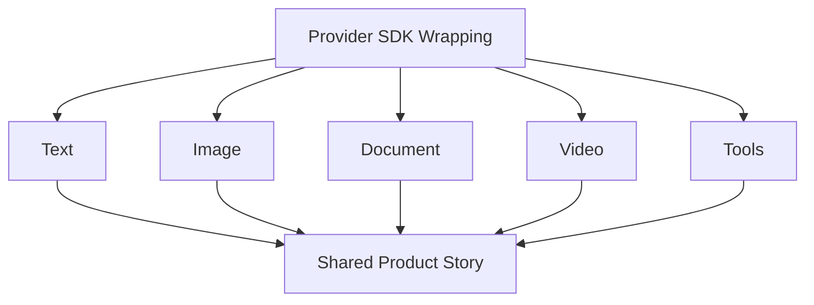

## Proof Areas

## 1. Proof: Text Workflows Stay Simple Or Become Structured

This proof area shows that a minimal async text path can stay visible while the
same request style also returns validated records instead of forcing downstream
parsing.

### Seen In Tests

[OpenAI-compatible async structured text](../../../../tests/llm_router/e2e/provider_sdk_wrapping/test_openai_compatible_async_text_structured_pipeline.py):
proves text-only input can become a validated legal-case record on the
OpenAI-compatible path.

Question this diagram answers: How does this file prove the async
structured-text contract on the OpenAI-compatible family?

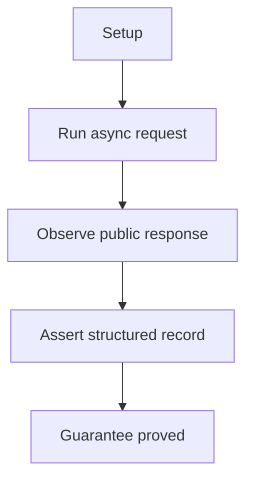

Walkthrough:

1. loads the replay cassette, builds the legal-case prompt, and uses an
   OpenAI-compatible router with deterministic settings

2. calls `aquery(...)` with the `LegalCase` response schema

3. parses the payload through the shared legal-case helper

4. asserts the expected parties are present and at least one legal issue exists

Why this is sufficient:

- the public async API is exercised together with schema parsing, so the proof
  checks the full structured-text contract rather than a raw provider reply
- named parties plus at least one legal issue are enough domain anchors to show
  that the output is a valid legal-case record instead of generic text

Would fail if:

- the async path returned unparsable or non-structured output
- response normalization or schema binding lost the party or issue fields

[AI Studio async structured text](../../../../tests/llm_router/e2e/provider_sdk_wrapping/test_aistudio_async_text_structured_pipeline.py):
proves the same pattern on AI Studio with movie-style extraction.

Question this diagram answers: How does this file prove async
structured-text output on AI Studio instead of only a raw text reply?

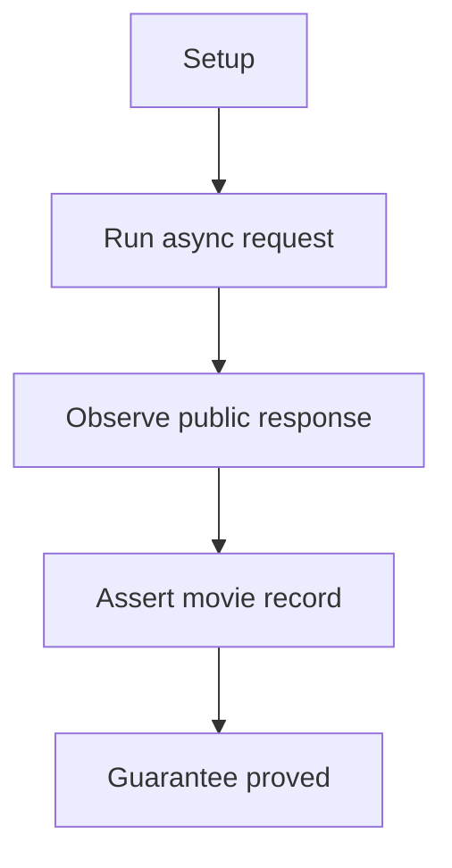

Walkthrough:

1. loads the replay cassette, builds the movie-record prompt, and uses the AI
   Studio route

2. calls `aquery(...)` with the `MovieRecord` response schema

3. validates the parsed record with the shared movie helper

4. asserts title, director, cast, and reviews are all present

Why this is sufficient:

- the same public async structured path is proved on a different provider
  family, which strengthens the claim that this is a shared workflow rather than
  one backend's special case
- title, director, cast, and reviews span several field shapes, so the test
  checks more than one trivial scalar extraction

Would fail if:

- the AI Studio async path skipped schema enforcement or returned unusable JSON
- one of the core movie fields were missing, misbound, or normalized wrongly

[QwenChat async text smoke test](../../../../tests/llm_router/e2e/provider_sdk_wrapping/test_qwenchat_async_text_pipeline.py):
proves the baseline async text entry point without a large schema-heavy
scenario.

Question this diagram answers: How does this file prove the plain async text
entry point on QwenChat?

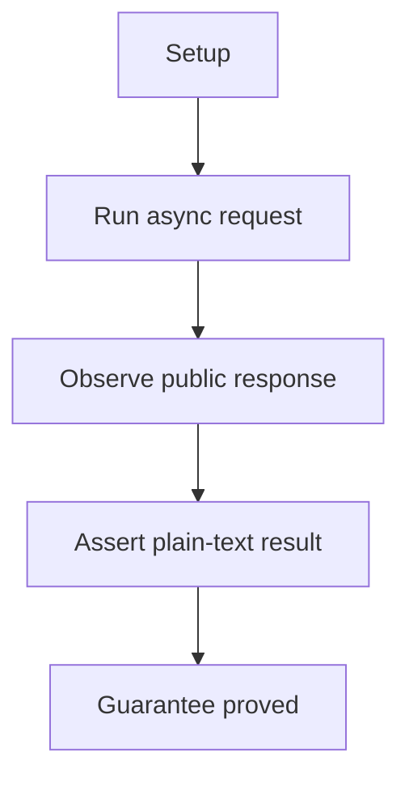

Walkthrough:

1. loads the replay cassette, builds a tiny pong prompt, and uses the QwenChat
   route

2. calls the public async API rather than a provider helper

3. asserts the response payload is populated

4. normalizes the output text and checks that it resolves to `pong`

Why this is sufficient:

- the prompt is intentionally minimal, so the proof isolates the public async
  entry point instead of mixing it with schema or multimodal complexity
- checking both a populated response object and normalized text confirms that
  the call completed correctly and that caller-visible text extraction still
  works

Would fail if:

- the public async API returned an empty or malformed response object
- QwenChat async normalization drifted and no longer produced the expected text

[Gemini WebAPI async text smoke test](../../../../tests/llm_router/e2e/provider_sdk_wrapping/test_gemini_webapi_async_text_pipeline.py):
proves the same basic public async text entry point on the browser-backed
Gemini path.

Question this diagram answers: How does this file prove the browser-backed
async text path rather than a provider-specific helper path?


Walkthrough:

1. loads the replay cassette and the Gemini WebAPI runtime guard

2. builds the tiny pong prompt and uses the browser-backed route through the
   public async API

3. asserts the response payload is populated

4. normalizes the output text and checks that it resolves to `pong`

Why this is sufficient:

- this is the smallest possible proof of the browser-backed async seam, which
  keeps the claim focused on the public API path rather than on structured or
  multimodal features
- the runtime guard plus normalized text check show that the browser-backed
  route still lands on the same caller-visible async contract

Would fail if:

- the Gemini WebAPI async path could not produce a valid public response object
- browser-backed text extraction or normalization stopped matching the shared
  async contract

[QwenChat structured incident report](../../../../tests/llm_router/e2e/provider_sdk_wrapping/test_qwenchat_text_structured_pipeline.py):
proves a more operational extraction case with tightly constrained fields
and exact counts.

Question this diagram answers: How does this file prove that plain text can
turn into a constrained structured incident report on QwenChat?

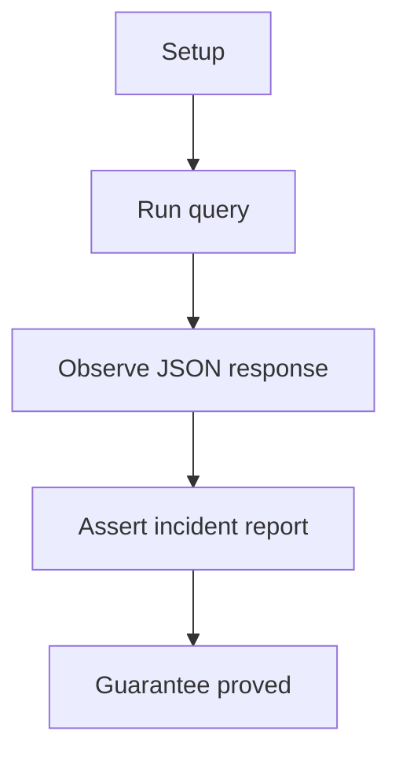

Walkthrough:

1. loads the replay cassette, builds the constrained incident-report prompt,
   and uses QwenChat with deterministic settings

2. calls `query(...)` with the `IncidentReport` response schema

3. parses the JSON output into `IncidentReport`

4. asserts the incident id plus exact service, timeline, and remediation counts

Why this is sufficient:

- exact counts and a fixed incident id force the output to satisfy a tightly
  constrained structured contract instead of a loose summary-like response
- deterministic settings reduce ambiguity, so mismatches are much more likely to
  reflect implementation drift than prompt variance

Would fail if:

- the structured extraction missed required sections or returned the wrong field
  shapes
- the output remained parseable but semantically incomplete, with the wrong
  incident id or section counts

## 2. Proof: Images Become Structured Scene Understanding

This proof area shows that multimodal input does not need a different caller
contract. The same logical request shape can turn an image into a
machine-ready scene summary grounded in the image itself.

### Seen In Tests

[Google GenAI async image](../../../../tests/llm_router/e2e/provider_sdk_wrapping/test_google_genai_async_image_structured_pipeline.py):
proves that image understanding also works on the async path.

Question this diagram answers: How does this file prove async multimodal image
understanding on the native Google path?

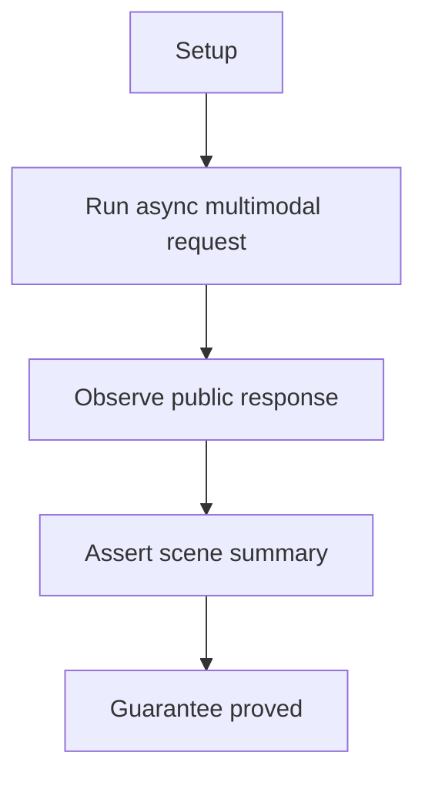

Walkthrough:

1. loads the replay cassette, builds the traffic-scene prompt, attaches the
   test image, and uses the native Google route

2. calls `aquery(...)` with image parts plus the `SceneSummary` response schema

3. runs the shared traffic-scene assertion helper

4. checks road setting plus car and lane evidence

Why this is sufficient:

- the same public request shape is used with image parts and a shared schema, so
  the proof shows that multimodal input lands on the same structured contract
- the helper checks scene facts tied to visible road, car, and lane evidence,
  which is enough to show grounded image understanding instead of generic text

Would fail if:

- the async multimodal path dropped or misencoded the image parts
- the response parsed but no longer preserved the expected grounded scene fields

[AI Studio image](../../../../tests/llm_router/e2e/provider_sdk_wrapping/test_aistudio_image_structured_pipeline.py):
proves structured scene summaries on AI Studio.

Question this diagram answers: How does this file prove AI Studio image input
becomes a structured scene summary?

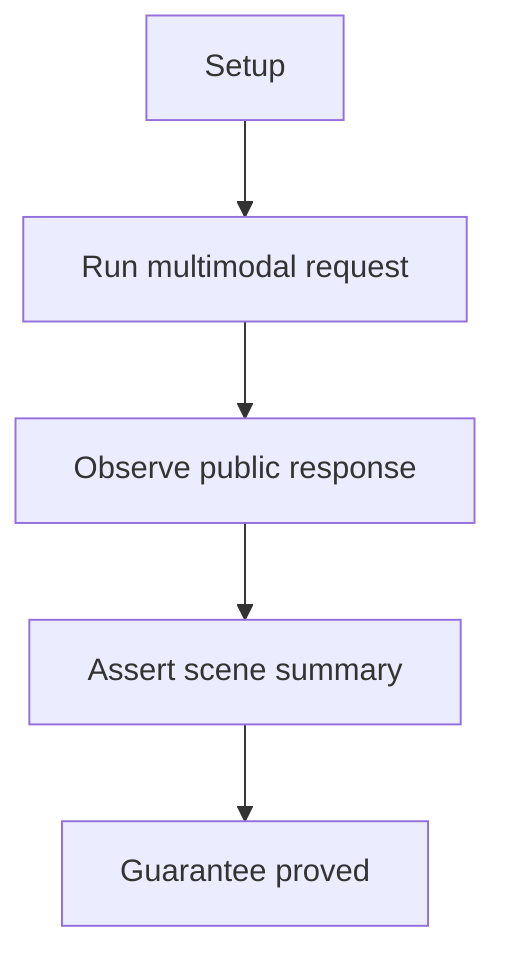

Walkthrough:

1. loads the replay cassette, builds the traffic-scene prompt, attaches the
   test image, and uses the AI Studio route

2. calls `query(...)` with the image attachment and `SceneSummary` response schema

3. validates the response with the shared traffic-scene helper

4. asserts road setting plus car and lane evidence

Why this is sufficient:

- the AI Studio path is checked against the same scene helper and schema
  contract, so the proof verifies workflow parity instead of a provider-specific
  interpretation
- road setting plus car and lane evidence are enough to show that the image was
  analyzed rather than merely acknowledged

Would fail if:

- the AI Studio attachment path stopped delivering the image to the model
- the returned scene summary lost one of the shared grounded fields

[Gemini WebAPI image](../../../../tests/llm_router/e2e/provider_sdk_wrapping/test_gemini_webapi_image_structured_pipeline.py):
proves the same image workflow on the browser-backed Gemini path.

Question this diagram answers: How does this file prove the browser-backed
Gemini image path returns the same structured scene contract?


Walkthrough:

1. loads the replay cassette and runtime guard, builds the traffic-scene
   prompt, and attaches the image fixture

2. calls `query(...)` on the browser-backed Gemini path with the `SceneSummary`
   response schema

3. runs the shared traffic-scene helper

4. asserts road setting plus car and lane evidence

Why this is sufficient:

- the browser-backed path is validated against the same schema and helper as the
  direct API paths, which shows that the workflow contract survives a different
  transport seam
- the shared scene evidence keeps the proof about semantic parity, not just
  request completion

Would fail if:

- the browser-backed image path stopped transmitting or reconstructing the
  attachment correctly
- Gemini WebAPI returned a response that parsed but no longer matched the
  shared scene contract

[QwenChat image](../../../../tests/llm_router/e2e/provider_sdk_wrapping/test_qwenchat_image_structured_pipeline.py):
proves the upload-based QwenChat image path returns the same kind of
structured result.

Question this diagram answers: How does this file prove the QwenChat
image-upload seam still lands on the same structured scene contract?

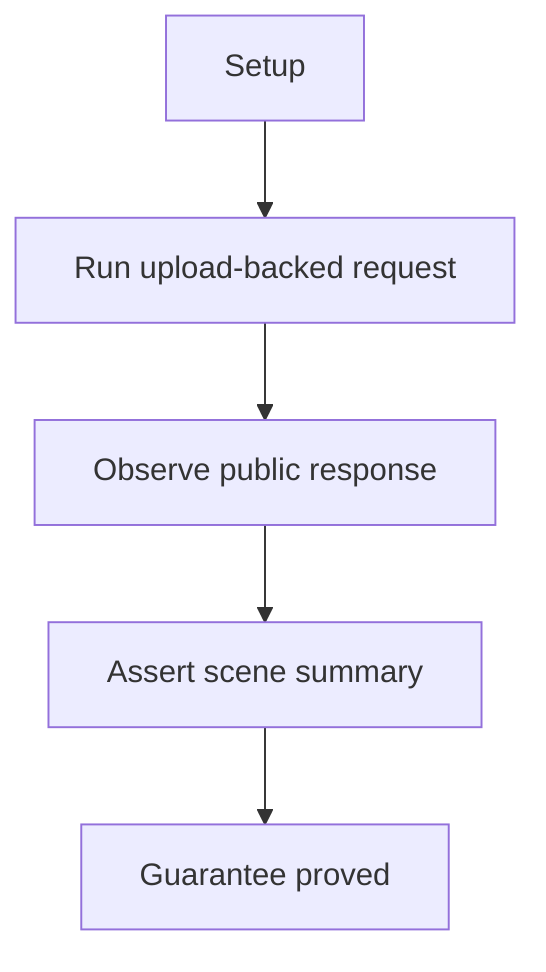

Walkthrough:

1. loads the replay cassette, builds the traffic-scene prompt, uploads the
   image fixture, and uses the QwenChat route

2. calls `query(...)` with the uploaded image plus the `SceneSummary` response schema

3. validates the parsed output through the shared traffic-scene helper

4. asserts road setting plus car and lane evidence

Why this is sufficient:

- the proof targets the upload-backed QwenChat seam directly, so it verifies the
  workflow that is most likely to drift from the direct-attachment providers
- the same scene helper and schema checks show that upload-based transport still
  lands on the shared image-understanding contract

Would fail if:

- the upload step succeeded operationally but the image was not actually used in
  the model request
- the upload-backed result no longer preserved the expected scene fields

[OpenAI-compatible image](../../../../tests/llm_router/e2e/provider_sdk_wrapping/test_openai_compatible_image_structured_pipeline.py):
proves that the OpenAI-compatible family can deliver the same
image-to-structure workflow.

Question this diagram answers: How does this file prove the generic
OpenAI-compatible image path returns the same structured scene story?


Walkthrough:

1. loads the replay cassette, builds the traffic-scene prompt, attaches the
   test image, and uses an OpenAI-compatible route

2. calls `query(...)` with the image attachment and `SceneSummary` response schema

3. runs the shared traffic-scene assertion helper

4. asserts road setting plus car and lane evidence

Why this is sufficient:

- the OpenAI-compatible family is checked against the same image schema and
  helper as the other providers, which makes the workflow claim comparable
  across provider families
- the helper requires concrete scene evidence, so the proof checks grounded
  image understanding instead of a vague descriptive answer

Would fail if:

- the OpenAI-compatible multimodal request shape stopped matching the shared
  contract
- the returned summary parsed but no longer preserved the expected grounded
  scene fields

## 3. Proof: Documents Become Grounded Records

This proof area shows that callers can extract tightly constrained fields,
evidence, and named entities while staying close to the source file instead of
settling for loose PDF summarization.

### Seen In Tests

[Google GenAI PDF extraction](../../../../tests/llm_router/e2e/provider_sdk_wrapping/test_google_genai_file_structured_pipeline.py):
proves native Google document extraction with grounded evidence.

Question this diagram answers: How does this file prove the PDF answer stays
grounded in the source document on the native Google path?

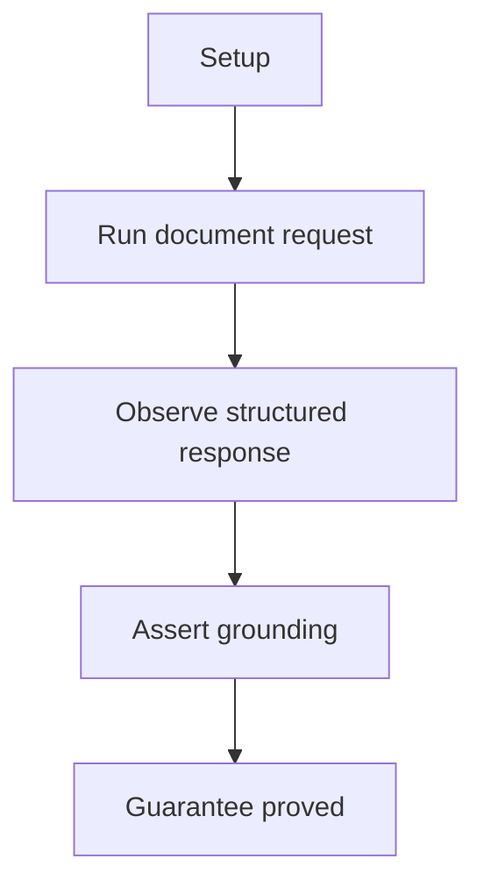

Walkthrough:

1. loads the replay cassette and extracts expected page text and title from the
   PDF fixture before the request runs

2. builds the native Google route, the PDF prompt, and the `FileSchema`
   attachment

3. calls `query(...)` with the `PDFDigest` response schema

4. runs the shared PDF grounding helper and asserts title, snippets, and
   entities map back to the PDF

Why this is sufficient:

- expected title and text anchors are derived from the source PDF before the
  request runs, so the proof checks grounding against the document rather than
  against hand-written output guesses
- title, snippets, and entities together cover the main ways a document answer
  can drift away from the source material

Would fail if:

- the document attachment path broke and the model no longer used the PDF
- the output remained parseable but lost grounding in the source document

[Gemini WebAPI PDF extraction](../../../../tests/llm_router/e2e/provider_sdk_wrapping/test_gemini_webapi_file_structured_pipeline.py):
proves the same document-extraction story on the Gemini WebAPI path.

Question this diagram answers: How does this file prove browser-backed Gemini
PDF extraction stays grounded in the shared paper fixture?


Walkthrough:

1. loads the replay cassette and runtime guard, then extracts expected page
   text and title from the shared PDF

2. builds the Gemini WebAPI route, the PDF prompt, and the `FileSchema`
   attachment

3. calls `query(...)` with the `PDFDigest` response schema

4. runs the shared PDF grounding helper and asserts title, evidence, and
   entities match the source PDF

Why this is sufficient:

- the browser-backed document path is checked against source-derived anchors, so
  the proof still tests grounding instead of merely testing transport success
- title, evidence, and entities are enough to show that the PDF was interpreted
  as a document rather than flattened into a generic summary

Would fail if:

- Gemini WebAPI no longer passed the document through the shared grounded
  workflow
- browser-backed extraction returned plausible text that no longer matched the
  source PDF facts

[QwenChat PDF extraction](../../../../tests/llm_router/e2e/provider_sdk_wrapping/test_qwenchat_file_structured_pipeline.py):
proves that the Qwen upload flow can support the same extraction-style output
with title, evidence, and source-linked entities.

Question this diagram answers: How does this file prove the Qwen upload flow
keeps PDF extraction grounded in source facts?

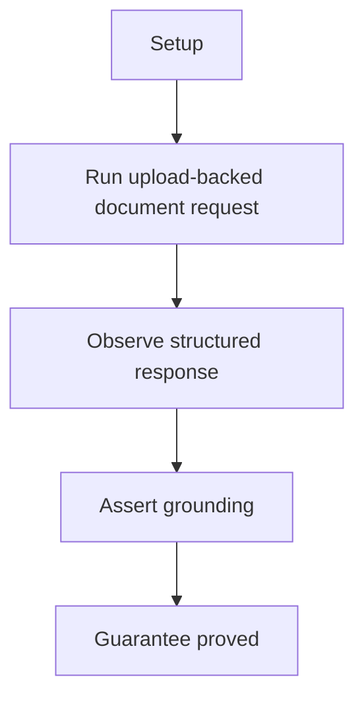

Walkthrough:

1. loads the replay cassette and extracts expected page text and title from the
   shared PDF

2. builds the QwenChat route, the PDF prompt, and the uploaded file attachment

3. calls `query(...)` with the `PDFDigest` response schema

4. runs the shared PDF grounding helper and asserts title, evidence, and
   entities still point to the document

Why this is sufficient:

- the Qwen upload seam is the risky part of this workflow, and the proof checks
  it with the same source-grounded helper used on the direct-file providers
- title, evidence, and entity checks are enough to show that upload-based
  document processing still lands on the same grounded contract

Would fail if:

- the uploaded file was accepted operationally but not actually used in the
  structured extraction
- the extracted result stopped preserving source-linked evidence or entities

## 4. Proof: Video Works From Files And Remote URLs

This proof area shows that callers can analyze either a local upload or, where
the provider supports it, a remote clip reference while still using the same
logical request model and getting structured observations back.

### Seen In Tests

[Google GenAI local video](../../../../tests/llm_router/e2e/provider_sdk_wrapping/test_google_genai_video_file_structured_pipeline.py):
proves local video analysis on the native Google path.

Question this diagram answers: How does this file prove uploaded local video
becomes a structured observation on native Google?

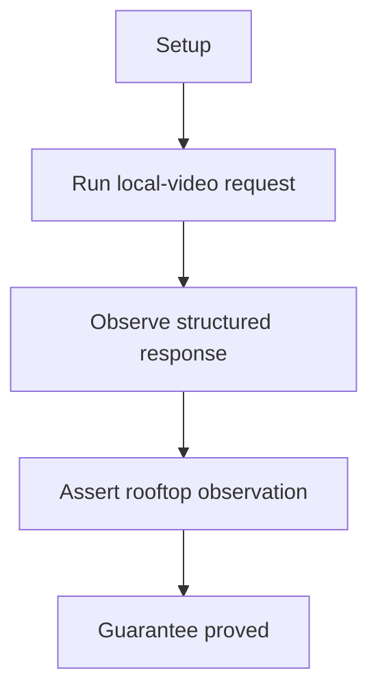

Walkthrough:

1. loads the replay cassette, builds the rooftop-video prompt, attaches the
   local clip fixture, and uses the native Google route

2. calls `query(...)` with `VideoSchema` input plus the `VideoObservation`
   response schema

3. runs the shared rooftop-video assertion helper

4. asserts jump action and rooftop or tall-building location

Why this is sufficient:

- the proof uses a local clip plus a structured schema, which is the core seam
  for video-file understanding on the public API
- action plus location are enough to show the clip was actually analyzed rather
  than only acknowledged as a file attachment

Would fail if:

- the local video file stopped being transmitted or interpreted as video input
- the returned observation parsed but no longer captured the expected action or
  setting

[AI Studio local video](../../../../tests/llm_router/e2e/provider_sdk_wrapping/test_aistudio_video_file_structured_pipeline.py):
proves the same local-file story on AI Studio.

Question this diagram answers: How does this file prove the AI Studio local
video path produces the expected structured rooftop report?


Walkthrough:

1. loads the replay cassette, builds the rooftop-video prompt, attaches the
   local clip fixture, and uses the AI Studio route

2. calls `query(...)` with `VideoSchema` input plus the `VideoObservation`
   response schema

3. runs the shared rooftop-video helper

4. asserts jump action and rooftop or tall-building location

Why this is sufficient:

- this is the same local-video workflow proved on a different provider family,
  which supports the claim that local video is part of the shared product story
- the shared helper keeps the proof focused on semantic parity rather than on
  provider-specific phrasing

Would fail if:

- the AI Studio local-video path stopped accepting or using the uploaded clip
- the returned structured observation no longer matched the expected rooftop
  behavior

[Google GenAI remote video URL](../../../../tests/llm_router/e2e/provider_sdk_wrapping/test_google_genai_video_url_structured_pipeline.py):
proves remote URL analysis on native Google.

Question this diagram answers: How does this file prove a remote video URL
works through the same structured contract on native Google?

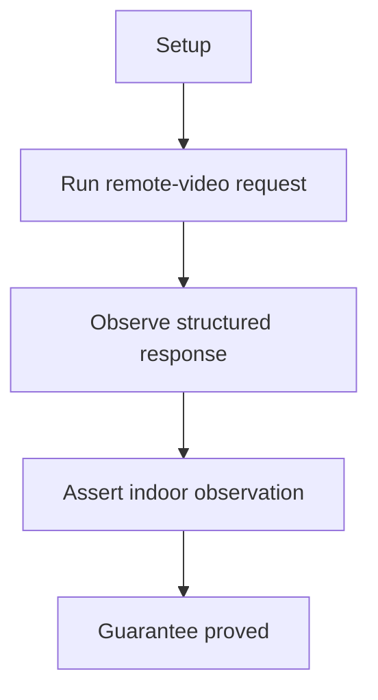

Walkthrough:

1. loads the replay cassette, builds the indoor-video prompt, passes the remote
   video URL, and uses the native Google route

2. calls `query(...)` with `VideoUrlSchema` input plus the `VideoObservation`
   response schema

3. runs the shared indoor-video assertion helper

4. asserts non-empty action and indoor location wording

Why this is sufficient:

- the proof changes only the input mode from local file to remote URL, so it
  directly tests the URL-based video seam
- non-empty action plus indoor-location wording are enough to show the remote
  clip was interpreted and turned into a structured observation

Would fail if:

- the remote URL input was ignored or treated as plain text instead of video
- the returned observation no longer preserved the expected action or setting

[AI Studio remote video URL](../../../../tests/llm_router/e2e/provider_sdk_wrapping/test_aistudio_video_url_structured_pipeline.py):
proves the same URL-based flow on AI Studio.

Question this diagram answers: How does this file prove AI Studio can analyze
a remote clip URL and still return the expected structured indoor report?


Walkthrough:

1. loads the replay cassette, builds the indoor-video prompt, passes the remote
   URL, and uses the AI Studio route

2. calls `query(...)` with `VideoUrlSchema` input plus the `VideoObservation`
   response schema

3. runs the shared indoor-video helper

4. asserts non-empty action and indoor location wording

Why this is sufficient:

- the AI Studio URL seam is checked with the same structured contract and helper
  as the native Google path, which makes the comparison meaningful across
  providers
- the proof asks for concrete action and setting evidence instead of accepting a
  generic acknowledgment of the URL

Would fail if:

- AI Studio stopped treating the remote URL as analyzable video input
- the returned structured observation lost the expected indoor-video semantics

## 5. Proof: Tool Workflows Support Controlled Execution

This proof area shows that the library can move beyond prompting into
controlled workflow execution. Callers can force one named tool, require tool
use, or place tools on the route profile while still receiving structured
final results.

### Seen In Tests

[AI Studio explicit tool choice](../../../../tests/llm_router/e2e/provider_sdk_wrapping/test_aistudio_tool_choice_pipeline.py):
proves that one named tool can be forced when the workflow must stay tightly
controlled.

Question this diagram answers: How does this file prove AI Studio obeys one
forced tool path instead of choosing tools freely?

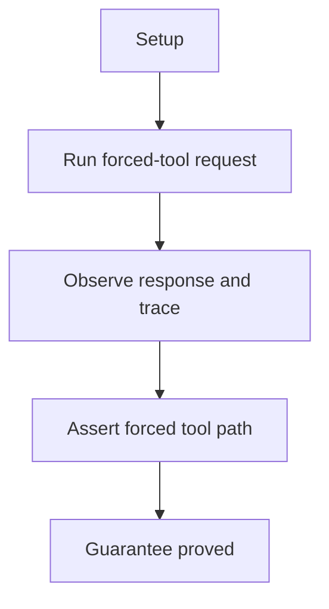

Walkthrough:

1. loads the replay cassette, defines `add` and `multiply`, and builds the AI
   Studio route with deterministic settings

2. calls `query(...)` with tools and explicit `tool_choice` for `add`

3. collects the public response plus the tool trace

4. asserts final result `42` and that the trace names only `add`

Why this is sufficient:

- explicit `tool_choice` plus tool trace evidence proves that the model did
  not select tools freely and that the forced-tool contract reached execution
- final result `42` ties the visible answer to `add`, so the proof is about both
  orchestration and outcome

Would fail if:

- the wrong tool ran or the backend ignored the forced `tool_choice`
- the final result looked plausible but the tool trace showed a different or
  additional tool path

[OpenAI-compatible explicit tool choice plus structured output](../../../../tests/llm_router/e2e/provider_sdk_wrapping/test_openai_compatible_tool_choice_structured_pipeline.py):
proves the same controlled tool-choice story on the OpenAI-compatible family.

Question this diagram answers: How does this file prove a forced tool call can
still end in structured output on the OpenAI-compatible family?

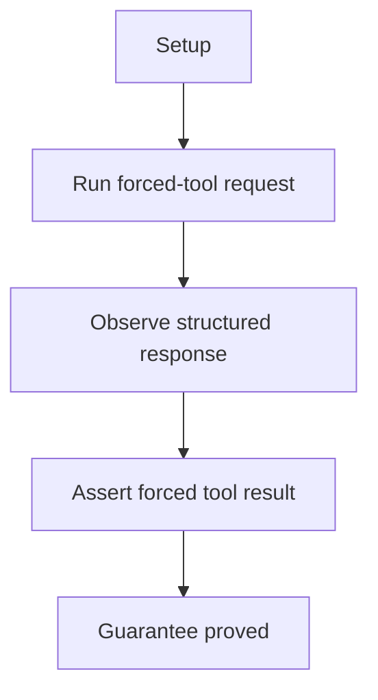

Walkthrough:

1. loads the replay cassette, defines `add` and `multiply`, and builds an
   OpenAI-compatible route

2. calls `query(...)` with forced `add` `tool_choice` plus the `ToolResult`
   response schema

3. parses the final structured output

4. asserts `tool_name=add`, `final_result=42`, and an add-only tool trace

Why this is sufficient:

- the proof combines forced tool choice with structured output, so it shows
  that controlled tool execution and structured final responses can coexist on
  the same public path
- `tool_name`, `final_result`, and tool trace together are enough to bind the
  final record to the actual forced tool execution

Would fail if:

- the OpenAI-compatible path ignored the forced tool and chose another tool
- the final structured record drifted from the executed tool trace

[AI Studio tools plus structured output](../../../../tests/llm_router/e2e/provider_sdk_wrapping/test_aistudio_tools_structured_pipeline.py):
proves a multi-step tool flow that still ends in a structured, auditable
result.

Question this diagram answers: How does this file prove a multi-round AI
Studio tool loop still returns an auditable structured answer?

```mermaid
flowchart TD
    A["Setup"] --> B["Run multi-round tool request"]
    B --> C["Observe structured response"]
    C --> D["Assert audited tool path"]
    D --> E["Guarantee proved"]
```

Walkthrough:

1. loads the replay cassette, defines `add` and `multiply`, and builds the AI
   Studio route

2. calls `query(...)` with tools, required tool use, a response schema, and a
   round limit

3. parses the final structured audit result

4. asserts `final_result=84` and that at least two tool steps match the tool trace

Why this is sufficient:

- required tool use, multiple steps, and a round limit together prove a real
  tool loop rather than one isolated tool call
- the final audit result is checked against the recorded tool trace, so the
  proof connects orchestration history to the final structured output

Would fail if:

- the loop skipped a required tool step or terminated without the expected
  multi-step execution
- the final structured audit no longer matched the actual sequence in the
  tool trace

[Google GenAI profile-level tools](../../../../tests/llm_router/e2e/provider_sdk_wrapping/test_google_genai_profile_tools_structured_pipeline.py):
proves that tools can live on the route profile itself rather than being
passed ad hoc on each call.

Question this diagram answers: How does this file prove profile-level tools,
required tool use, and structured output stay aligned on native Google?

```mermaid
flowchart TD
    A["Setup"] --> B["Run profile-tool request"]
    B --> C["Observe structured response"]
    C --> D["Assert profile-level tool result"]
    D --> E["Guarantee proved"]
```

Walkthrough:

1. loads the replay cassette and defines the `multiply` tool on the route
   profile itself

2. builds the native Google route with profile-level tools

3. calls `query(...)` with required tool use plus the `CalculationAudit`
   response schema

4. parses the final structured output and asserts `final_result=323`,
   non-empty tool trace, and one Google route

Why this is sufficient:

- the tool is attached at the route-profile layer rather than per call, so
  success proves that profile-level tool configuration participates in the same
  public workflow
- required tool use, non-empty tool trace, and `final_result=323` are enough
  to show that the profile-owned tool was actually executed and surfaced in the
  final structured record

Would fail if:

- profile-level tools were ignored unless passed again on the call
- the final result appeared correct but the tool trace stayed empty or
  disconnected from the route-level tool configuration
