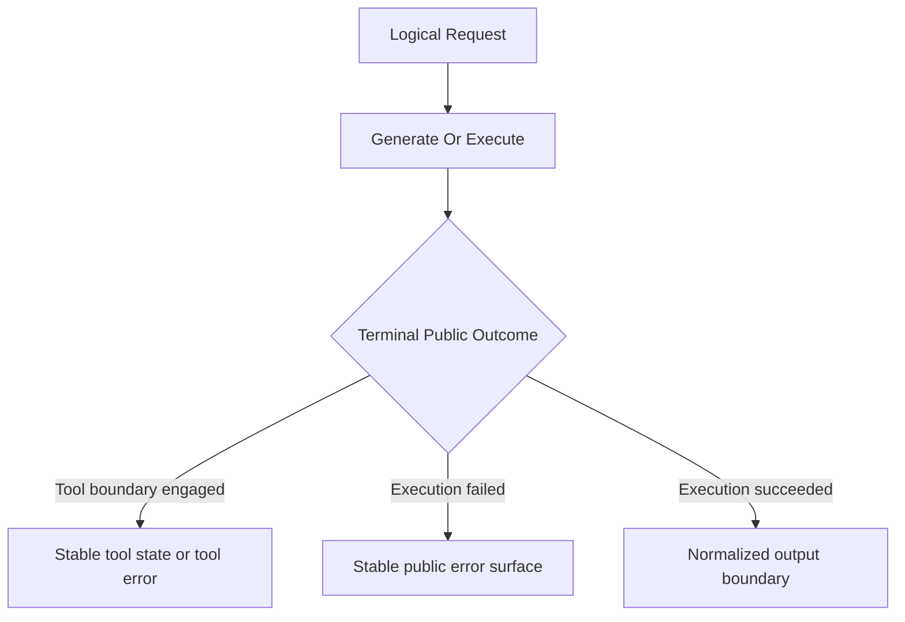
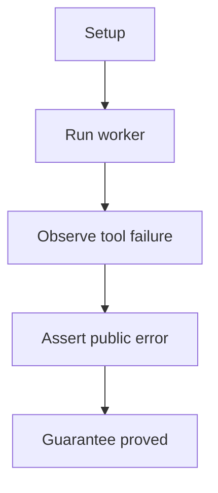
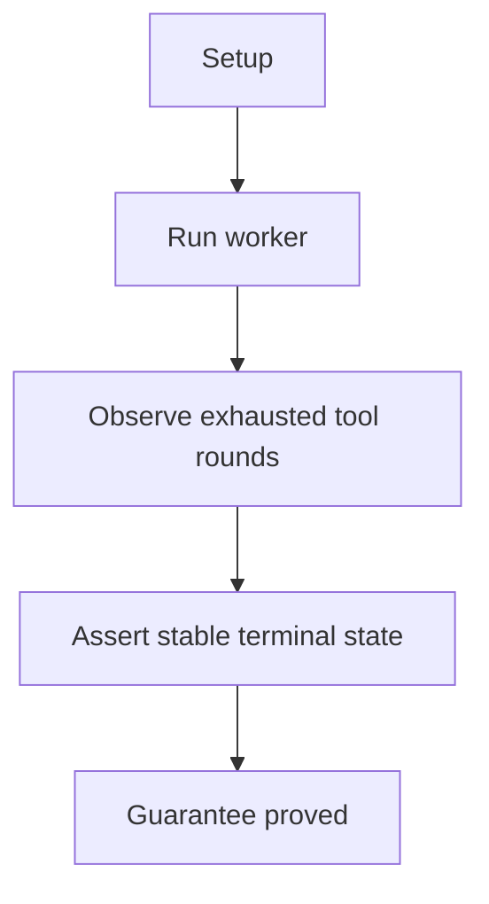
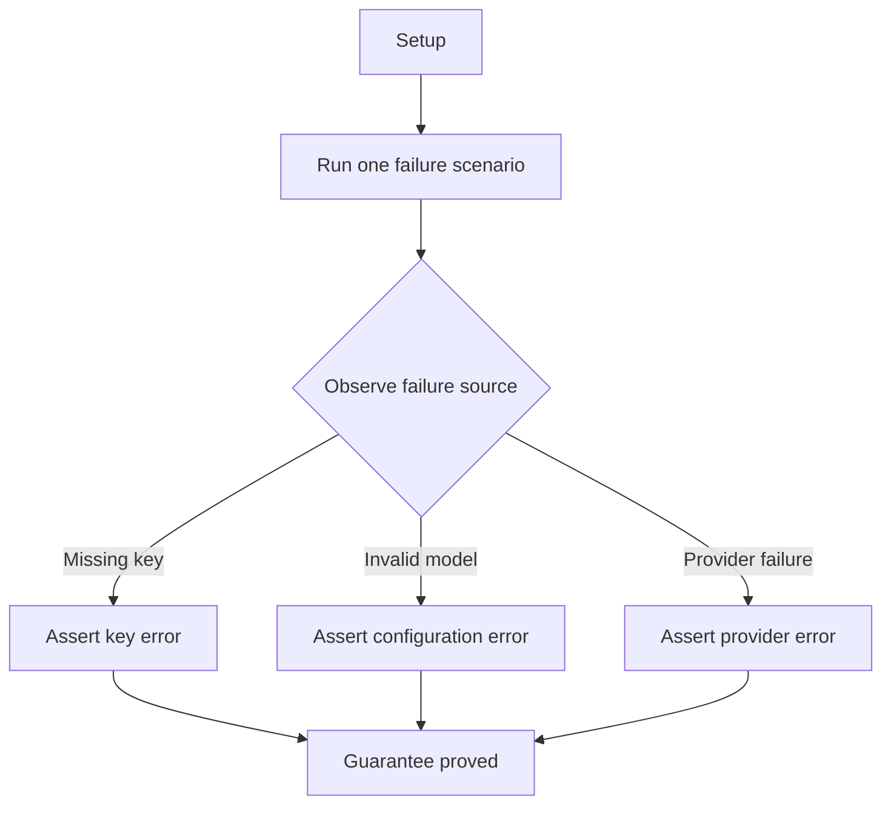
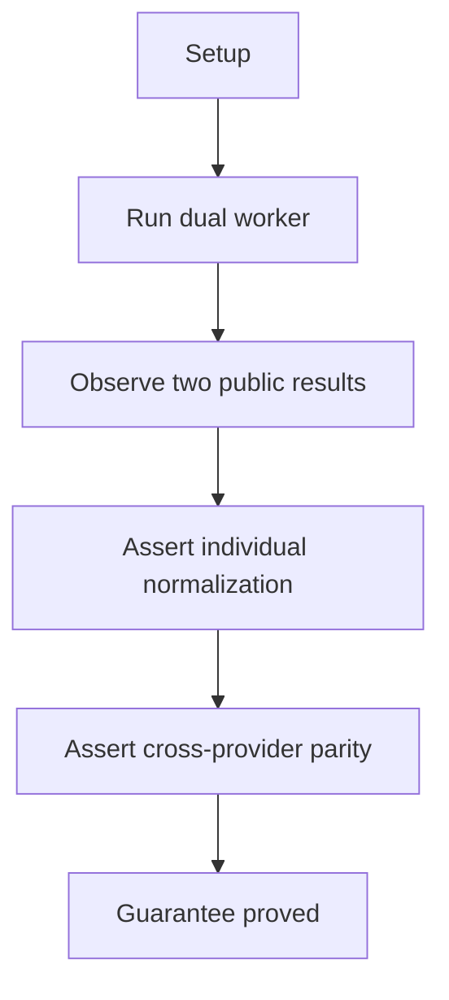

# Public Output And Errors

## Overview

This document describes how the e2e suite proves that terminal public outcomes
stay stable when tools fail, limits are reached, errors cross the public
boundary, or different provider families normalize into one shared result
shape.

Question this diagram answers: Which terminal public-boundary guarantees does
the behavior suite prove for tools, errors, and normalized outputs?

## Proof Areas

## 1. Proof: Tool Workflows Fail Safely

This proof area shows that local tool problems and runaway tool loop states
stop in predictable public states instead of devolving into undefined
behavior.

### Seen In Tests

[Tool failure behavior](../../../../tests/llm_router/e2e/public_output_and_errors/test_tool_failure_pipeline.py):
proves that a local tool crash becomes a public `ToolExecutionError` and stops
the tool loop before any extra model turn can happen.

Question this diagram answers: How does this file prove that local tool failure
stops both representative tool loop implementations immediately?

Walkthrough:

1. runs the same proof on both representative implementations: an
   OpenAI-compatible path and a Google path

2. the scripted provider returns one tool call for `explode(value=7)`

3. the router executes the local tool, the tool raises, and the worker ends
   with public `ToolExecutionError`

4. asserts the error message keeps the tool name and argument context and that
   the provider hit count stays at `1`

Why this is sufficient:

- the proof checks both the public error category and the stop condition, so it
  shows not only that the failure is classified correctly but also that the
  tool loop does not continue after a local tool crash
- the same contract is verified on two representative tool-calling
  implementations, which makes the boundary claim stronger than a
  single-backend example

Would fail if:

- local tool exceptions were swallowed, misclassified as generic provider
  errors, or surfaced without the failing tool context
- the router continued into another model turn after the tool failure instead of
  stopping immediately

[Tool-round limit behavior](../../../../tests/llm_router/e2e/public_output_and_errors/test_tool_round_limit_pipeline.py):
proves that repeated tool requests stop at the configured limit while still
exposing the last outstanding tool request and the full tool loop trace.

Question this diagram answers: How does this file prove that exhausting
`max_tool_rounds` is a supported public state rather than an error or hidden
continuation?

Walkthrough:

1. runs the same proof on both representative implementations with two repeated
   `ping(value=7)` tool calls

2. the configured tool loop reaches its round limit after two rounds

3. asserts the worker still succeeds, does not fabricate final assistant text,
   and records provider hit count `2`

4. asserts `tool_trace` contains two `ping` steps and `tool_calls` preserves
   the last outstanding `ping(value=7)` request

Why this is sufficient:

- the proof checks the full terminal surface of the tool loop: visible
  output, provider hit count, accumulated `tool_trace`, and preserved
  `tool_calls`
- because the same checks run on both representative implementations, the
  documented limit behavior is shown to be a library guarantee rather than one
  backend's accident

Would fail if:

- the loop exceeded the configured round limit, stopped one round too early, or
  fabricated final assistant text after exhaustion
- the last pending tool request or accumulated tool trace were dropped,
  overwritten, or returned in the wrong shape

## 2. Proof: Public Error Classes Stay Distinct

This proof area shows that missing credentials, invalid configuration, and
provider-side failures remain distinct public exception categories.

### Seen In Tests

[Public error boundary behavior](../../../../tests/llm_router/e2e/public_output_and_errors/test_public_error_boundary_pipeline.py):
proves that missing credentials, invalid configuration, and provider-side
failures remain distinct public exception categories.

Question this diagram answers: How does this file prove that public error
classes stay separated by failure source?

Walkthrough:

1. missing-key branch runs fully in process and asserts public
   `ApiKeyNotFoundError` with the missing key name in the message

2. invalid-model branch runs fully in process and asserts public
   `ConfigurationError` with an unknown-model message

3. provider branch uses a scripted provider `400` response, asserts public
   `ProviderError`, and confirms the server was hit exactly once

4. the combined file proves the public error surface stays separated by
   failure source

Why this is sufficient:

- the file isolates failures on both sides of the provider boundary, so the
  proof can distinguish missing credentials, invalid configuration, and actual
  provider failure instead of collapsing them into one generic error path
- the provider branch also checks that the scripted server was hit exactly
  once, which proves the request really crossed the provider boundary before
  the public error was classified

Would fail if:

- missing keys and invalid models surfaced as the same public exception type
- provider-side `400` failures were misclassified as configuration errors or
  handled as if no provider call had happened

## 3. Proof: Normalized Outputs Stay Stable Across Providers

This proof area shows that representative OpenAI-compatible and native Google
responses converge to the same normalized result shape.

### Seen In Tests

[Response normalization parity](../../../../tests/llm_router/e2e/public_output_and_errors/test_response_normalization_pipeline.py):
proves that representative OpenAI-compatible and native Google responses
converge to the same normalized result shape.

Question this diagram answers: How does this file prove parity from two
different provider payload families without erasing provider identity?

Walkthrough:

1. starts one scripted OpenAI-compatible server and one scripted Google server

2. runs one dual worker so both representative routes are exercised in one
   proof

3. first validates each result on its own: output text, provider, model, usage,
   routing trace, and empty tool fields

4. then compares shared fields across both normalized result objects and
   asserts text, usage, tool fields, `route_index`, and `wait_seconds` parity

Why this is sufficient:

- each result is first validated on its own before parity is compared, so the
  proof does not hide one broken normalization path behind a superficial
  cross-provider equality check
- the comparison is limited to the provider-independent fields that should
  converge, while provider and model identity remain distinct, which matches
  the actual normalized result contract

Would fail if:

- one provider family normalized usage, tool fields, or routing metadata
  differently from the other
- parity appeared only in output text while one route still leaked
  provider-specific structure into the public result
