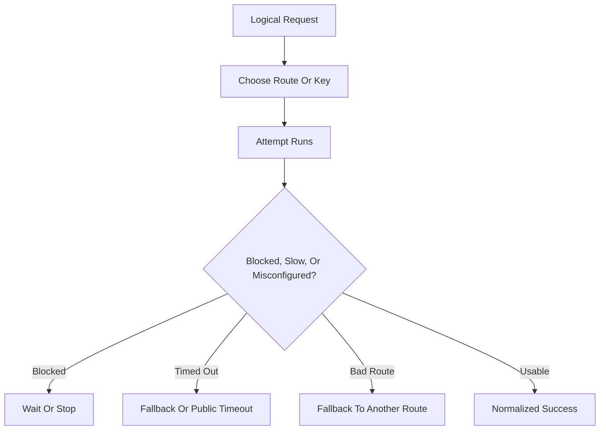
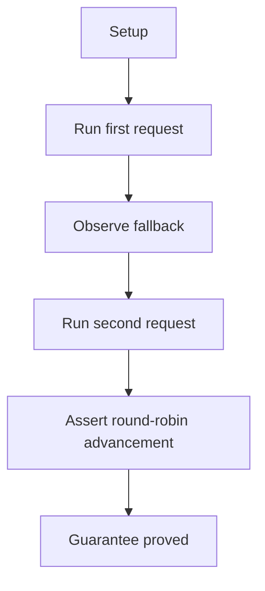
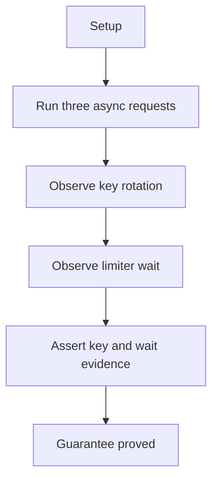
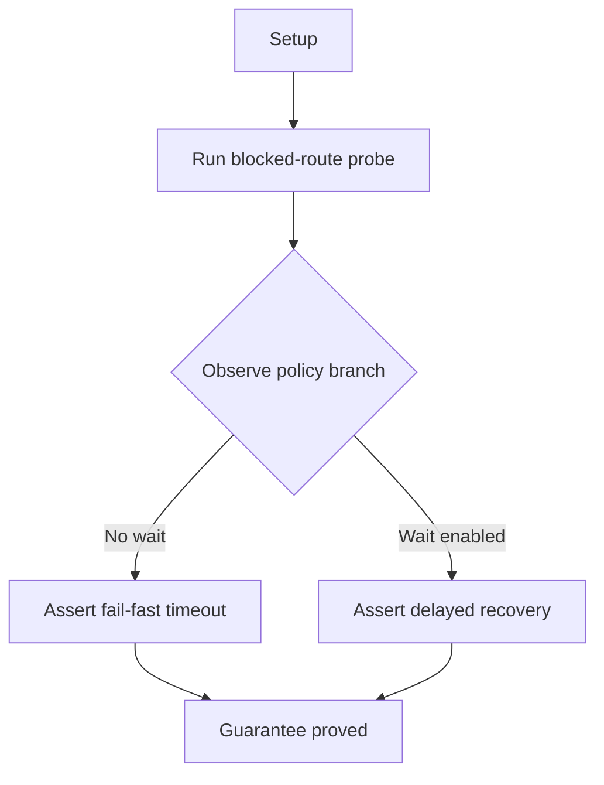
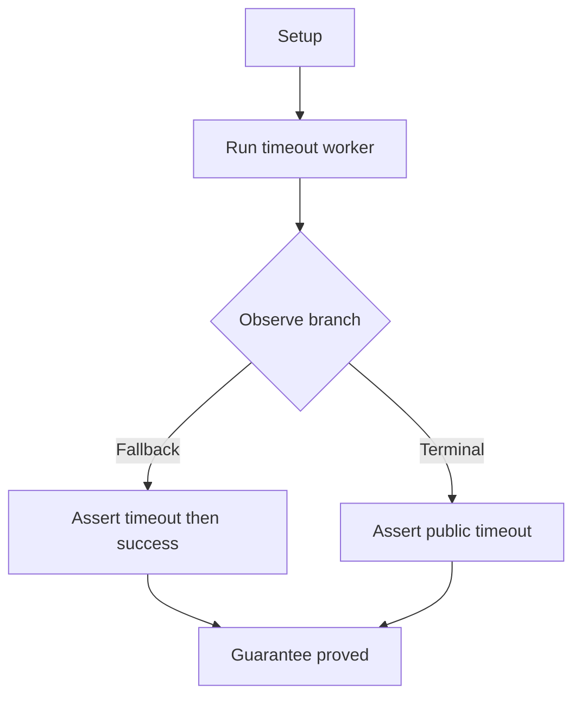

# Route Fallback And Attempt Policy

## Overview

This document describes how the e2e suite proves that the router makes
route-level operational decisions for the caller instead of forcing
application code to reimplement fallback, waiting, and per-attempt timeout
policy.

Question this diagram answers: How does the behavior suite prove that route
selection and per-attempt policy stay resilient under blocked, slow, or
misconfigured attempts?

## Proof Areas

## 1. Proof: Router Recovers From Bad Route Choices

This proof area shows that route choice is not a one-shot guess. The router
can recover from an invalid route, rotate keys when needed, and expose the
resulting path through its routing trace.

### Seen In Tests

[Fallback plus round-robin routing](../../../../tests/llm_router/e2e/route_fallback_and_attempt_policy/test_routing_fallback_round_robin_pipeline.py):
proves that one failed route does not end the logical request, and that the
next request starts from the newly established round-robin position.

Question this diagram answers: How does this file prove both fallback recovery
and round-robin advancement with only two calls?

Walkthrough:

1. builds one router with invalid route `0` and valid NVIDIA route `1`

2. first request asks for `OK`, route `0` fails with `ValueError`, and the
   router falls back to route `1`

3. asserts the first response succeeds on NVIDIA and the routing trace shows
   failed route `0` followed by successful route `1`

4. second request asks for `12345` and asserts the next starting point is still
   route index `1`

Why this is sufficient:

- two consecutive calls are enough here because the first proves immediate
  fallback recovery and the second proves that the router stored the updated
  round-robin starting position
- the routing trace records both the failed invalid route and the recovered
  valid route, so the proof explains the behavior rather than only trusting the
  final output text

Would fail if:

- the router stopped after the invalid route instead of falling back
- the router recovered once but forgot to advance the round-robin pointer for
  the next request

[Async key rotation and per-key waiting](../../../../tests/llm_router/e2e/route_fallback_and_attempt_policy/test_routing_key_rotation_async_pipeline.py):
proves that routing trace semantics extend below route choice into key
selection, rotation, and limiter-driven waiting.

Question this diagram answers: How does this file prove key rotation first and
per-key waiting second on one async route?

Walkthrough:

1. ensures two NVIDIA key ids exist, then builds one async router with
   `key_id="auto"` and a per-key rate limit

2. first two calls ask for `A` and `B` and assert that their routing trace
   entries use different key ids

3. third call asks for `C`, starts a wall-clock timer, and waits because both
   keys are cooling down

4. asserts the third trace records positive `wait_seconds` and the real wait is
   at least the recorded wait minus jitter

Why this is sufficient:

- distinct key ids on the first two requests prove actual rotation, while the
  third request combines trace evidence and wall-clock evidence to prove real
  limiter waiting instead of a cosmetic trace field
- all three requests use the same route and same public API, so the proof
  isolates key-choice behavior from unrelated routing changes

Would fail if:

- the router reused one key even though another key id was available
- the limiter skipped the wait, misreported `wait_seconds`, or waited less than
  the trace claimed

[Wait policy for blocked routes](../../../../tests/llm_router/e2e/route_fallback_and_attempt_policy/test_routing_wait_policy_pipeline.py):
proves the policy boundary directly by contrasting fail-fast and wait-to-
recover outcomes against the same blocked route shape.

Question this diagram answers: How does this file prove that the
wait-for-cooldown policy changes the public outcome of the same blocked route?

Walkthrough:

1. requires one NVIDIA key and uses tiny deterministic prompts so the proof
   isolates routing policy rather than model quality

2. no-wait branch builds a router with
   `wait_for_cooldown_if_all_blocked=False`, then asserts the second immediate
   request raises `TimeoutError` quickly after the first request succeeds

3. wait-enabled branch builds a router with
   `wait_for_cooldown_if_all_blocked=True`, then asserts the blocked second
   request succeeds after measurable delay

4. wait-enabled branch also asserts the recovered trace stays on the same
   provider and key

Why this is sufficient:

- both branches create the same blocked-route condition and change only the
  wait policy, so the different public outcomes can be attributed directly to
  that policy switch
- the proof uses outcome, timing, and routing trace evidence together, which
  makes it clear that the wait-enabled branch really recovered after cooldown
  rather than succeeding immediately by chance

Would fail if:

- the no-wait policy silently slept, retried, or hid the blocked-route error
- the wait-enabled policy still failed fast, resumed on the wrong route, or
  returned before the cooldown interval had elapsed

## 2. Proof: Per-Attempt Slowness Changes Public Outcomes

This proof area shows that a slow attempt is treated as a routing signal, not
just as generic noise. The router can either move to a fallback route or
surface a clean public timeout when no recovery path exists.

### Seen In Tests

[Attempt timeout fallback](../../../../tests/llm_router/e2e/route_fallback_and_attempt_policy/test_attempt_timeout_pipeline.py):
proves both branches in one place: fallback after a slow first attempt and a
terminal `TimeoutError` when no usable route remains.

Question this diagram answers: How does this file prove the difference between
recoverable attempt slowness and terminal attempt slowness?

Walkthrough:

1. starts a scripted server where the first response can be slow enough to
   exceed the per-attempt timeout

2. fallback branch scripts one slow response plus one fast response, then
   asserts worker success, server hit count `2`, and a routing trace with
   `TimeoutError` followed by success on route index `1`

3. terminal branch scripts only one slow response and asserts a public
   `TimeoutError` with server hit count `1`

Why this is sufficient:

- the two branches share the same worker machinery and differ only in whether a
  usable fallback attempt exists, which isolates the timeout policy from other
  failure causes
- request counts plus routing trace entries prove that timeout is treated as a
  routing signal: recoverable when another route exists and terminal when it
  does not

Would fail if:

- a timed-out attempt did not trigger fallback when a second route was
  available
- the router invented hidden extra retries, misreported the trace, or surfaced
  the wrong public error when no fallback route remained
