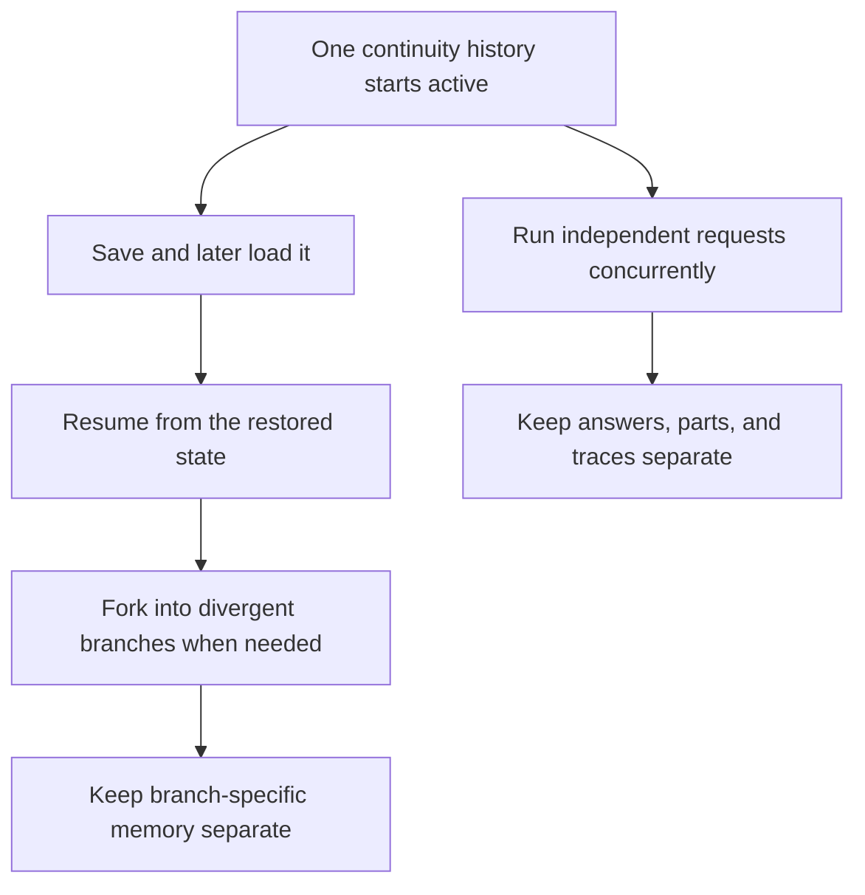
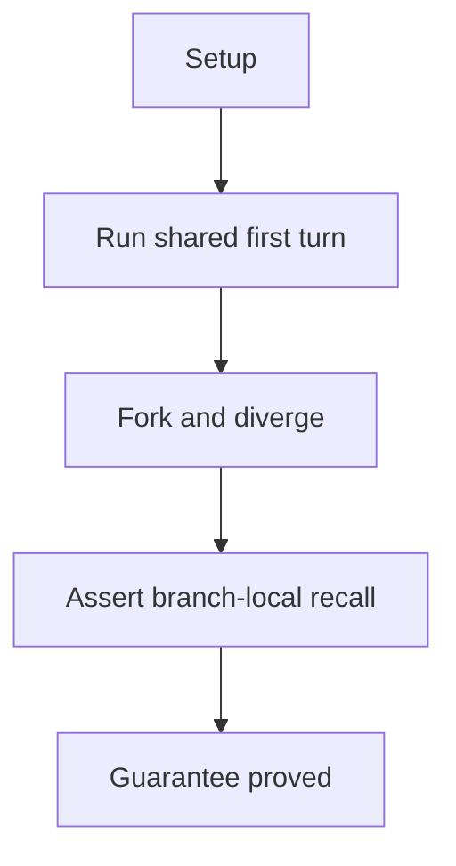
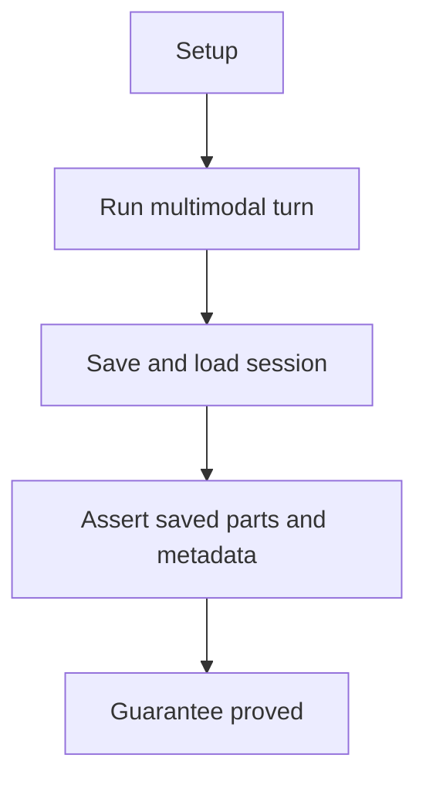
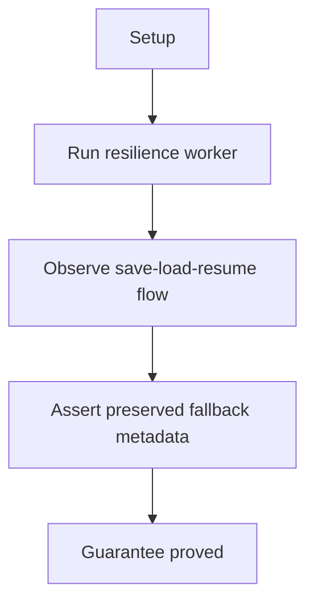
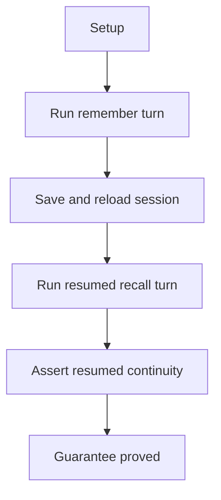
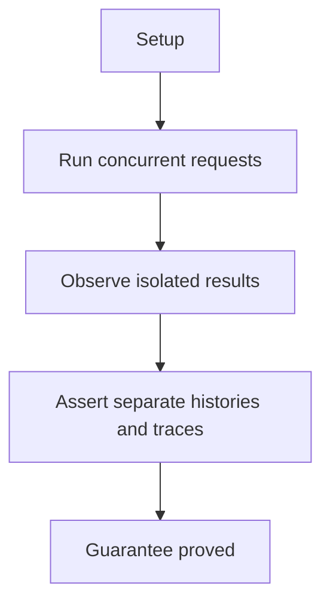

# Session State And Isolation

## Overview

This document describes how the e2e suite proves that continuity state can
be saved, resumed, branched, and kept separate across concurrent requests.

Question this diagram answers: What continuity guarantees does the behavior
suite prove for sessions and concurrent execution?

## Proof Areas

## 1. Proof: Sessions Preserve Meaning Across Process Boundaries

This proof area shows that continuity is more than a convenience buffer. It
can be persisted, resumed, branched, and inspected later without losing the
meaning of the prior interaction.

### Seen In Tests

[Session fork and divergent history](../../../../tests/llm_router/e2e/session_state_and_isolation/test_session_fork_pipeline.py):
proves that one shared continuity history can split into two branches that
later remember different values.

Question this diagram answers: How does this file prove that forking creates a
new timeline instead of another reference to the same session state?

Walkthrough:

1. creates one `Session`, one QwenChat router, and one shared first turn that
   remembers secret code `81723`

2. forks immediately after the shared first turn, then updates only the
   original branch to `12345`

3. asks both branches the same recall question and asserts original answer
   `12345` versus fork answer `81723`

4. asserts original history length `6`, fork history length `4`, and that the
   update prompt exists only in the original history

Why this is sufficient:

- both branches answer the same recall question, so the divergent outputs can be
  attributed to session state rather than prompt wording or model randomness
- history length and prompt-presence checks prove true branch separation in the
  stored continuity, not just two lucky answers

Would fail if:

- the fork shared mutable history with the original session
- the original update leaked into the fork or the fork lost the shared first
  turn it was supposed to inherit

[Session media persistence and assistant metadata](../../../../tests/llm_router/e2e/session_state_and_isolation/test_session_media_metadata_pipeline.py):
proves that saved continuity history can preserve media parts and assistant
metadata such as provider, model, usage, and routing details.

Question this diagram answers: How does this file prove that a saved session
keeps both multimodal user parts and assistant execution metadata?

Walkthrough:

1. creates one `Session` and one AI Studio router, then runs one query with
   text plus a video file

2. saves the session immediately after the assistant reply and loads it back

3. asserts the reloaded user message contains the text instruction plus one
   `VideoSchema` whose materialized file path exists

4. asserts the reloaded assistant message keeps the original output text and
   metadata for provider, model, usage, and one routing trace entry

Why this is sufficient:

- the proof checks both halves of the saved turn: user parts and assistant
  metadata, which together cover semantic persistence instead of only raw output
  text
- file existence plus reloaded metadata fields show that the saved session can
  reconstruct a usable multimodal turn rather than a lossy serialization stub

Would fail if:

- the saved media part degraded into plain text, lost its materialized path, or
  could not be reloaded as `VideoSchema`
- provider, model, usage, or routing trace metadata disappeared or drifted
  during save and load

[Session persistence after resilience behavior](../../../../tests/llm_router/e2e/session_state_and_isolation/test_session_resilience_pipeline.py):
proves that saved sessions retain the routing trace after timeout and
fallback recovery.

Question this diagram answers: How does this file prove that recovered
assistant turns keep their timeout-and-fallback story after save and resume?

Walkthrough:

1. starts a scripted server with a slow OpenRouter path and a fast Groq path

2. runs one worker that remembers data, saves, loads, resumes, and recalls it

3. asserts final recalled output `81723`, saved history length `4`, and server
   hit counts `2` on OpenRouter plus `2` on Groq

4. asserts both saved assistant metadata blocks preserve the same
   timeout-then-fallback routing trace: `TimeoutError` on route `0` and
   success on route `1`

Why this is sufficient:

- the session is persisted after real timeout-and-fallback behavior, so the
  proof checks resilience metadata under a meaningful failure pattern rather
  than a plain happy path
- both assistant turns are inspected after save and resume, which shows that the
  same fallback story survives across persistence boundaries more than once

Would fail if:

- timeout information were lost when assistant metadata was saved
- the resumed turn forgot prior continuity, omitted the fallback trace, or
  drifted from the expected OpenRouter-to-Groq recovery pattern

[Session save, load, and resume](../../../../tests/llm_router/e2e/session_state_and_isolation/test_session_resume_pipeline.py):
proves that a session can be restored in a new process context and still
answer from remembered continuity history.

Question this diagram answers: How does this file prove that saved
continuity remains usable after a full save-load-resume cycle?

Walkthrough:

1. creates one `Session` and one Gemini WebAPI router, then remembers secret
   code `81723`

2. saves the session to disk, loads it back, and builds a resumed router

3. runs the resumed recall turn and saves the session again

4. asserts the resumed reply is `81723` and the persisted history length is `4`

Why this is sufficient:

- save, load, and resumed recall are the minimal end-to-end steps needed to
  prove that continuity survives a process boundary rather than only staying
  alive in memory
- the final persisted history length proves the resumed turn was not only
  answered correctly but also appended and saved back into the session state

Would fail if:

- the loaded session forgot the remembered value from the first turn
- the resumed conversation could answer once but failed to extend or persist the
  restored history correctly

## 2. Proof: Concurrent Requests Stay Separate

This proof area shows that lower-level shared resources do not cause two
simultaneous requests to leak continuity history, user parts, answers, or
routing traces into one another.

### Seen In Tests

[Concurrency isolation](../../../../tests/llm_router/e2e/session_state_and_isolation/test_concurrency_isolation_pipeline.py):
proves that two simultaneous requests return different expected outputs while
preserving separate continuity histories and routing traces.

Question this diagram answers: How does this file prove that concurrent
requests stay isolated even when they share one in-process client layer?

Walkthrough:

1. starts a worker with one body-aware local server and creates two routers
   with separate sessions

2. launches concurrent `aquery(...)` calls that ask for `ALPHA` and `BETA`

3. asserts outputs `ALPHA` and `BETA`, session history length `2` for both
   sessions, and separate user parts

4. asserts request count `2` and one successful routing trace entry per
   request

Why this is sufficient:

- the proof checks multiple isolation surfaces at once: outputs, user parts,
  session history, request count, and routing trace, which makes accidental
  leakage hard to hide behind one correct-looking field
- both requests run concurrently against one in-process client layer, so the
  scenario targets the real shared-resource risk rather than a sequential toy
  case

Would fail if:

- prompt parts or answers leaked between the two sessions
- one request reused the other request's routing trace, duplicated provider
  work, or corrupted per-session history
