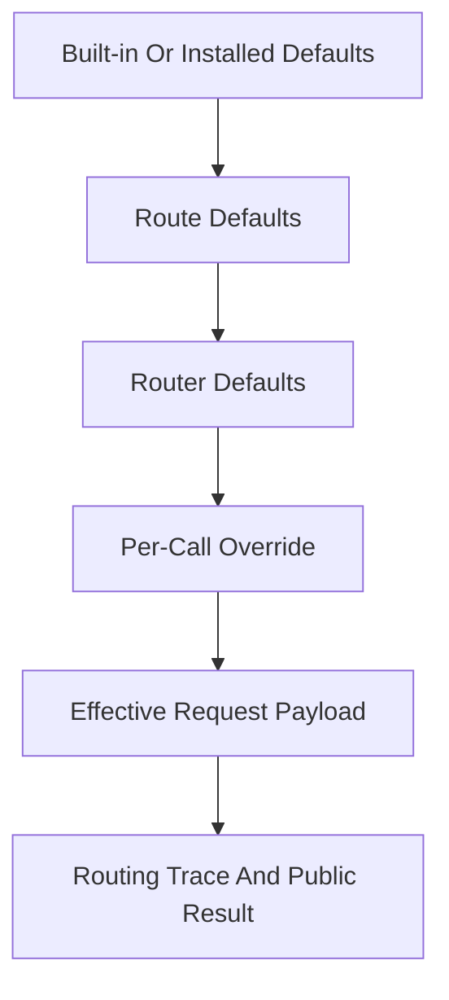
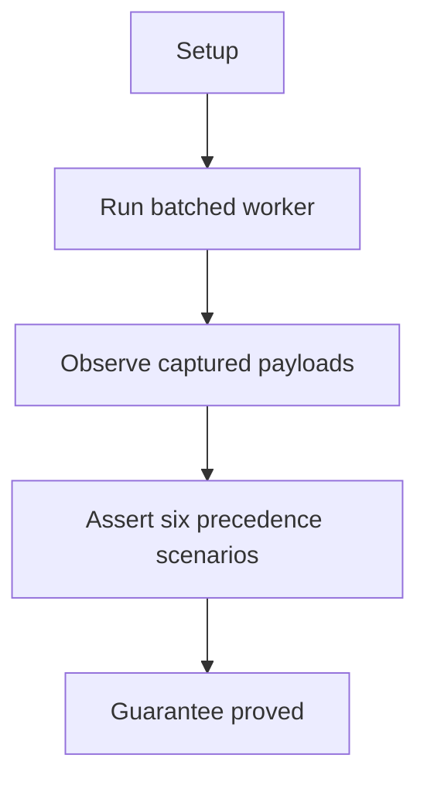

# Settings Overrides And Propagation

## Overview

This document describes how the e2e suite proves that omission,
per-call override, and explicit `None` keep distinct meaning at the public
request boundary.

Question this diagram answers: How does the behavior suite prove that request
settings keep stable precedence and propagation semantics all the way to the
provider payload?

## Proof Areas

## 1. Proof: Public Request Precedence And Schema Defaults Stay Distinct

This proof area shows that omission, per-call override, and explicit `None`
keep distinct meaning for defaults and response schema settings at the
public boundary.

### Seen In Tests

[Public request precedence and schema defaults](../../../../tests/llm_router/e2e/settings_overrides_and_propagation/test_request_precedence_pipeline.py):
proves that omission, per-call override, and explicit `None` keep distinct
meaning for defaults and response schema settings at the public boundary.

Question this diagram answers: How does this file prove the full precedence
contract instead of only one example override?

Walkthrough:

1. starts one scripted OpenAI-compatible server with six deterministic
   responses and runs one batched worker across six scenarios

2. captures one outbound provider payload per scenario so the proof reads the
   actual boundary payload, not only the final result

3. asserts `router_defaults`, `call_overrides`, and
   `call_none_clears_defaults` through both payload fields and routing trace
   fields

4. asserts `route_schema_default`, `call_schema_override`, and
   `call_schema_none_clears_default` through `response_format` presence,
   `json_schema.name`, parsed structured output, or plain text clearing

Why this is sufficient:

- the proof inspects the outbound provider payloads themselves, so precedence
  is verified at the real request translation boundary instead of being inferred
  only from final output text
- the six scenarios cover the three meaningfully different public cases for
  both generation settings and response schema: omission, explicit override,
  and explicit `None` clearing

Would fail if:

- router defaults leaked through when a per-call override should win, or
  explicit `None` were treated as omission
- route-level schema defaults overrode a per-call schema, or
  `response_format` clearing and routing trace values drifted from the actual
  outbound payload
