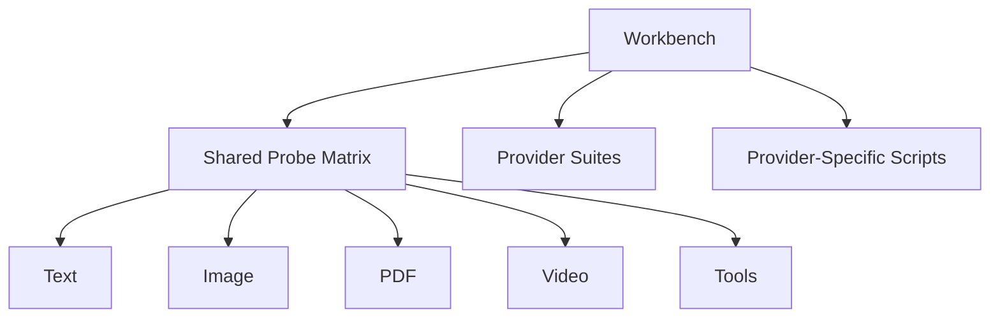

# Workbench Overview

## Overview

This document describes the live provider probes used for executable validation
and provider comparison.

Question this diagram answers: What kinds of live probes make up the workbench
surface?

## Provider Suites

- [openai](../../../workbench/llm_router/openai/README.md)
- [aistudio](../../../workbench/llm_router/aistudio/README.md)
- [google_genai](../../../workbench/llm_router/google_genai/README.md)
- [gemini_webapi](../../../workbench/llm_router/gemini_webapi/README.md)
- [qwenchat](../../../workbench/llm_router/qwenchat/README.md)

## Proof Areas

## 1. Proof: Async Text Generation

This proof area shows that the provider set shares one baseline async
plain-text probe.

### Seen In Scripts

- [openai/text_generation_async.py](../../../workbench/llm_router/openai/text_generation_async.py):
  proves the OpenAI-compatible async text-generation baseline.
- [aistudio/text_generation_async.py](../../../workbench/llm_router/aistudio/text_generation_async.py):
  proves the AI Studio async text-generation baseline on the non-video path.
- [google_genai/text_generation_async.py](../../../workbench/llm_router/google_genai/text_generation_async.py):
  proves the native Google async text-generation baseline.
- [gemini_webapi/text_generation_async.py](../../../workbench/llm_router/gemini_webapi/text_generation_async.py):
  proves the browser-backed Gemini async text-generation baseline.
- [qwenchat/text_generation_async.py](../../../workbench/llm_router/qwenchat/text_generation_async.py):
  proves the direct-HTTP QwenChat async text-generation baseline.

### Exceptions

- None in the current provider set.

## 2. Proof: Image Structured Output

This proof area shows that the provider set shares one comparable image
structured output probe.

### Seen In Scripts

- [openai/image_structured.py](../../../workbench/llm_router/openai/image_structured.py):
  proves the OpenAI-compatible image plus structured JSON path.
- [aistudio/image_structured.py](../../../workbench/llm_router/aistudio/image_structured.py):
  proves the AI Studio image plus structured JSON path.
- [google_genai/image_structured.py](../../../workbench/llm_router/google_genai/image_structured.py):
  proves the native Google image plus structured JSON path.
- [gemini_webapi/image_structured.py](../../../workbench/llm_router/gemini_webapi/image_structured.py):
  proves the browser-backed Gemini image plus structured JSON path.
- [qwenchat/image_structured.py](../../../workbench/llm_router/qwenchat/image_structured.py):
  proves the upload-based QwenChat image plus structured JSON path.

### Exceptions

- None in the current provider set.

## 3. Proof: PDF Structured Output

This proof area shows that document extraction can be compared through one
grounded structured output case per provider.

### Seen In Scripts

- [aistudio/pdf_structured.py](../../../workbench/llm_router/aistudio/pdf_structured.py):
  proves the native AI Studio PDF plus structured JSON path.
- [google_genai/pdf_structured.py](../../../workbench/llm_router/google_genai/pdf_structured.py):
  proves the native Google PDF plus structured JSON path.
- [gemini_webapi/pdf_structured.py](../../../workbench/llm_router/gemini_webapi/pdf_structured.py):
  proves the Gemini WebAPI PDF plus structured JSON path.
- [qwenchat/pdf_structured.py](../../../workbench/llm_router/qwenchat/pdf_structured.py):
  proves the uploaded QwenChat PDF plus structured JSON path.

### Exceptions

- `openai/` does not have `pdf_structured.py`.
- Treat that as unsupported in `src` until a real provider path or stable workaround is proven.

## 4. Proof: Video File Structured Output

This proof area shows that local video understanding can be exercised in the
exact request shape each provider supports.

### Seen In Scripts

- [aistudio/video_file_structured.py](../../../workbench/llm_router/aistudio/video_file_structured.py):
  proves the native streamed AI Studio local-video path.
- [google_genai/video_file_structured.py](../../../workbench/llm_router/google_genai/video_file_structured.py):
  proves the native Google local-video path.
- [gemini_webapi/video_file_structured.py](../../../workbench/llm_router/gemini_webapi/video_file_structured.py):
  proves the browser-backed Gemini local-video upload path.
- [qwenchat/video_file_structured.py](../../../workbench/llm_router/qwenchat/video_file_structured.py):
  proves the uploaded MP4 analysis path on QwenChat.

### Exceptions

- `openai/` does not have `video_file_structured.py`.
- Treat that as unsupported in `src` until a real provider path or stable workaround is proven.

## 5. Proof: Video URL Structured Output

This proof area shows that remote video analysis is comparable where a
provider has a real URL-based path today.

### Seen In Scripts

- [aistudio/video_url_structured.py](../../../workbench/llm_router/aistudio/video_url_structured.py):
  proves the native streamed AI Studio remote-video URL path.
- [google_genai/video_url_structured.py](../../../workbench/llm_router/google_genai/video_url_structured.py):
  proves the native Google remote-video URL path.
- [gemini_webapi/video_url_structured.py](../../../workbench/llm_router/gemini_webapi/video_url_structured.py):
  proves the Gemini WebAPI public-video URL path through prompt text.

### Exceptions

- `openai/` does not have `video_url_structured.py`.
- `qwenchat/` does not have `video_url_structured.py`.
- Treat both as unsupported in `src` until a real provider path or stable workaround is proven.

## 6. Proof: Async Tool Loop Structured Output

This proof area shows that the provider set reaches one comparable async
tool loop outcome, even when some paths rely on workarounds.

### Seen In Scripts

- [openai/tool_loop_structured_async.py](../../../workbench/llm_router/openai/tool_loop_structured_async.py):
  proves the OpenAI-compatible async multi-round tool loop.
- [aistudio/tool_loop_structured_async.py](../../../workbench/llm_router/aistudio/tool_loop_structured_async.py):
  proves the AI Studio async tool flow with a separate final structured step.
- [google_genai/tool_loop_structured_async.py](../../../workbench/llm_router/google_genai/tool_loop_structured_async.py):
  proves the native Google async tool loop.
- [gemini_webapi/tool_loop_structured_async.py](../../../workbench/llm_router/gemini_webapi/tool_loop_structured_async.py):
  proves the prompt-driven async tool loop on Gemini WebAPI.
- [qwenchat/tool_loop_structured_async.py](../../../workbench/llm_router/qwenchat/tool_loop_structured_async.py):
  proves the textual async tool loop flow on QwenChat.

### Exceptions

- The comparable outcome is shared, but the transport is not.
- `gemini_webapi/` and `qwenchat/` are not native tool protocols; they are provider-specific workarounds.

## 7. Proof: Named Tool Choice Structured Output

This proof area shows that single-tool steering can still end in a
structured output result.

### Seen In Scripts

- [openai/tool_choice_named_structured.py](../../../workbench/llm_router/openai/tool_choice_named_structured.py):
  proves the OpenAI-compatible named tool-choice path.
- [aistudio/tool_choice_named_structured.py](../../../workbench/llm_router/aistudio/tool_choice_named_structured.py):
  proves the AI Studio named tool-choice path.
- [google_genai/tool_choice_named_structured.py](../../../workbench/llm_router/google_genai/tool_choice_named_structured.py):
  proves the native Google named tool-choice path.
- [gemini_webapi/tool_choice_named_structured.py](../../../workbench/llm_router/gemini_webapi/tool_choice_named_structured.py):
  proves the prompt-driven named tool-choice path on Gemini WebAPI.
- [qwenchat/tool_choice_named_structured.py](../../../workbench/llm_router/qwenchat/tool_choice_named_structured.py):
  proves the textual named tool-choice path on QwenChat.

### Exceptions

- The comparable outcome is shared, but `gemini_webapi/` and `qwenchat/` use non-native provider-specific flows.

## 8. Proof: Provider-Specific Scripts

This proof area shows that a small provider-specific script set is still
useful for behaviors that do not fit the shared probe matrix.

### Seen In Scripts

- [aistudio/schema_ref_resolution.py](../../../workbench/llm_router/aistudio/schema_ref_resolution.py):
  proves the AI Studio schema-inlining workaround.
  This script exists because AI Studio can mishandle `$ref` and `$defs` in
  schema-driven output. The script keeps that exact quirk visible and proves
  why the adapter has to inline schema references before sending them.
- [aistudio/models_list.py](../../../workbench/llm_router/aistudio/models_list.py):
  proves the live AI Studio OpenAI-compatible model-discovery path.
  This script exists because provider discovery is useful on its own before
  any generation probe runs. It shows exactly which model IDs the configured
  AI Studio endpoint exposes right now.
- [gemini_webapi/runtime_preflight.py](../../../workbench/llm_router/gemini_webapi/runtime_preflight.py):
  proves the Gemini WebAPI browser-runtime prerequisites.
  This script exists because Gemini WebAPI depends on local Opera cookies,
  cookie decryption, and SDK cache setup before any normal request can run.
  It is about environment readiness, not about one model capability.
- [google_genai/models_list.py](../../../workbench/llm_router/google_genai/models_list.py):
  proves the live native Google GenAI model-discovery path.
  This script exists because the native SDK exposes a separate model-discovery
  seam that helps answer what an API key can currently see without sending a
  generation request.
- [openai/logprobs_text_generation.py](../../../workbench/llm_router/openai/logprobs_text_generation.py):
  proves token logprobs on the NVIDIA OpenAI-compatible route.
  This script exists because logprobs are a distinct response seam from
  ordinary text generation. It keeps token probabilities and top alternatives
  visible without mixing that behavior into the baseline text script.
- [qwenchat/message_parts_mixed.py](../../../workbench/llm_router/qwenchat/message_parts_mixed.py):
  proves QwenChat mixed text and media parts in one user message.
  This script exists because QwenChat flattens role-less text and uploaded
  media parts into one custom message shape. That behavior is important for
  the adapter, but it is not a shared cross-provider capability category.

### Exceptions

- None in the current provider set.
